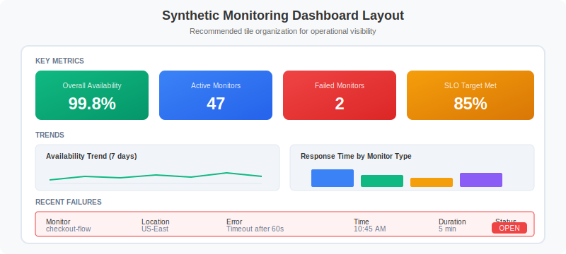

# 📊 Synthetic Analytics & Alerting

> **Series:** SYNTH | **Notebook:** 6 of 6 | **Created:** December 2025 | **Last Updated:** 01/28/2026

## Dashboards, SLOs, and Alerting Strategies
This notebook covers advanced analytics for synthetic monitoring, including building dashboards, configuring SLOs, and implementing effective alerting strategies using the latest Dynatrace platform.

---

## Table of Contents

1. [Availability Analysis](#availability-analysis)
2. [Performance Analysis](#performance-analysis)
3. [Location Comparison](#location-comparison)
4. [SLO Configuration](#slo-configuration)
5. [Alerting Strategies](#alerting-strategies)
6. [Dashboard Building](#dashboard-building)
7. [Series Complete!](#series-complete)

---


## Prerequisites

- ✅ Access to a Dynatrace environment with Synthetic Monitoring
- ✅ Completed SYNTH-01 through SYNTH-05
- ✅ Active synthetic monitors generating data


## 1. Analytics Overview <a name="overview"></a>

### Key Metrics for Synthetic Monitoring

| Metric Category | Metrics | Use Case |
|-----------------|---------|----------|
| **Availability** | Success rate, failure count | SLA compliance |
| **Performance** | Response time, TTFB, DNS | User experience |
| **Reliability** | Consecutive failures, MTTR | Stability |
| **Geographic** | Per-location metrics | Regional issues |

### Data Sources

| Source | Description | Best For |
|--------|-------------|----------|
| `bizevents` | Execution results | Real-time analysis |
| `dt.entity.synthetic_test` | Monitor definitions | Configuration |
| `dt.entity.synthetic_location` | Location info | Geographic analysis |
| `metrics` | Aggregated metrics | Long-term trends |

<a id="availability-analysis"></a>
## 2. Availability Analysis
### Calculating Availability

```
Availability = (Successful Executions / Total Executions) × 100%

Example SLA Targets:
- 99.9% = max 8.76 hours downtime/year
- 99.5% = max 43.8 hours downtime/year
- 99.0% = max 87.6 hours downtime/year
```

```dql
// Overall synthetic availability (last 7 days)
fetch bizevents, from: now() - 7d
| filter event.provider == "dynatrace.synthetic"
| summarize {
    total_executions = count(),
    successful = countIf(synthetic.availability == true),
    failed = countIf(synthetic.availability == false)
  }
| fieldsAdd availability_pct = round((successful * 100.0) / total_executions, decimals: 3)
| fieldsAdd downtime_minutes = round((failed * 5.0), decimals: 0)  // Assuming 5-min frequency
```

```dql
// Availability by monitor (last 7 days)
fetch bizevents, from: now() - 7d
| filter event.provider == "dynatrace.synthetic"
| summarize {
    total = count(),
    successful = countIf(synthetic.availability == true),
    failed = countIf(synthetic.availability == false)
  }, by: {dt.entity.synthetic_test}
| fieldsAdd availability_pct = round((successful * 100.0) / total, decimals: 3)
| sort availability_pct asc
| limit 30
```

```dql
// Availability trend over time
fetch bizevents, from: now() - 7d
| filter event.provider == "dynatrace.synthetic"
| fieldsAdd hour_bucket = bin(timestamp, 1h)
| summarize {
    success_count = countIf(synthetic.availability == true),
    total_count = count()
  }, by: {hour_bucket}
| fieldsAdd availability_pct = round((success_count * 100.0) / total_count, decimals: 2)
| sort hour_bucket desc
```

```dql
// Daily availability report
fetch bizevents, from: now() - 30d
| filter event.provider == "dynatrace.synthetic"
| fieldsAdd day = formatTimestamp(timestamp, format: "yyyy-MM-dd")
| summarize {
    total = count(),
    successful = countIf(synthetic.availability == true),
    failed = countIf(synthetic.availability == false)
  }, by: {day}
| fieldsAdd availability_pct = round((successful * 100.0) / total, decimals: 3)
| sort day desc
| limit 30
```

<a id="performance-analysis"></a>
## 3. Performance Analysis
### Performance Metrics

| Metric | Description | Good | Warning | Critical |
|--------|-------------|------|---------|----------|
| **Response Time** | Total execution time | < 2s | 2-5s | > 5s |
| **DNS** | DNS resolution | < 50ms | 50-200ms | > 200ms |
| **Connect** | TCP connection | < 100ms | 100-300ms | > 300ms |
| **TTFB** | Time to first byte | < 500ms | 500ms-1s | > 1s |

```dql
// Response time percentiles by monitor
fetch bizevents, from: now() - 24h
| filter event.provider == "dynatrace.synthetic"
| filter synthetic.availability == true
| summarize {
    p50_ms = percentile(toDouble(synthetic.response_time), 50),
    p75_ms = percentile(toDouble(synthetic.response_time), 75),
    p90_ms = percentile(toDouble(synthetic.response_time), 90),
    p95_ms = percentile(toDouble(synthetic.response_time), 95),
    p99_ms = percentile(toDouble(synthetic.response_time), 99),
    executions = count()
  }, by: {dt.entity.synthetic_test}
| sort p95_ms desc
| limit 20
```

```dql
// Performance trend comparison (this week vs last week)
fetch bizevents, from: now() - 14d
| filter event.provider == "dynatrace.synthetic"
| filter synthetic.availability == true
| fieldsAdd week = if(timestamp > now() - 7d, "This Week", else: "Last Week")
| summarize {
    avg_response_ms = avg(toDouble(synthetic.response_time)),
    p95_response_ms = percentile(toDouble(synthetic.response_time), 95),
    executions = count()
  }, by: {dt.entity.synthetic_test, week}
| sort dt.entity.synthetic_test, week
```

```dql
// Timing breakdown analysis
fetch bizevents, from: now() - 24h
| filter event.provider == "dynatrace.synthetic"
| filter synthetic.availability == true
| summarize {
    avg_dns_ms = avg(toDouble(synthetic.dns_time)),
    avg_connect_ms = avg(toDouble(synthetic.connect_time)),
    avg_ssl_ms = avg(toDouble(synthetic.ssl_time)),
    avg_ttfb_ms = avg(toDouble(synthetic.time_to_first_byte)),
    avg_download_ms = avg(toDouble(synthetic.download_time)),
    avg_total_ms = avg(toDouble(synthetic.response_time))
  }, by: {dt.entity.synthetic_test}
| fieldsAdd other_ms = avg_total_ms - avg_dns_ms - avg_connect_ms - avg_ssl_ms - avg_ttfb_ms - avg_download_ms
| sort avg_total_ms desc
| limit 20
```

```dql
// Performance anomalies (response time > 2x average)
// First calculate average per monitor, then find executions above threshold
fetch bizevents, from: now() - 24h
| filter event.provider == "dynatrace.synthetic"
| filter synthetic.availability == true
| fieldsAdd response_ms = toDouble(synthetic.response_time)
| summarize {
    avg_response = avg(response_ms),
    max_response = max(response_ms),
    min_response = min(response_ms),
    executions = count()
  }, by: {dt.entity.synthetic_test}
| fieldsAdd deviation_factor = round(max_response / avg_response, decimals: 1)
| filter deviation_factor > 2
| sort deviation_factor desc
| limit 50
```

<a id="location-comparison"></a>
## 4. Location Comparison
### Geographic Analysis

Compare synthetic results across locations to:
- Identify regional performance issues
- Detect CDN or DNS problems
- Validate global availability
- Optimize user experience by region

```dql
// Availability by location
fetch bizevents, from: now() - 24h
| filter event.provider == "dynatrace.synthetic"
| summarize {
    total = count(),
    successful = countIf(synthetic.availability == true),
    failed = countIf(synthetic.availability == false)
  }, by: {dt.entity.synthetic_location}
| fieldsAdd availability_pct = round((successful * 100.0) / total, decimals: 2)
| sort availability_pct asc
| limit 30
```

```dql
// Performance by location
fetch bizevents, from: now() - 24h
| filter event.provider == "dynatrace.synthetic"
| filter synthetic.availability == true
| summarize {
    avg_response_ms = avg(toDouble(synthetic.response_time)),
    p50_ms = percentile(toDouble(synthetic.response_time), 50),
    p95_ms = percentile(toDouble(synthetic.response_time), 95),
    executions = count()
  }, by: {dt.entity.synthetic_location}
| sort avg_response_ms desc
| limit 30
```

```dql
// Location performance heatmap (monitor x location)
fetch bizevents, from: now() - 24h
| filter event.provider == "dynatrace.synthetic"
| filter synthetic.availability == true
| summarize {
    avg_response_ms = avg(toDouble(synthetic.response_time)),
    availability_pct = countIf(synthetic.availability == true) * 100.0 / count()
  }, by: {dt.entity.synthetic_test, dt.entity.synthetic_location}
| sort dt.entity.synthetic_test, avg_response_ms desc
```

```dql
// Location-specific failures
fetch bizevents, from: now() - 24h
| filter event.provider == "dynatrace.synthetic"
| filter synthetic.availability == false
| summarize {
    failure_count = count(),
    unique_monitors = countDistinct(dt.entity.synthetic_test),
    error_types = collectDistinct(synthetic.error_message)
  }, by: {dt.entity.synthetic_location}
| sort failure_count desc
| limit 20
```

<a id="slo-configuration"></a>
## 5. SLO Configuration
### Service Level Objectives for Synthetic

| SLO Type | Metric | Example Target |
|----------|--------|----------------|
| **Availability** | Success rate | 99.9% |
| **Performance** | Response time P95 | < 3000ms |
| **Error Budget** | Allowed failures | 0.1% of executions |

### Creating Synthetic SLOs

1. **Navigate to**: Settings → Service-level objectives
2. **Create SLO**: Name, description, timeframe
3. **Define metric**: Use synthetic availability or response time
4. **Set target**: e.g., 99.9% availability
5. **Configure alerting**: Error budget alerts

```dql
// SLO calculation - Availability (30-day window)
fetch bizevents, from: now() - 30d
| filter event.provider == "dynatrace.synthetic"
| summarize {
    total_executions = count(),
    successful = countIf(synthetic.availability == true),
    failed = countIf(synthetic.availability == false)
  }, by: {dt.entity.synthetic_test}
| fieldsAdd sli_availability = round((successful * 100.0) / total_executions, decimals: 4)
| fieldsAdd slo_target = 99.9
| fieldsAdd error_budget_total = round(total_executions * 0.001, decimals: 0)  // 0.1% budget
| fieldsAdd error_budget_remaining = round(error_budget_total - failed, decimals: 0)
| fieldsAdd error_budget_pct = round((error_budget_remaining * 100.0) / error_budget_total, decimals: 1)
| fieldsAdd slo_status = if(sli_availability >= slo_target, "✅ Met", else: "❌ Breached")
| sort sli_availability asc
| limit 30
```

```dql
// SLO calculation - Performance (P95 < 3000ms)
fetch bizevents, from: now() - 30d
| filter event.provider == "dynatrace.synthetic"
| filter synthetic.availability == true
| summarize {
    executions = count(),
    p95_response_ms = percentile(toDouble(synthetic.response_time), 95),
    within_target = countIf(toDouble(synthetic.response_time) < 3000)
  }, by: {dt.entity.synthetic_test}
| fieldsAdd sli_performance = round((within_target * 100.0) / executions, decimals: 2)
| fieldsAdd slo_target = 95.0  // 95% of requests < 3s
| fieldsAdd slo_status = if(sli_performance >= slo_target, "✅ Met", else: "❌ Breached")
| sort sli_performance asc
| limit 30
```

```dql
// Error budget burn rate (last 7 days)
fetch bizevents, from: now() - 7d
| filter event.provider == "dynatrace.synthetic"
| fieldsAdd day = formatTimestamp(timestamp, format: "yyyy-MM-dd")
| summarize {
    total = count(),
    failed = countIf(synthetic.availability == false)
  }, by: {dt.entity.synthetic_test, day}
| fieldsAdd daily_error_rate = round((failed * 100.0) / total, decimals: 3)
| fieldsAdd budget_consumed = round(failed * 100.0 / (total * 0.001), decimals: 1)  // vs 0.1% budget
| sort dt.entity.synthetic_test, day desc
```

<a id="alerting-strategies"></a>
## 6. Alerting Strategies
### Alert Types

| Alert Type | Trigger | Use Case |
|------------|---------|----------|
| **Availability** | Consecutive failures | Outage detection |
| **Performance** | Response time threshold | Degradation |
| **SLO** | Error budget consumption | Proactive warning |
| **SSL** | Certificate expiration | Security |

### Alert Configuration Best Practices

| Setting | Recommendation | Reason |
|---------|----------------|--------|
| **Consecutive failures** | 2-3 | Avoid false positives |
| **Location threshold** | 2+ locations | Confirm not local issue |
| **Alert delay** | 5-10 minutes | Allow for transients |
| **Auto-resolve** | After 2 successes | Clear resolved issues |

```dql
// Monitors with recent failures (potential outages)
// Check for monitors that have failed multiple times recently
fetch bizevents, from: now() - 1h
| filter event.provider == "dynatrace.synthetic"
| filter synthetic.availability == false
| summarize {
    failure_count = count(),
    last_failure = max(timestamp),
    first_failure = min(timestamp)
  }, by: {dt.entity.synthetic_test, dt.entity.synthetic_location}
| filter failure_count >= 2
| sort failure_count desc
| limit 20
```

```dql
// Performance degradation alerts (P95 > threshold)
fetch bizevents, from: now() - 1h
| filter event.provider == "dynatrace.synthetic"
| filter synthetic.availability == true
| summarize {
    avg_response_ms = avg(toDouble(synthetic.response_time)),
    p95_response_ms = percentile(toDouble(synthetic.response_time), 95),
    executions = count()
  }, by: {dt.entity.synthetic_test}
| filter p95_response_ms > 5000  // > 5 seconds threshold
| sort p95_response_ms desc
```

```dql
// Multi-location failure detection (global outage indicator)
fetch bizevents, from: now() - 30m
| filter event.provider == "dynatrace.synthetic"
| filter synthetic.availability == false
| summarize {
    failing_locations = countDistinct(dt.entity.synthetic_location),
    failure_count = count(),
    locations = collectDistinct(dt.entity.synthetic_location)
  }, by: {dt.entity.synthetic_test}
| filter failing_locations >= 2
| fieldsAdd severity = if(failing_locations >= 3, "CRITICAL", else: "WARNING")
| sort failing_locations desc
```

<a id="dashboard-building"></a>
## 7. Dashboard Building
### Recommended Dashboard Tiles

| Tile Type | Content | Visualization |
|-----------|---------|---------------|
| **Overall Health** | Availability % | Single value |
| **Availability Trend** | Hourly availability | Line chart |
| **Response Time** | P95 by monitor | Bar chart |
| **Location Map** | Geographic availability | World map |
| **Failures Table** | Recent failures | Table |
| **SLO Status** | Error budget | Gauge |

### Dashboard Layout


<!-- MARKDOWN_TABLE_ALTERNATIVE
| Row | Tiles | Content |
|-----|-------|---------|
| 1 | KPI Cards | Availability, Active Monitors, Failed, SLO Status |
| 2 | Trend Chart | Availability and Response Time over 7 days |
| 3 | Details | Response Time by Monitor, Failures by Location |
| 4 | Table | Recent Failures with timestamp, monitor, error |
-->

```dql
// Dashboard tile: Overall availability (single value)
fetch bizevents, from: now() - 24h
| filter event.provider == "dynatrace.synthetic"
| summarize {
    availability_pct = round(countIf(synthetic.availability == true) * 100.0 / count(), decimals: 2)
  }
```

```dql
// Dashboard tile: Active vs failed monitors
fetch bizevents, from: now() - 1h
| filter event.provider == "dynatrace.synthetic"
| summarize {
    latest_status = takeFirst(synthetic.availability)
  }, by: {dt.entity.synthetic_test}
| summarize {
    total_monitors = count(),
    healthy = countIf(latest_status == true),
    failing = countIf(latest_status == false)
  }
```

```dql
// Dashboard tile: Response time by monitor (bar chart)
fetch bizevents, from: now() - 24h
| filter event.provider == "dynatrace.synthetic"
| filter synthetic.availability == true
| summarize {
    p95_response_ms = percentile(toDouble(synthetic.response_time), 95)
  }, by: {dt.entity.synthetic_test}
| sort p95_response_ms desc
| limit 10
```

```dql
// Dashboard tile: Recent failures table
fetch bizevents, from: now() - 24h
| filter event.provider == "dynatrace.synthetic"
| filter synthetic.availability == false
| fields timestamp,
         monitor = dt.entity.synthetic_test,
         location = dt.entity.synthetic_location,
         error = synthetic.error_message
| sort timestamp desc
| limit 20
```

```dql
// Dashboard tile: Hourly availability trend (line chart)
fetch bizevents, from: now() - 24h
| filter event.provider == "dynatrace.synthetic"
| fieldsAdd hour_bucket = bin(timestamp, 1h)
| summarize {
    success_count = countIf(synthetic.availability == true),
    total_executions = count(),
    failures = countIf(synthetic.availability == false)
  }, by: {hour_bucket}
| fieldsAdd availability_pct = round((success_count * 100.0) / total_executions, decimals: 2)
| sort hour_bucket asc
```

---

## Summary

In this notebook, you learned:

✅ **Availability analysis** - Calculating and trending availability  
✅ **Performance analysis** - Percentiles, timing breakdown, anomalies  
✅ **Location comparison** - Geographic performance analysis  
✅ **SLO configuration** - Service level objectives and error budgets  
✅ **Alerting strategies** - Outage detection, performance alerts  
✅ **Dashboard building** - Key tiles and layouts  

---

<a id="series-complete"></a>
## Series Complete!
You have completed the Synthetic Monitoring Best Practices series:

1. ✅ **SYNTH-01**: Fundamentals
2. ✅ **SYNTH-02**: Browser Monitors
3. ✅ **SYNTH-03**: HTTP Monitors
4. ✅ **SYNTH-04**: Private Locations
5. ✅ **SYNTH-05**: Network Monitoring
6. ✅ **SYNTH-06**: Analytics & Alerting

---

## References

- [Synthetic Monitoring Overview](https://docs.dynatrace.com/docs/platform-modules/digital-experience/synthetic-monitoring)
- [Analyze Synthetic Monitors](https://docs.dynatrace.com/docs/platform-modules/digital-experience/synthetic-monitoring/analysis-and-alerting/analyze-synthetic-monitors)
- [Service Level Objectives](https://docs.dynatrace.com/docs/platform-modules/automations/service-level-objectives)
- [Alerting Profiles](https://docs.dynatrace.com/docs/platform-modules/automations/alerting)
- [Dashboards](https://docs.dynatrace.com/docs/observe-and-explore/dashboards-and-notebooks/dashboards-new)

---

<sub>*This notebook was AI-generated from community-submitted and publicly available sources. This notebook series is not officially supported by Dynatrace. Always verify information against official Dynatrace documentation.*</sub>
