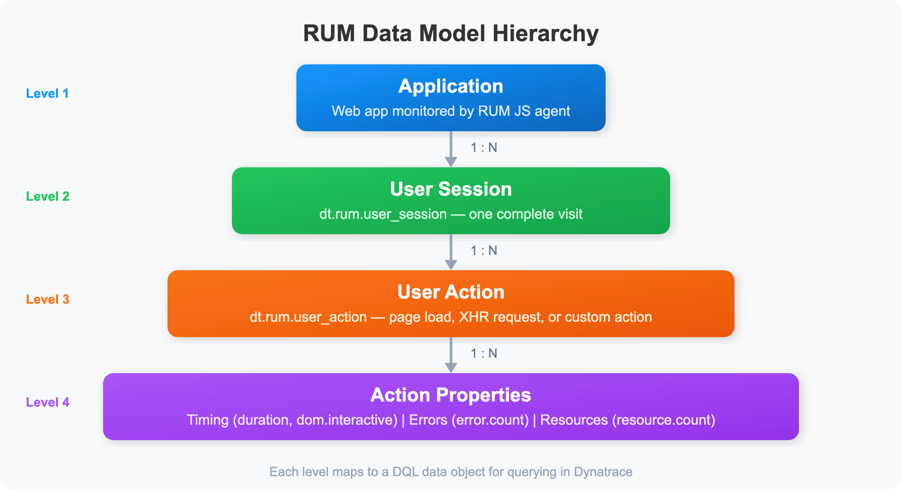

# WEBRUM-01: Web RUM Fundamentals

> **Series:** WEBRUM — Web Real User Monitoring | **Notebook:** 1 of 8 | **Created:** March 2026 | **Last Updated:** 04/04/2026

## Overview

Real User Monitoring (RUM) captures the actual experience of users interacting with your web applications. Unlike synthetic monitoring, which simulates user interactions from controlled locations, RUM measures real browser performance, user behavior, and errors as they happen. Dynatrace RUM uses a lightweight JavaScript agent (OneAgent RUM injection) to automatically capture page loads, user actions, XHR/fetch calls, JavaScript errors, and Core Web Vitals — all flowing into Grail for DQL analysis.

This notebook introduces the fundamentals of Dynatrace Web RUM: how the JavaScript agent works, what data it captures, how that data flows from browser to Grail, and how to write your first DQL queries against RUM data.

---

## Table of Contents

1. [How Dynatrace RUM Works](#how-dynatrace-rum-works)
2. [RUM vs Synthetic Monitoring](#rum-vs-synthetic)
3. [RUM Data Model](#rum-data-model)
4. [Exploring User Sessions](#exploring-user-sessions)
5. [Exploring User Actions](#exploring-user-actions)
6. [Session and Action Counts](#session-and-action-counts)
7. [Summary and Next Steps](#summary)

---

## Prerequisites

| Requirement | Details |
|-------------|----------|
| **Dynatrace Environment** | SaaS with Grail enabled |
| **RUM Enabled** | At least one web application with RUM injection active |
| **Permissions** | `storage:events:read`, `storage:entities:read` |
| **Data** | At least 24 hours of RUM session data |

<a id="how-dynatrace-rum-works"></a>

## 1. How Dynatrace RUM Works

Dynatrace captures real user experience through a **JavaScript agent** that is automatically injected into web pages by OneAgent. The injection process works as follows:

1. **OneAgent instruments the web server** — When a browser requests a page, OneAgent on the server-side injects a small JavaScript snippet into the HTML response.
2. **The JavaScript agent loads** — The injected snippet bootstraps the full RUM JavaScript agent from the Dynatrace CDN or your ActiveGate.
3. **Browser events are captured** — The agent hooks into browser APIs (Performance API, Navigation Timing, Resource Timing, PerformanceObserver) to capture timing data, user interactions, and errors.
4. **Data is sent to Dynatrace** — Captured data is batched and sent as beacons to the Dynatrace cluster via the beacon endpoint.
5. **Data lands in Grail** — Sessions, actions, and errors are stored as structured records queryable via DQL.

### Injection Methods

| Method | How It Works | Best For |
|--------|-------------|----------|
| **Automatic injection** | OneAgent modifies HTML responses at the web server | Traditional server-rendered apps |
| **Manual injection** | Developer adds the RUM script tag manually | CDN-hosted content, SPAs with no server-side agent |
| **Agentless RUM** | JavaScript tag added without full OneAgent | Environments where OneAgent cannot be deployed |

> **Note:** Automatic injection is the recommended approach as it requires zero code changes and keeps the JavaScript agent version in sync with OneAgent.

<a id="rum-vs-synthetic"></a>

## 2. RUM vs Synthetic Monitoring

RUM and synthetic monitoring are complementary approaches — each answers different questions:

| Aspect | RUM | Synthetic |
|--------|-----|----------|
| **Data source** | Real user browsers | Simulated browsers from controlled locations |
| **Coverage** | Only when real users visit | Runs on schedule, even at 3 AM |
| **Variability** | High — reflects real network conditions, devices, geographies | Low — consistent execution environment |
| **Baseline** | Organic — based on actual usage patterns | Fixed — ideal for SLA monitoring |
| **Error detection** | Catches errors users actually encounter | Catches errors in scripted flows |
| **Performance data** | Real-world load times with real content | Clean-room load times (no cache, extensions) |
| **Geographic insight** | Wherever real users are located | Only from configured locations |

> **Tip:** Use synthetic for availability SLAs and baseline benchmarks. Use RUM for understanding the actual user experience and identifying issues affecting real users.

<a id="rum-data-model"></a>

## 3. RUM Data Model

Dynatrace RUM data is organized into a hierarchical model:



<!-- MARKDOWN_TABLE_ALTERNATIVE
| Level | Data Object | Description |
|-------|-------------|-------------|
| 1 | Application | Web app monitored by RUM JS agent |
| 2 | User Session (user.sessions) | One complete visit |
| 3 | User Action (user.events) | Page load, XHR, or custom action |
| 4 | Action Properties | Timing, errors, and resources |
For environments where SVG doesn't render
-->

### Key Data Objects

| DQL Data Object | Description | Key Fields |
|----------------|-------------|------------|
| `user.sessions` | A complete user visit from first page to last | `sessionId`, `userType`, `duration`, `userActionCount`, `totalErrorCount` |
| `user.events` | A single user interaction (page load, click, XHR) | `action.name`, `action.type`, `duration`, `dom.interactive.time` |
| `user.events` | JavaScript or XHR error | `error.message`, `error.type`, `error.source` |

### Session Types

| User Type | Description |
|-----------|-------------|
| `REAL_USER` | Identified or anonymous real visitor |
| `ROBOT` | Bot or crawler detected by Dynatrace |
| `SYNTHETIC` | Synthetic monitor execution |

> **Note:** Always filter for `userType == "REAL_USER"` when analyzing genuine user experience to exclude bots and synthetic executions.

<a id="exploring-user-sessions"></a>

## 4. Exploring User Sessions

Let's start by examining what a user session looks like in Grail. A session represents a single visit — from the first page load to when the user closes the tab or the session times out (30 minutes of inactivity by default).

```dql
// Explore recent user sessions — sample 10 sessions to see available fields
fetch user.sessions, from:-1h
| filter userType == "REAL_USER"
| fieldsKeep sessionId, application, userType, duration, userActionCount, totalErrorCount, city, country, osFamily, browserFamily
| sort duration desc
| limit 10
```

The query above returns the 10 longest sessions from the last hour. Each record includes the session ID, application name, duration, action count (number of interactions), error count, and geographic/device information.

### Session Duration Distribution

Understanding how long sessions last helps identify engagement patterns:

```dql
// Session duration distribution — bucket sessions by duration range
fetch user.sessions, from:-24h
| filter userType == "REAL_USER"
| fieldsAdd duration_sec = toDouble(duration) / 1000000000.0
| fieldsAdd duration_bucket = if(duration_sec < 10, "< 10s",
    else: if(duration_sec < 30, "10-30s",
    else: if(duration_sec < 60, "30-60s",
    else: if(duration_sec < 300, "1-5 min",
    else: "> 5 min"))))
| summarize session_count = count(), by:{duration_bucket}
| sort session_count desc
```

<a id="exploring-user-actions"></a>

## 5. Exploring User Actions

User actions represent individual interactions within a session. Dynatrace automatically detects three types of actions:

| Action Type | Description | Example |
|-------------|-------------|----------|
| **Load** | Full page load or navigation | User navigates to `/checkout` |
| **XHR** | Background XHR/fetch request triggered by interaction | Click triggers API call |
| **Custom** | Developer-defined action via RUM API | Custom business event |

Let's explore the most common user actions:

```dql
// Top 20 user actions by count in the last hour
fetch user.events, from:-1h
| summarize action_count = count(), avg_duration = avg(duration), by:{action.name, action.type}
| sort action_count desc
| limit 20
```

### Page Load Actions with Timing Breakdown

For load-type actions, Dynatrace captures detailed timing milestones:

```dql
// Page load timing breakdown — average timings for the top 10 pages
fetch user.events, from:-1h
| filter action.type == "Load"
| summarize action_count = count(),
    avg_duration = avg(duration),
    avg_dom_interactive = avg(dom.interactive.time),
    avg_load_event = avg(load.event.time),
    by:{action.name}
| sort action_count desc
| limit 10
```

<a id="session-and-action-counts"></a>

## 6. Session and Action Counts

Tracking session and action volume over time reveals traffic patterns, peak hours, and trend changes.

```dql
// Session count over the last 24 hours, bucketed by hour
fetch user.sessions, from:-24h
| filter userType == "REAL_USER"
| makeTimeseries session_count = count(), interval:1h
```

```dql
// Action volume by type over the last 24 hours
fetch user.events, from:-24h
| makeTimeseries action_count = count(), interval:1h, by:{action.type}
```

```dql
// Sessions and actions per application — high-level overview
fetch user.sessions, from:-24h
| filter userType == "REAL_USER"
| summarize session_count = count(),
    total_actions = sum(userActionCount),
    total_errors = sum(totalErrorCount),
    avg_duration = avg(duration),
    by:{application}
| sort session_count desc
```

<a id="summary"></a>

## 7. Summary and Next Steps

In this notebook, we covered:

- **How RUM works** — JavaScript agent injection, browser event capture, beacon delivery to Grail
- **RUM vs synthetic** — Complementary approaches for full UX visibility
- **RUM data model** — Sessions, actions, and errors as hierarchical records in Grail
- **Basic DQL queries** — Exploring sessions, actions, timing breakdowns, and volume trends

### Next Steps

- **WEBRUM-02: SPA Instrumentation** — Deep dive into Single-Page Application monitoring with Angular, React, and Vue.js
- **WEBRUM-03: Core Web Vitals** — Track LCP, INP, and CLS with DQL

### References

- [Dynatrace RUM Overview](https://docs.dynatrace.com/docs/platform-modules/digital-experience/web-applications/setup-and-configuration)
- [RUM JavaScript Agent](https://docs.dynatrace.com/docs/platform-modules/digital-experience/web-applications/setup-and-configuration/rum-javascript)
- [DQL for RUM Data](https://docs.dynatrace.com/docs/observe-and-explore/query-data/dql-guide)

---

<sub>*This notebook was AI-generated from community-submitted and publicly available sources. This notebook series is not officially supported by Dynatrace. Always verify information against official Dynatrace documentation.*</sub>
