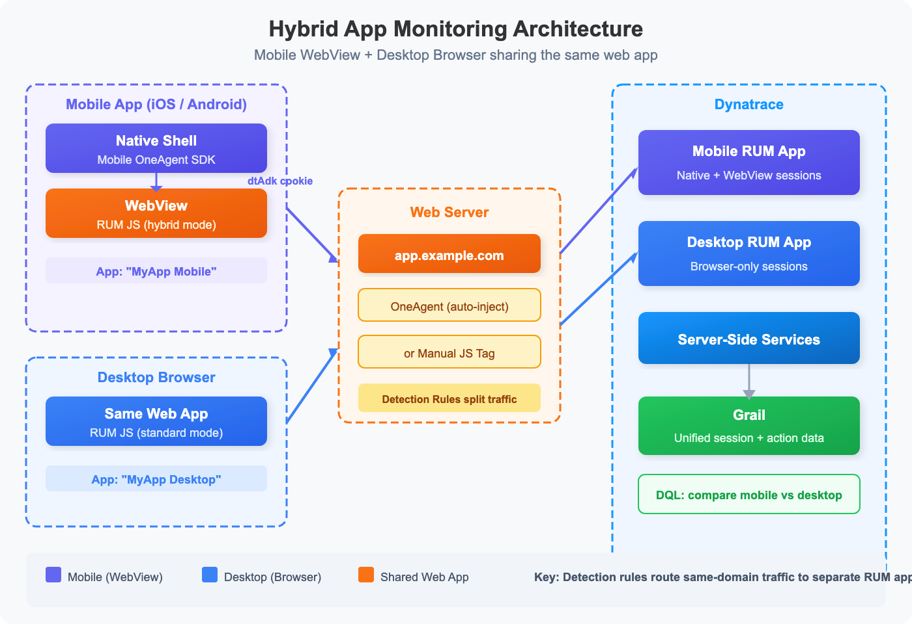

# WEBRUM-02: SPA Instrumentation

> **Series:** WEBRUM | **Notebook:** 2 of 8 | **Created:** March 2026 | **Last Updated:** 03/12/2026

## Overview

Single-Page Applications (SPAs) present unique challenges for Real User Monitoring. Unlike traditional multi-page apps where each navigation triggers a full page load, SPAs dynamically update content via JavaScript — meaning route changes, data fetches, and user interactions happen without the browser firing standard navigation events. Dynatrace addresses this with automatic SPA detection, XHR/fetch monitoring, route change tracking, and custom action naming.

This notebook covers SPA instrumentation strategies for Angular, React, and Vue.js applications, including injection methods, route change detection, framework-specific considerations, and DQL queries to validate your instrumentation.

---

## Table of Contents

1. [SPA Monitoring Challenges](#spa-monitoring-challenges)
2. [RUM Injection Methods](#rum-injection-methods)
3. [Route Change Detection](#route-change-detection)
4. [Framework-Specific Instrumentation](#framework-specific)
5. [Custom Action Naming](#custom-action-naming)
6. [XHR and Fetch Monitoring](#xhr-fetch-monitoring)
7. [Validating SPA Instrumentation](#validating-instrumentation)
8. [Hybrid Apps: Mobile WebView + Desktop](#hybrid-apps)
9. [Summary and Next Steps](#summary)

---

## Prerequisites

| Requirement | Details |
|-------------|----------|
| **Dynatrace Environment** | SaaS with Grail enabled |
| **RUM Enabled** | At least one SPA with RUM injection active |
| **Permissions** | `storage:events:read`, `storage:entities:read` |
| **Knowledge** | Familiarity with SPA frameworks (Angular, React, or Vue.js) |
| **Previous Notebook** | WEBRUM-01: RUM Fundamentals |

<a id="spa-monitoring-challenges"></a>

## 1. SPA Monitoring Challenges

Traditional RUM relies on browser navigation events (`load`, `DOMContentLoaded`) to detect page loads. SPAs break this model:

| Challenge | Traditional App | SPA |
|-----------|----------------|-----|
| **Page load detection** | Browser `load` event fires on every page | Only fires once on initial load |
| **Route changes** | Full HTTP request per page | JavaScript updates the URL and DOM |
| **Data fetching** | Server renders HTML with data | Client fetches data via XHR/fetch after load |
| **User interactions** | Links trigger navigation | Clicks trigger state changes without navigation |
| **Timing measurement** | Navigation Timing API covers full load | Custom timing needed for virtual route changes |

Dynatrace handles these by:

- **Monitoring `history.pushState` and `hashchange`** events for route detection
- **Tracking XHR/fetch calls** triggered by user interactions
- **Grouping related XHR calls** into a single user action
- **Detecting framework-specific lifecycle events** for Angular, React, and Vue.js

> **Important:** SPA monitoring requires the **Async Web Requests** and **SPA route changes** capture settings to be enabled in your web application configuration.

<a id="rum-injection-methods"></a>

## 2. RUM Injection Methods

For SPAs, choose the injection method that matches your deployment architecture:

### Automatic Injection (Recommended)

If your SPA is served by a web server with OneAgent installed, injection happens automatically. OneAgent modifies the HTML response to include the RUM JavaScript snippet in the `<head>` section.

```html
<!-- Automatically injected by OneAgent -->
<script type="text/javascript" src="/ruxitagentjs_..." data-dtconfig="..."></script>
```

### Manual Injection

For SPAs served from CDNs or static hosting (S3, Netlify, Vercel) where no server-side OneAgent exists:

```html
<!-- Add to <head> before other scripts -->
<script type="text/javascript" src="https://your-activegate/jstag/managed/.../ruxitagentjs_..." 
        data-dtconfig="..."></script>
```

### Agentless RUM (JavaScript Tag)

For environments where you cannot install OneAgent at all:

1. Navigate to **Digital Experience > Web Applications > Your App > Setup**
2. Select **Agentless monitoring**
3. Copy the generated `<script>` tag
4. Paste into your application's `index.html`

> **Tip:** For SPAs built with modern bundlers (Webpack, Vite), you can inject the RUM tag via an HTML plugin to keep it out of source code.

<a id="route-change-detection"></a>

## 3. Route Change Detection

Dynatrace detects SPA route changes by monitoring:

- **`history.pushState()` / `history.replaceState()`** — Used by most modern SPAs
- **`hashchange` events** — Used by hash-based routing (e.g., `/#/page`)
- **Framework-specific routing** — Angular Router, React Router, Vue Router

Each detected route change generates a **Route change** user action in Dynatrace, capturing:

| Field | Description |
|-------|-------------|
| `action.name` | The route change action name (e.g., "Route change to /dashboard") |
| `action.type` | `RouteChange` |
| `duration` | Time from route trigger to visual completeness |
| `xhr.count` | Number of XHR/fetch calls during the route change |

Let's query route change actions to validate detection:

```dql
// Route change actions in the last hour — verify SPA detection is working
fetch user.events, from:-1h
| filter action.type == "RouteChange"
| summarize route_count = count(), avg_duration = avg(duration), by:{action.name, app.name}
| sort route_count desc
| limit 20
```

<a id="framework-specific"></a>

## 4. Framework-Specific Instrumentation

### Angular

Angular applications use the Angular Router with `history.pushState`. Dynatrace automatically detects:

- Route changes via `NavigationEnd` events
- Zone.js async tracking for XHR/fetch calls
- Component lifecycle events

**Configuration tips:**
- Enable **Async Web Requests** capture for Zone.js tracked calls
- Set **User action naming rules** to map Angular routes to meaningful names
- For lazy-loaded modules, ensure the RUM agent loads before the router initializes

### React

React applications typically use React Router or Next.js routing:

- Route changes detected via `history.pushState` (React Router v5+) or `startTransition` (React 18+)
- Component renders tracked through XHR/fetch activity
- No Zone.js — relies on standard browser API monitoring

**Configuration tips:**
- For Next.js SSR/SSG, use automatic injection on the Node.js server
- For client-only React apps, use manual or agentless injection
- Set **User action naming** to use URL path segments for clearer action names

### Vue.js

Vue applications use Vue Router with `history.pushState` or hash mode:

- Route changes detected via `router.afterEach` hook monitoring
- Vuex/Pinia store actions tracked through associated XHR calls

**Configuration tips:**
- For Nuxt.js, inject the RUM tag in `nuxt.config.js` head configuration
- Enable **Fetch API monitoring** (disabled by default in some configurations)

> **Note:** Regardless of framework, the key setting is enabling **SPA route changes** in your web application configuration. Without it, Dynatrace only captures the initial page load.

```dql
// Compare action types across applications — identify SPA vs traditional apps
fetch user.events, from:-24h
| summarize action_count = count(), by:{app.name, action.type}
| sort app.name asc, action_count desc
```

If an application shows only `Load` actions and no `RouteChange` or `Xhr` actions, SPA instrumentation may not be configured correctly.

<a id="custom-action-naming"></a>

## 5. Custom Action Naming

Default action names like "loading of page /app/dashboard" or "route change to /app/users/12345" can be noisy — especially with dynamic URL segments (IDs, tokens). Custom action naming rules let you normalize names:

### Naming Rule Configuration

Configure via **Settings > Web and mobile monitoring > User action naming**:

| Rule Type | Example Pattern | Result |
|-----------|----------------|--------|
| **URL cleanup** | `/users/{id}` → `/users/{*}` | Groups all user detail pages |
| **CSS selector** | Use `data-dtname` attribute | `<button data-dtname="Checkout">` |
| **JavaScript variable** | Read from SPA router state | Dynamic names from app context |
| **Regex replacement** | `/api/v[0-9]+/` → `/api/` | Normalize API versions |

### RUM API for Custom Actions

For fine-grained control, use the Dynatrace JavaScript RUM API:

```javascript
// Start a custom action
const actionId = dtrum.enterAction('Checkout - Payment Step');

// ... perform user interaction ...

// End the action
dtrum.leaveAction(actionId);
```

Let's check for custom actions in our environment:

```dql
// Find custom user actions — these indicate manual RUM API usage
fetch user.events, from:-24h
| filter action.type == "Custom"
| summarize custom_count = count(), by:{action.name, app.name}
| sort custom_count desc
| limit 15
```

<a id="xhr-fetch-monitoring"></a>

## 6. XHR and Fetch Monitoring

SPAs rely heavily on asynchronous API calls. Dynatrace monitors both `XMLHttpRequest` and the Fetch API to:

- **Correlate API calls with user actions** — Which button click triggered which API call?
- **Measure API response times** — How long did the backend take?
- **Detect failed requests** — HTTP 4xx/5xx responses and network errors
- **Track third-party calls** — Calls to external APIs, CDNs, analytics services

### Enabling Fetch API Monitoring

By default, Dynatrace monitors `XMLHttpRequest`. For modern SPAs using `fetch()`, ensure the setting is enabled:

**Settings > Web and mobile monitoring > Async web requests and SPAs > Fetch requests**

```dql
// XHR action performance — identify slow API calls impacting user experience
fetch user.events, from:-1h
| filter action.type == "Xhr"
| summarize xhr_count = count(),
    avg_duration = avg(duration),
    p95_duration = percentile(duration, 95),
    by:{action.name}
| sort p95_duration desc
| limit 15
```

```dql
// XHR error rate by action — find failing API calls
fetch user.events, from:-24h
| filter action.type == "Xhr"
| summarize total = count(),
    errors = countIf(isNotNull(error.count) and error.count > 0),
    by:{action.name}
| fieldsAdd error_rate_pct = round(toDouble(errors) / toDouble(total) * 100.0, decimals: 2)
| filter total > 10
| sort error_rate_pct desc
| limit 10
```

<a id="validating-instrumentation"></a>

## 7. Validating SPA Instrumentation

After configuring SPA monitoring, validate that instrumentation is working correctly with this checklist:

| Check | DQL Validation | Expected Result |
|-------|---------------|------------------|
| Route changes detected | Query for `RouteChange` actions | Actions appear for each route |
| XHR/fetch captured | Query for `Xhr` actions | API calls visible per action |
| Action names meaningful | Review action name distribution | No generic/unclear names |
| No duplicate actions | Check for overlapping actions | One action per interaction |
| Custom actions working | Query for `Custom` type | Developer-defined actions appear |

```dql
// Instrumentation health check — action type distribution per app
fetch user.events, from:-24h
| summarize total_actions = count(), by:{app.name, action.type}
| sort app.name asc, total_actions desc
```

<a id="hybrid-apps"></a>

## 8. Hybrid Apps: Mobile WebView + Desktop

A common pattern is a web application served to both desktop browsers and mobile app WebViews — the same `app.example.com` pages, but consumed in two very different contexts. Dynatrace can monitor both as separate RUM applications with full session correlation.



<!-- MARKDOWN_TABLE_ALTERNATIVE
| Component | Description |
|-----------|-------------|
| Mobile App (Native Shell) | iOS/Android app instrumented with Mobile OneAgent SDK |
| Mobile App (WebView) | Embedded browser loading app.example.com, instrumented in hybrid mode |
| Desktop Browser | Standard browser loading app.example.com, standard RUM JS |
| Web Server | Shared origin serving the same web app to both clients |
| Detection Rules | Route same-domain traffic to separate Dynatrace RUM applications |
| Dynatrace | Separate Mobile RUM App and Desktop RUM App with unified Grail storage |
For environments where SVG doesn't render
-->

### Architecture Overview

| Client | Instrumentation | Dynatrace Application |
|---|---|---|
| **iOS / Android app** | Mobile OneAgent SDK + `hybridWebView` enabled | Mobile RUM App ("MyApp Mobile") |
| **Desktop browser** | RUM JavaScript (auto-inject or manual tag) | Web RUM App ("MyApp Desktop") |

Both clients load the **same web pages** from the same origin, but Dynatrace routes them to **separate applications** using application detection rules.

### Step 1: Create Two RUM Applications

In Dynatrace, create two separate applications:

| Application | Type | Purpose |
|---|---|---|
| **MyApp Desktop** | Web Application | Desktop/laptop browser traffic |
| **MyApp Mobile** | Mobile Application | iOS/Android native + WebView traffic |

### Step 2: Configure Application Detection Rules

Detection rules route traffic from the same domain to different applications based on request characteristics.

Navigate to **Settings > Web and mobile monitoring > Application detection** and create rules in this order (higher priority first):

| Priority | Rule | Condition | Target Application |
|---|---|---|---|
| 1 | Mobile WebView | User-Agent header **contains** `MyAppName` (your app's custom UA string) | MyApp Mobile |
| 2 | Desktop fallback | Domain **equals** `app.example.com` | MyApp Desktop |

> **Tip:** Most mobile apps append a custom identifier to the WebView User-Agent string (e.g., `MyAppName/3.2.1`). Use this as the primary differentiator. If your app doesn't, add one via WebView settings:

```java
// Android: Add custom User-Agent suffix
webView.getSettings().setUserAgentString(
    webView.getSettings().getUserAgentString() + " MyAppName/3.2.1"
);
```

```swift
// iOS: Add custom User-Agent suffix
let config = WKWebViewConfiguration()
config.applicationNameForUserAgent = "MyAppName/3.2.1"
let webView = WKWebView(frame: .zero, configuration: config)
```

### Step 3: Enable Hybrid Monitoring in the Mobile SDK

#### Android (Gradle Plugin)

```groovy
// build.gradle (app module)
dynatrace {
    configurations {
        defaultConfig {
            autoStart {
                applicationId "your-application-id"
                beaconUrl "https://your-env.bf.dynatrace.com/mbeacon"
            }
            hybridWebView {
                enabled true
                domains "app.example.com"   // Only instrument your own domain
            }
        }
    }
}
```

Then instrument the WebView instance:

```kotlin
// In your Activity or Fragment
import com.dynatrace.android.agent.Dynatrace

val webView = findViewById<WebView>(R.id.webView)
Dynatrace.instrumentWebView(webView)
webView.loadUrl("https://app.example.com")
```

#### iOS (plist or manual config)

Add to your `Info.plist`:

```xml
<key>DTXHybridApplication</key>
<true/>
<key>DTXMonitoredDomains</key>
<array>
    <string>app.example.com</string>
</array>
```

Or configure programmatically:

```swift
import Dynatrace

// In AppDelegate or SceneDelegate
Dynatrace.startupWithInfoPlistSettings()

// When creating a WKWebView
let webView = WKWebView(frame: view.bounds)
// The SDK automatically instruments WKWebView when DTXHybridApplication is true
```

### Step 4: Session Correlation (dtAdk Cookie)

When hybrid monitoring is enabled, the Mobile OneAgent SDK sets a **`dtAdk` cookie** on the WebView domain. This cookie links the WebView's web session to the native mobile session, creating a **unified session** that includes both native actions (taps, gestures) and web actions (page loads, XHR calls).

| Correlation Mechanism | Description |
|---|---|
| `dtAdk` cookie | Set by Mobile SDK on the WebView; links web beacon to mobile session |
| `x-dtc` header | Propagated on XHR/fetch requests for distributed tracing |
| `applicationId` | Routes beacons to the correct Dynatrace application |

> **Important:** Only add your own domains to `domains` / `DTXMonitoredDomains`. Never instrument third-party WebViews (e.g., OAuth login pages, payment providers) — this can break functionality and violate privacy policies.

### Step 5: Validate the Setup

After deploying both applications, verify that:

1. **Desktop sessions** appear under "MyApp Desktop" with standard browser User-Agents
2. **Mobile WebView sessions** appear under "MyApp Mobile" with your custom UA string
3. **Mobile sessions show both native and web actions** in a single session timeline
4. **Distributed traces** connect WebView XHR calls to server-side services

```dql
// Compare user action metrics between mobile WebView and desktop browser apps
fetch user.events, from:-24h
| filter application.name == "MyApp Desktop" or application.name == "MyApp Mobile"
| summarize
    actions = count(),
    avg_duration = avg(duration),
    error_rate = toDouble(countIf(error.count > 0)) / toDouble(count()) * 100,
    by:{application.name, action.type}
| sort application.name asc, actions desc
```

### WebView Session Analysis

Identify sessions in the mobile app that include WebView activity — these are your hybrid users.

```dql
// Identify WebView sessions in the mobile app — these have both native and web actions
fetch user.events, from:-24h
| filter application.name == "MyApp Mobile"
| summarize
    native_actions = countIf(action.type == "Custom" or action.type == "UserAction"),
    web_actions = countIf(in(action.type, {"Load", "RouteChange", "Xhr"})),
    by:{user.session.id}
| filter web_actions > 0
| sort web_actions desc
| limit 20
```

### Performance Comparison: Mobile WebView vs Desktop

WebView performance typically differs from desktop browsers due to device constraints, network conditions, and rendering engine differences.

```dql
// Compare page load performance: mobile WebView vs desktop browser
fetch user.events, from:-24h
| filter action.type == "Load"
| filter application.name == "MyApp Desktop" or application.name == "MyApp Mobile"
| summarize
    p50_duration = percentile(duration, 50),
    p95_duration = percentile(duration, 95),
    avg_dom_interactive = avg(dom.interactive.time),
    actions = count(),
    by:{application.name}
```

<a id="summary"></a>

## 9. Summary and Next Steps

In this notebook, we covered:

- **SPA monitoring challenges** — Why traditional page-load tracking fails for SPAs
- **Injection methods** — Automatic, manual, and agentless approaches
- **Route change detection** — How Dynatrace captures SPA navigation
- **Framework-specific tips** — Angular, React, and Vue.js considerations
- **Custom action naming** — Normalizing action names for cleaner analytics
- **XHR/fetch monitoring** — Tracking API call performance and errors
- **Hybrid app setup** — Monitoring mobile WebView and desktop browser as separate RUM applications

### Next Steps

- **WEBRUM-03: Core Web Vitals** — Measure LCP, INP, and CLS with DQL
- **WEBRUM-05: Error Analysis** — Deep dive into JavaScript error tracking in SPAs

### References

- [SPA Monitoring](https://docs.dynatrace.com/docs/platform-modules/digital-experience/web-applications/setup-and-configuration/rum-javascript/spa-monitoring)
- [Hybrid App Monitoring (Android)](https://docs.dynatrace.com/docs/observe/digital-experience/new-rum-experience/mobile-frontends/android/hybrid-app-monitoring)
- [Application Detection Rules](https://docs.dynatrace.com/docs/observe/digital-experience/web-applications/setup-and-configuration/application-detection)
- [Custom Action Naming](https://docs.dynatrace.com/docs/platform-modules/digital-experience/web-applications/setup-and-configuration/user-action-naming)
- [RUM JavaScript API](https://docs.dynatrace.com/docs/platform-modules/digital-experience/web-applications/setup-and-configuration/rum-javascript/rum-javascript-api)

---

<sub>*This notebook was AI-generated from community-submitted and publicly available sources. This notebook series is not officially supported by Dynatrace. Always verify information against official Dynatrace documentation.*</sub>
