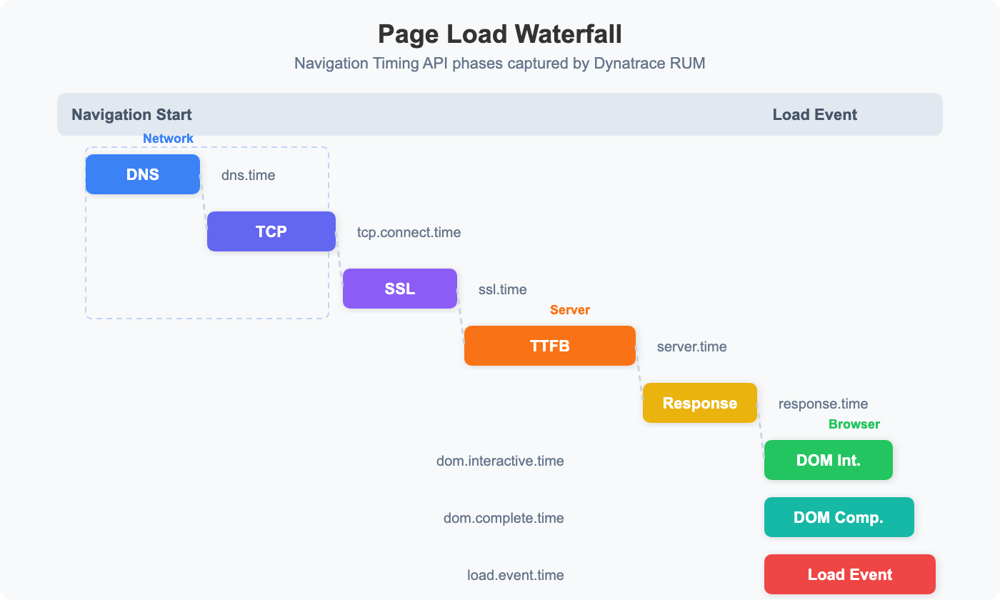

# WEBRUM-06: Performance Analysis

> **Series:** WEBRUM — Web Real User Monitoring | **Notebook:** 6 of 8 | **Created:** March 2026 | **Last Updated:** 03/12/2026

## Overview

Web performance directly impacts user experience, conversion rates, and SEO rankings. While Core Web Vitals (covered in WEBRUM-03) provide high-level scoring, a deeper performance analysis requires understanding the full page load waterfall — from DNS lookup to load complete — and how performance varies across geographies, network conditions, and device types.

This notebook covers page load waterfall analysis, time-to-first-byte (TTFB), DOM interactive timing, speed index concepts, performance by geography and network type, and techniques for identifying slow pages and bottlenecks.

---

## Table of Contents

1. [Page Load Waterfall](#page-load-waterfall)
2. [Time to First Byte (TTFB)](#ttfb)
3. [DOM Interactive and Load Event](#dom-timing)
4. [Performance by Geography](#perf-by-geo)
5. [Performance by Network and Device](#perf-by-device)
6. [Identifying Slow Pages](#slow-pages)
7. [Performance Trends](#performance-trends)
8. [Summary and Next Steps](#summary)

---

## Prerequisites

| Requirement | Details |
|-------------|----------|
| **Dynatrace Environment** | SaaS with Grail enabled |
| **RUM Enabled** | Web applications with detailed timing capture |
| **Permissions** | `storage:events:read` |
| **Previous Notebooks** | WEBRUM-01: RUM Fundamentals, WEBRUM-03: Core Web Vitals |

<a id="page-load-waterfall"></a>

## 1. Page Load Waterfall

Every page load follows a sequence of phases captured by the browser's Navigation Timing API. Dynatrace records these milestones for each load action:



<!-- MARKDOWN_TABLE_ALTERNATIVE
| Phase | DQL Field | Category |
|-------|-----------|----------|
| DNS Lookup | dns.time | Network |
| TCP Connect | tcp.connect.time | Network |
| SSL Handshake | ssl.time | Network |
| Time to First Byte | server.time | Server |
| Response Download | response.time | Server |
| DOM Interactive | dom.interactive.time | Browser |
| DOM Complete | dom.complete.time | Browser |
| Load Event | load.event.time | Browser |
For environments where SVG doesn't render
-->

### Timing Milestones Explained

| Milestone | Description | Optimization Focus |
|-----------|-------------|--------------------|
| **DNS time** | Domain name resolution | Use DNS prefetching, reduce DNS lookups |
| **TCP connect** | Establishing TCP connection | Enable HTTP/2, use CDN edge servers |
| **SSL time** | TLS handshake | Enable TLS 1.3, OCSP stapling |
| **TTFB** | Server processing + first byte transit | Optimize server response time |
| **Response time** | Full HTML download | Compress, minimize HTML size |
| **DOM interactive** | HTML parsed, DOM ready for interaction | Defer non-critical JS, reduce blocking resources |
| **DOM complete** | All sub-resources loaded | Lazy load images, async load scripts |
| **Load event** | `window.onload` fires | Final milestone; all resources ready |

```dql
// Page load waterfall — average timing breakdown for top 10 pages
fetch user.events, from:-24h
| filter action.type == "Load"
| summarize page_views = count(),
    avg_duration = avg(duration),
    avg_dom_interactive = avg(dom.interactive.time),
    avg_load_event = avg(load.event.time),
    avg_server_time = avg(server.time),
    by:{action.name}
| sort page_views desc
| limit 10
```

<a id="ttfb"></a>

## 2. Time to First Byte (TTFB)

TTFB measures the time from the browser sending the request to receiving the first byte of the response. It reflects:

- **Server processing time** — How long the backend takes to generate the response
- **Network latency** — Round-trip time between client and server
- **CDN performance** — Cache hit/miss at the edge

Google recommends a TTFB of **≤ 800ms** for a good user experience.

```dql
// TTFB analysis by page — identify pages with slow server response
fetch user.events, from:-24h
| filter action.type == "Load"
| filter isNotNull(server.time)
| summarize page_views = count(),
    avg_ttfb = avg(server.time),
    p75_ttfb = percentile(server.time, 75),
    p95_ttfb = percentile(server.time, 95),
    by:{action.name}
| filter page_views > 10
| sort p75_ttfb desc
| limit 10
```

```dql
// TTFB distribution — classify into Good / Needs Improvement / Poor
fetch user.events, from:-24h
| filter action.type == "Load"
| filter isNotNull(server.time)
| fieldsAdd ttfb_ms = toDouble(server.time) / 1000000.0
| fieldsAdd ttfb_category = if(ttfb_ms <= 800, "Good",
    else: if(ttfb_ms <= 1800, "Needs Improvement",
    else: "Poor"))
| summarize action_count = count(), by:{ttfb_category}
| sort action_count desc
```

<a id="dom-timing"></a>

## 3. DOM Interactive and Load Event

**DOM Interactive** is when the HTML has been fully parsed and the DOM tree is ready — but images, stylesheets, and sub-frames may still be loading. This is when users can first interact with the page.

**Load Event** fires when all resources (images, scripts, stylesheets, iframes) have finished loading. The gap between DOM Interactive and Load Event reveals how much time is spent on sub-resource loading.

```dql
// DOM Interactive vs Load Event — identify resource-heavy pages
fetch user.events, from:-24h
| filter action.type == "Load"
| filter isNotNull(dom.interactive.time) and isNotNull(load.event.time)
| summarize page_views = count(),
    avg_dom_interactive = avg(dom.interactive.time),
    avg_load_event = avg(load.event.time),
    by:{action.name}
| fieldsAdd resource_load_gap = avg_load_event - avg_dom_interactive
| filter page_views > 10
| sort resource_load_gap desc
| limit 10
```

A large gap between DOM Interactive and Load Event suggests the page has many sub-resources (large images, heavy scripts, third-party tags) that delay full load completion. Consider lazy loading and async script loading to reduce this gap.

<a id="perf-by-geo"></a>

## 4. Performance by Geography

Performance varies significantly by user location due to network latency, CDN coverage, and server proximity.

```dql
// Page load performance by country — identify slow regions
fetch user.events, from:-24h
| filter action.type == "Load"
| filter isNotNull(country)
| summarize page_views = count(),
    avg_duration_ms = avg(toDouble(duration) / 1000000.0),
    p75_duration_ms = percentile(toDouble(duration) / 1000000.0, 75),
    avg_ttfb_ms = avg(toDouble(server.time) / 1000000.0),
    by:{country}
| filter page_views > 20
| sort p75_duration_ms desc
| limit 15
```

```dql
// Compare TTFB across regions — CDN effectiveness indicator
fetch user.events, from:-24h
| filter action.type == "Load"
| filter isNotNull(continent)
| summarize page_views = count(),
    avg_ttfb_ms = avg(toDouble(server.time) / 1000000.0),
    p75_ttfb_ms = percentile(toDouble(server.time) / 1000000.0, 75),
    by:{continent}
| sort p75_ttfb_ms desc
```

> **Tip:** If TTFB is consistently high for specific regions, consider deploying CDN edge servers or regional server instances closer to those users.

<a id="perf-by-device"></a>

## 5. Performance by Network and Device

Network connection type and device capability significantly impact perceived performance.

```dql
// Performance by connection type — wifi vs cellular vs wired
fetch user.events, from:-24h
| filter action.type == "Load"
| filter isNotNull(connection.type)
| summarize page_views = count(),
    avg_duration_ms = avg(toDouble(duration) / 1000000.0),
    p75_duration_ms = percentile(toDouble(duration) / 1000000.0, 75),
    by:{connection.type}
| sort p75_duration_ms desc
```

```dql
// Performance by browser — which browsers are slowest?
fetch user.events, from:-24h
| filter action.type == "Load"
| filter isNotNull(browser.family)
| summarize page_views = count(),
    avg_duration_ms = avg(toDouble(duration) / 1000000.0),
    p75_duration_ms = percentile(toDouble(duration) / 1000000.0, 75),
    by:{browser.family}
| filter page_views > 20
| sort p75_duration_ms desc
| limit 10
```

```dql
// Performance by OS — desktop vs mobile operating systems
fetch user.events, from:-24h
| filter action.type == "Load"
| filter isNotNull(os.family)
| summarize page_views = count(),
    avg_duration_ms = avg(toDouble(duration) / 1000000.0),
    p75_duration_ms = percentile(toDouble(duration) / 1000000.0, 75),
    by:{os.family}
| filter page_views > 20
| sort p75_duration_ms desc
```

<a id="slow-pages"></a>

## 6. Identifying Slow Pages

Find the pages that need optimization attention — ranked by the impact of their slowness (volume x duration).

```dql
// Slowest pages by p95 duration — worst-case performance
fetch user.events, from:-24h
| filter action.type == "Load"
| summarize page_views = count(),
    avg_ms = avg(toDouble(duration) / 1000000.0),
    p75_ms = percentile(toDouble(duration) / 1000000.0, 75),
    p95_ms = percentile(toDouble(duration) / 1000000.0, 95),
    by:{action.name}
| filter page_views > 20
| sort p95_ms desc
| limit 10
```

```dql
// Weighted impact score — pages with high traffic AND high duration
fetch user.events, from:-24h
| filter action.type == "Load"
| summarize page_views = count(),
    avg_ms = avg(toDouble(duration) / 1000000.0),
    by:{action.name}
| fieldsAdd impact_score = page_views * avg_ms
| sort impact_score desc
| limit 10
```

> **Tip:** The impact score (page views x average duration) helps prioritize optimization efforts. A moderately slow page with high traffic may be more impactful than a very slow page with few visitors.

<a id="performance-trends"></a>

## 7. Performance Trends

Track performance over time to detect regressions and measure the impact of optimizations.

```dql
// Page load duration trend — daily p75 over the last 7 days
fetch user.events, from:-7d
| filter action.type == "Load"
| fieldsAdd duration_ms = toDouble(duration) / 1000000.0
| makeTimeseries p75_duration = percentile(duration_ms, 75), interval:1d
```

```dql
// TTFB trend — hourly p75 over the last 24 hours
fetch user.events, from:-24h
| filter action.type == "Load"
| filter isNotNull(server.time)
| fieldsAdd ttfb_ms = toDouble(server.time) / 1000000.0
| makeTimeseries p75_ttfb = percentile(ttfb_ms, 75), interval:1h
```

<a id="summary"></a>

## 8. Summary and Next Steps

In this notebook, we covered:

- **Page load waterfall** — Full timing breakdown from DNS to load complete
- **TTFB analysis** — Server response time measurement and classification
- **DOM timing** — Interactive vs complete timing for resource load gap analysis
- **Geographic performance** — Regional and continental performance differences
- **Network/device performance** — Impact of connection type, browser, and OS
- **Slow page identification** — Ranking pages by p95 duration and impact score
- **Performance trends** — Time-series tracking for regression detection

### Next Steps

- **WEBRUM-07: Session Replay** — Visually investigate slow page experiences
- **WEBRUM-08: Dashboards and Alerting** — Build operational RUM dashboards with Apdex

### References

- [Dynatrace Performance Analysis](https://docs.dynatrace.com/docs/platform-modules/digital-experience/web-applications/analyze-and-use/waterfall-analysis)
- [Navigation Timing API](https://developer.mozilla.org/en-US/docs/Web/API/Navigation_timing_API)
- [TTFB Best Practices](https://web.dev/ttfb/)

---

<sub>*This notebook was AI-generated from community-submitted and publicly available sources. This notebook series is not officially supported by Dynatrace. Always verify information against official Dynatrace documentation.*</sub>
