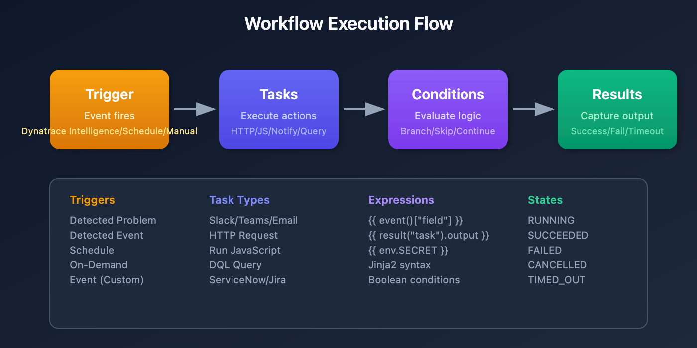

# WFLOW-01: Workflow Fundamentals

> **Series:** WFLOW — Workflows and Alert Notifications | **Notebook:** 1 of 10 | **Created:** January 2026 | **Last Updated:** 04/25/2026

## Introduction to Dynatrace Workflows
Dynatrace Workflows is the automation engine that enables event-driven automation, scheduled tasks, and integration orchestration. This notebook introduces core concepts, components, and your first workflow.

---

## Table of Contents

1. [What Are Workflows?](#what-are-workflows)
2. [Workflows vs Other Automation](#workflows-vs-other-automation)
3. [Workflow Components](#workflow-components)
4. [Accessing Workflows](#accessing-workflows)
5. [Execution Model](#execution-model)
6. [Your First Workflow](#your-first-workflow)
7. [Viewing Execution History](#viewing-execution-history)

---

## Prerequisites

| Requirement | Details |
|-------------|----------|
| **Dynatrace Environment** | SaaS with Platform subscription |
| **Permissions** | `automation:workflows:read`, `automation:workflows:write` |
| **Prior Knowledge** | Basic Dynatrace navigation |

<a id="what-are-workflows"></a>
## 1. What Are Workflows?
**Workflows** are automated sequences of tasks that execute in response to events, schedules, or manual triggers. They enable:

| Capability | Example |
|------------|----------|
| **Alert Notifications** | Send Slack/Teams messages when problems occur |
| **Incident Management** | Create PagerDuty/ServiceNow tickets automatically |
| **Auto-Remediation** | Restart pods, scale resources, run scripts |
| **Reporting** | Generate and email daily reports |
| **Integration** | Sync data with external systems |
| **Data Enrichment** | Query APIs and enrich events |

### Key Benefits

- **No Infrastructure** - Runs in Dynatrace, no external servers needed
- **Event-Driven** - Triggers on detected problems, metric events, schedules
- **Low-Code + Code** - Visual builder with JavaScript option
- **Secure** - Built-in secrets management, RBAC, audit logs
- **Observable** - Execution history, metrics, debugging

<a id="workflows-vs-other-automation"></a>
## 2. Workflows vs Other Automation
Dynatrace offers multiple automation approaches. When should you use Workflows?

| Approach | Best For | Limitations |
|----------|----------|-------------|
| **Workflows** | Event-driven automation, notifications, integrations | Rate limits, execution time limits |
| **Alerting Profiles** (Legacy) | Simple email/webhook notifications | Limited routing, no logic |
| **Apps (AppEngine)** | Custom UI, complex applications | Requires development expertise |
| **Extensions** | Data collection, custom metrics | Not for automation/notifications |
| **Site Reliability Guardian** | Release validation, SLO verification | Specific to deployment validation |

### Migration from Legacy Alerting

| Legacy Alerting | Workflow Equivalent |
|-----------------|---------------------|
| Problem notification → Email | Detected Problem trigger → Email task |
| Problem notification → Webhook | Detected Problem trigger → HTTP Request task |
| Custom integration | Detected Problem trigger → JavaScript + HTTP |

> **Recommendation:** New implementations should use Workflows. Legacy alerting profiles will eventually be deprecated.

<a id="workflow-components"></a>
## 3. Workflow Components
Every workflow consists of these components:

### 3.1 Trigger

What starts the workflow:

| Trigger Type | Starts When | Use Case |
|--------------|-------------|----------|
| **Detected Problem** | Dynatrace Intelligence detects a problem | Alert notifications |
| **Detected Event** | Metric threshold breached | Capacity alerts |
| **Schedule** | Cron expression matches | Daily reports |
| **On-Demand** | Manual execution or API call | Testing, ad-hoc runs |
| **Event Trigger** | Custom/business event ingested | Business process automation |

### 3.2 Tasks

Actions the workflow performs:

| Task Category | Examples |
|---------------|----------|
| **Notifications** | Slack, Teams, Email, PagerDuty |
| **Incident Management** | ServiceNow, Jira |
| **Data Queries** | DQL queries, entity lookups |
| **HTTP Requests** | REST API calls to any endpoint |
| **JavaScript** | Custom code execution |
| **Control Flow** | Wait, conditions, loops |

### 3.3 Conditions

Logic that controls task execution:

```
conditions:
  - name: is_critical
    expression: '{{ event()["severity"] == "CRITICAL" }}'
```

### 3.4 Expressions

Dynamic values using Jinja2 syntax:

```
{{ event()["title"] }}           # Access trigger data
{{ result("task_name").output }} # Access task output
{{ env.SECRET_NAME }}             # Access secrets
```

### Visual: Workflow Execution Flow



<!-- MARKDOWN_TABLE_ALTERNATIVE
| Stage | Description | Examples |
|-------|-------------|----------|
| Trigger | Event that starts workflow | Detected Problem, Schedule, On-Demand |
| Tasks | Actions to execute | Slack, HTTP, JavaScript, DQL |
| Conditions | Logic to control flow | Severity checks, boolean expressions |
| Results | Capture output | SUCCEEDED, FAILED, TIMED_OUT |
For environments where SVG doesn't render
-->

<a id="accessing-workflows"></a>
## 4. Accessing Workflows
### Navigation

1. Open Dynatrace
2. Go to **Apps** in the left navigation
3. Search for and open **Workflows**

Or use the direct URL: `https://<your-environment>/ui/apps/dynatrace.automations/workflows`

### Required Permissions

| Permission | Allows |
|------------|--------|
| `automation:workflows:read` | View workflows, view execution history |
| `automation:workflows:write` | Create, edit, delete workflows |
| `automation:workflows:run` | Execute workflows manually |
| `automation:workflows:admin` | Full admin access |

### Workflow Listing

The Workflows app shows:
- **My Workflows** - Workflows you created
- **Shared with me** - Workflows shared by others
- **All Workflows** - All workflows you can access

<a id="execution-model"></a>
## 5. Execution Model
Understanding how workflows execute is important for designing reliable automation.

### Execution Flow

```
Trigger fires
    ↓
Workflow instance created
    ↓
Tasks execute (sequential or parallel)
    ↓
Conditions evaluated at each step
    ↓
Results captured
    ↓
Execution complete (success/failure)
```

### Limits and Quotas

| Limit | Value | Notes |
|-------|-------|-------|
| Max execution time | 15 minutes | Per workflow execution |
| Max concurrent executions | 100 | Per environment |
| Max tasks per workflow | 50 | Design for simplicity |
| Task timeout | 5 minutes | Per individual task |
| Rate limit | Varies | Depends on subscription |

### Execution States

| State | Meaning |
|-------|----------|
| `RUNNING` | Currently executing |
| `SUCCEEDED` | Completed successfully |
| `FAILED` | One or more tasks failed |
| `CANCELLED` | Manually cancelled |
| `TIMED_OUT` | Exceeded execution limit |

<a id="your-first-workflow"></a>
## 6. Your First Workflow
Let's create a simple workflow that logs a message when manually triggered.

### Step 1: Create New Workflow

1. Open **Workflows** app
2. Click **+ Workflow**
3. Name it: `Hello World Workflow`

### Step 2: Configure Trigger

1. Click the trigger box (top of canvas)
2. Select **On demand** trigger
3. This allows manual execution for testing

### Step 3: Add a Task

1. Click **+** below the trigger
2. Search for **Run JavaScript**
3. Add the following code:

```javascript
export default async function() {
  const now = new Date().toISOString();
  console.log(`Hello from Dynatrace Workflows at ${now}`);
  
  return {
    message: "Workflow executed successfully!",
    timestamp: now
  };
}
```

### Step 4: Save and Run

1. Click **Save**
2. Click **Run** (play button)
3. View execution results

### Expected Output

The task output should show:

```json
{
  "message": "Workflow executed successfully!",
  "timestamp": "2026-01-27T12:00:00.000Z"
}
```

<a id="viewing-execution-history"></a>
## 7. Viewing Execution History
Monitor your workflow executions using DQL queries.

```dql
// Recent workflow executions
fetch events, from: now() - 24h
| filter event.type == "automation.workflow.execution"
| fields timestamp, 
         workflow.name, 
         execution.id,
         execution.status,
         execution.duration
| sort timestamp desc
| limit 20
```

```dql
// Workflow execution summary
fetch events, from: now() - 7d
| filter event.type == "automation.workflow.execution"
| summarize 
    total = count(),
    succeeded = countIf(execution.status == "SUCCEEDED"),
    failed = countIf(execution.status == "FAILED"),
    by:{workflow.name}
| fieldsAdd success_rate = round(100.0 * succeeded / total, decimals: 2)
| sort total desc
| limit 20
```

```dql
// Failed workflow executions
fetch events, from: now() - 24h
| filter event.type == "automation.workflow.execution"
| filter execution.status == "FAILED"
| fields timestamp, workflow.name, execution.id, execution.error
| sort timestamp desc
| limit 20
```

## Next Steps

Now that you understand workflow fundamentals, continue with:

### Recommended Path

1. **WFLOW-02: Triggers & Event Types** - Configure event-driven triggers
2. **WFLOW-03: Alert Notification Basics** - Send Slack, Teams, email alerts
3. **WFLOW-04: Advanced Notification Routing** - Conditional routing and escalation

### Key Takeaways

- Workflows automate responses to events, schedules, and manual triggers
- Components: Triggers → Tasks → Conditions → Results
- Use Workflows for notifications, integrations, and auto-remediation
- Monitor execution history via DQL queries

---

## Summary

In this notebook, you learned:

- What Dynatrace Workflows are and when to use them
- How workflows compare to other automation options
- Core workflow components (triggers, tasks, conditions)
- How to access and navigate the Workflows app
- The execution model and limits
- How to create your first workflow
- How to query execution history

---

## References

- [Dynatrace Workflows Documentation](https://docs.dynatrace.com/docs/platform/workflows)
- [Workflow Triggers](https://docs.dynatrace.com/docs/platform/workflows/triggers)
- [Workflow Actions](https://docs.dynatrace.com/docs/platform/workflows/actions)
- [Jinja Expressions](https://docs.dynatrace.com/docs/platform/workflows/expressions)

---

<sub>*This notebook was AI-generated from community-submitted and publicly available sources. This notebook series is not officially supported by Dynatrace. Always verify information against official Dynatrace documentation.*</sub>
