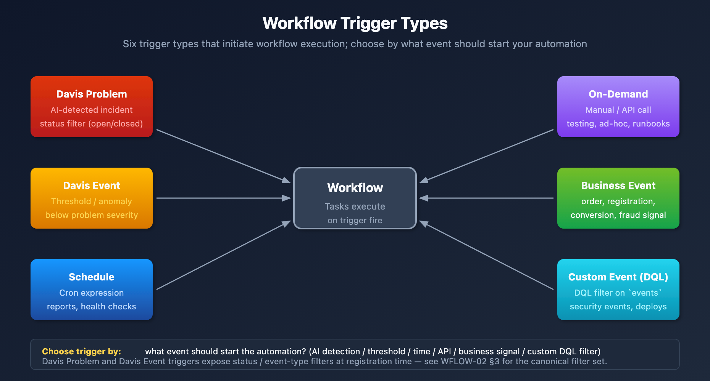
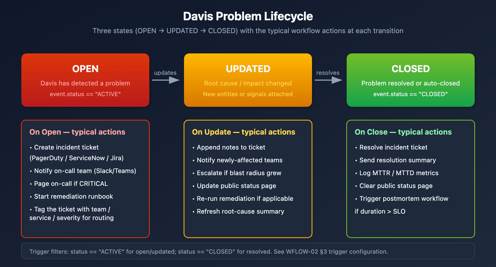

# WFLOW-02: Triggers & Event Types

> **Series:** WFLOW — Workflows and Alert Notifications | **Notebook:** 2 of 10 | **Created:** January 2026 | **Last Updated:** 06/23/2026

## Event-Driven Workflow Triggers
Triggers determine when workflows execute. This notebook covers all trigger types, detected problem events, metric events, schedules, and custom event triggers.

---

## Table of Contents

1. [Detected Problem Trigger](#davis-problem-trigger)
2. [Detected Event Trigger (Metrics)](#davis-event-trigger-metrics)
3. [Schedule Trigger](#schedule-trigger)
4. [On-Demand Trigger](#on-demand-trigger)
5. [Event Trigger (Custom/Business Events)](#event-trigger-custombusiness-events)
6. [Trigger Data and Expressions](#trigger-data-and-expressions)
7. [Davis Problem Event Payload Reference](#davis-problem-payload-reference)

---

## Prerequisites

| Requirement | Details |
|-------------|----------|
| **Dynatrace Environment** | SaaS with Platform subscription |
| **Permissions** | `automation:workflows:write` |
| **Prior Knowledge** | **WFLOW-01: Workflow Fundamentals** |

## 1. Trigger Types Overview

| Trigger Type | Fires When | Primary Use Case |
|--------------|------------|------------------|
| **Detected Problem** | Dynatrace Intelligence detects/updates/closes a problem | Alert notifications, incident management |
| **Detected Event** | Metric threshold breached | Capacity alerts, proactive notifications |
| **Schedule** | Cron expression matches | Reports, health checks, cleanup jobs |
| **On-Demand** | Manual execution or API call | Testing, ad-hoc automation |
| **Event** | Business/custom event ingested | Business process automation |



<!-- MARKDOWN_TABLE_ALTERNATIVE
| Trigger | Source | Use Case |
|---------|--------|----------|
| Detected Problem | AI detects incident | Alert notifications |
| Detected Event | Metric threshold | Capacity alerts |
| Schedule | Cron expression | Reports, health checks |
| On-Demand | Manual/API | Testing, ad-hoc |
| Event | Business event | Business automation |
For environments where SVG doesn't render
-->

### Choosing the Right Trigger

| Scenario | Recommended Trigger |
|----------|---------------------|
| "Notify when a service is slow" | Detected Problem |
| "Alert when CPU > 90% for 5 mins" | Detected Event |
| "Send weekly status report" | Schedule |
| "Process order completion events" | Event (bizevents) |
| "Test my workflow" | On-Demand |

<a id="davis-problem-trigger"></a>
## 2. Detected Problem Trigger
The most common trigger for alert notifications. Fires when Dynatrace Intelligence detects problems.

### Trigger Configuration

| Setting | Description | Example |
|---------|-------------|----------|
| **Categories** | Problem types to include | Infrastructure, Application |
| **Entity Type** | Entity types to filter | Service, Host, Process |
| **Management Zones** | Scope to specific zones | Production, Checkout |
| **Tags** | Entity tags to match | `env:prod`, `team:checkout` |

### Problem Event Data

When a detected problem triggers, you get access to:

```json
{
  "display_id": "P-12345",
  "title": "High response time on checkout service",
  "severity": "CRITICAL",
  "status": "OPEN",
  "start_time": "2026-01-27T10:00:00Z",
  "affected_entity_ids": ["SERVICE-ABC123"],
  "root_cause_entity_id": "HOST-XYZ789",
  "management_zones": ["Production"],
  "impacted_entities": [...],
  "problem_url": "https://env.dynatrace.com/ui/problems/P-12345"
}
```

### Problem Lifecycle Events

| Event | When | Typical Action |
|-------|------|----------------|
| Problem opened | New problem detected | Create incident, notify team |
| Problem updated | Root cause/impact changed | Update incident notes |
| Problem closed | Problem resolved | Close incident, send summary |



<!-- MARKDOWN_TABLE_ALTERNATIVE
| State | Description | Typical Workflow Actions |
|-------|-------------|--------------------------|
| OPENED | Problem detected | Create ticket, notify team, page if critical |
| UPDATED | Root cause changed | Add notes, escalate if spreading |
| CLOSED | Problem resolved | Resolve ticket, send summary, log MTTR |
For environments where SVG doesn't render
-->

### Example: Filter Critical Production Problems

```yaml
trigger:
  type: davis-problem
  config:
    categories:
      - AVAILABILITY
      - PERFORMANCE
    entityTagsMatch: all
    entityTags:
      - key: env
        value: prod
```

<a id="davis-event-trigger-metrics"></a>
## 3. Detected Event Trigger (Metrics)
Trigger based on metric thresholds without creating a detected problem.

### When to Use

- **Proactive alerts** before Dynatrace Intelligence detects a problem
- **Capacity warnings** (disk 80%, memory usage)
- **Business KPIs** (orders/minute, cart abandonment)
- **Custom thresholds** different from baselines

### Configuration

| Setting | Description |
|---------|-------------|
| **DQL Query** | Metric query defining the threshold |
| **Evaluation Frequency** | How often to check (1m - 1h) |
| **Alert Condition** | When the threshold is breached |

### Example: CPU Warning at 80%

```yaml
trigger:
  type: davis-event
  config:
    query: |
      timeseries avg_cpu = avg(builtin:host.cpu.usage), by:{dt.entity.host}
      | filter avg_cpu > 80
    evaluationFrequency: "5m"
```

### Event Data

```json
{
  "metric_key": "builtin:host.cpu.usage",
  "value": 85.5,
  "threshold": 80,
  "entity_id": "HOST-ABC123",
  "triggered_at": "2026-01-27T10:00:00Z"
}
```

<a id="schedule-trigger"></a>
## 4. Schedule Trigger
Execute workflows on a recurring schedule using cron expressions.

### Cron Expression Format

```
┌───────────── minute (0-59)
│ ┌───────────── hour (0-23)
│ │ ┌───────────── day of month (1-31)
│ │ │ ┌───────────── month (1-12)
│ │ │ │ ┌───────────── day of week (0-6, Sun=0)
│ │ │ │ │
* * * * *
```

### Common Schedules

| Schedule | Cron Expression | Description |
|----------|-----------------|-------------|
| Every hour | `0 * * * *` | Top of every hour |
| Daily at 9 AM | `0 9 * * *` | Every day at 9:00 |
| Weekdays at 8 AM | `0 8 * * 1-5` | Mon-Fri at 8:00 |
| First of month | `0 0 1 * *` | 1st day, midnight |
| Every 15 minutes | `*/15 * * * *` | 0, 15, 30, 45 past |

### Example: Daily Health Check Report

```yaml
trigger:
  type: schedule
  config:
    cron: "0 9 * * 1-5"  # Weekdays at 9 AM
    timezone: "America/New_York"
```

### Schedule Best Practices

- **Avoid minute 0** - Many workflows run at :00, spread load
- **Use timezones** - Be explicit about timezone
- **Consider rate limits** - Don't schedule too frequently

<a id="on-demand-trigger"></a>
## 5. On-Demand Trigger
Manual execution for testing, ad-hoc runs, or API-triggered automation.

### Manual Execution

1. Open workflow in editor
2. Click **Run** button
3. Optionally provide input parameters
4. View execution results

### API Execution

Trigger workflows programmatically via API:

```bash
curl -X POST "https://<env>/platform/automation/v1/workflows/<id>/run" \
  -H "Authorization: Api-Token <token>" \
  -H "Content-Type: application/json" \
  -d '{"params": {"custom_param": "value"}}'
```

### Input Parameters

Define custom parameters for on-demand workflows:

```yaml
trigger:
  type: on-demand
  config:
    parameters:
      - name: environment
        type: string
        required: true
      - name: notify_slack
        type: boolean
        default: true
```

Access in tasks:

```
{{ trigger().params.environment }}
{{ trigger().params.notify_slack }}
```

<a id="event-trigger-custombusiness-events"></a>
## 6. Event Trigger (Custom/Business Events)
Trigger on business events or custom events ingested into Grail.

### Use Cases

- **Order completed** → Update inventory system
- **User registered** → Send welcome notification
- **Deployment finished** → Run validation tests
- **Custom alert** → External system integration

### Configuration

```yaml
trigger:
  type: event
  config:
    eventType: "com.company.order-completed"
    filterQuery: |
      event.type == "com.company.order-completed"
      AND order.total > 1000
```

### Sending Business Events

Ingest events via API:

```bash
curl -X POST "https://<env>/api/v2/bizevents/ingest" \
  -H "Authorization: Api-Token <token>" \
  -H "Content-Type: application/json" \
  -d '{
    "type": "com.company.order-completed",
    "data": {
      "order_id": "ORD-12345",
      "customer": "ACME Corp",
      "total": 1500.00
    }
  }'
```

### Event Data

Access event fields in tasks:

```
{{ event()["data"]["order_id"] }}
{{ event()["data"]["customer"] }}
{{ event()["data"]["total"] }}
```

<a id="trigger-data-and-expressions"></a>
## 7. Trigger Data and Expressions
### Accessing Trigger Data

| Expression | Returns | Example |
|------------|---------|----------|
| `{{ event() }}` | Full event object | `{"title": "...", ...}` |
| `{{ event()["field"] }}` | Specific field | `"High response time"` |
| `{{ trigger() }}` | Trigger metadata | `{"type": "davis-problem"}` |
| `{{ trigger().params }}` | On-demand params | `{"env": "prod"}` |

### Common Event Fields by Trigger Type

**Detected Problem:**
```
{{ event()["display_id"] }}           # P-12345
{{ event()["title"] }}                # Problem title
{{ event()["severity"] }}             # CRITICAL, HIGH, MEDIUM, LOW
{{ event()["status"] }}               # OPEN, RESOLVED
{{ event()["affected_entity_ids"] }}  # Array of entity IDs
{{ event()["root_cause_entity_id"] }} # Root cause entity
{{ event()["management_zones"] }}     # Array of MZ names
{{ event()["problem_url"] }}          # Link to problem
```

**Detected Event (Metric):**
```
{{ event()["metric_key"] }}    # Metric identifier
{{ event()["value"] }}         # Current value
{{ event()["threshold"] }}     # Threshold that was breached
{{ event()["entity_id"] }}     # Affected entity
```

**Schedule:**
```
{{ trigger()["scheduled_time"] }}  # When scheduled to run
{{ trigger()["actual_time"] }}     # When actually started
```

<a id="davis-problem-payload-reference"></a>
## 8. Davis Problem Event Payload Reference

> **Verified against Dynatrace Workflows trigger reference (DT docs), May 2026.** Payload field names and lifecycle semantics can drift sprint-to-sprint — re-verify against your tenant version before building load-bearing routing logic on uncommon fields.

Workflows on a Detected Problem trigger receive a single `event` object representing the Davis problem at the moment the trigger fired. Sections 2 and 7 above show common access patterns; this section is the full reference: every field commonly seen in the payload, when it appears, how it joins to DQL, and which downstream notebooks consume it.

### 8.1. Top-Level Field Reference

| Field | Type | Always present? | Notes |
|-------|------|-----------------|-------|
| `event.kind` | string | Yes | Always `"DAVIS_PROBLEM"` for this trigger. Distinguishes from `DAVIS_EVENT` (raw signals). |
| `display_id` | string | Yes | Human-facing problem ID (`"P-12345"`). Use in notifications and ticket subjects. |
| `problem_id` | string | Yes | Internal problem ID. Use to **join to `fetch dt.davis.problems`** (see §8.3). |
| `event.id` | string | Yes | Event-record ID for this specific lifecycle update (different per OPEN/UPDATE/CLOSE firing). |
| `title` / `event.name` | string | Yes | Short problem title — `"High response time on checkout service"`. Both names appear; `event.name` is the DQL-canonical form. |
| `severity` / `event.category` | string | Yes | One of `AVAILABILITY`, `ERROR`, `SLOWDOWN`, `RESOURCE`, `CUSTOM_ALERT`, `MONITORING_UNAVAILABLE`, `INFO`. Older fields may also surface `CRITICAL` / `HIGH` / `MEDIUM` / `LOW` semantic levels. |
| `status` | string | Yes | `ACTIVE` (open) or `CLOSED`. Older notebooks and docs sometimes show `OPEN` / `RESOLVED` — both names occur depending on surface. |
| `event.status_transition` | string | On UPDATE/CLOSE | `CREATED`, `UPDATED`, or `CLOSED` — tells the workflow *which lifecycle event* triggered it. |
| `start_time` | timestamp (ISO 8601) | Yes | When the problem opened. |
| `end_time` | timestamp (ISO 8601) | On CLOSE only | When the problem closed. Null/missing while active. |
| `affected_entity_ids` | string[] | Yes | All entities Davis correlated to this problem (services, hosts, processes, etc.). |
| `root_cause_entity_id` | string | When determined | Single entity Davis identified as root cause. May be empty/null on initial OPEN before causation analysis completes. |
| `impacted_entities` | object[] | Yes | Richer per-entity records — typically `{ id, name, type }`. Use when you need the entity *name* without an extra lookup. |
| `affected_entity_types` | string[] | Yes | Distinct entity types touched by this problem (`["SERVICE", "HOST"]`). Useful for routing without enumerating entity IDs. |
| `management_zones` | string[] | Yes | Management-zone names this problem touches. Drives team routing in WFLOW-04. |
| `entity_tags` | object[] | When tagged | Tags on the affected entities (`[{"key": "team", "value": "checkout"}, ...]`). Custom-tag routing reads from here. |
| `problem_url` | string | Yes | Deep-link to the Davis Problems-app page for this problem. Always include in notifications. |
| `event.description` | string | Variable | Longer human-readable description; not always populated. Treat as optional. |

> <sub>**Sources:** [Workflow triggers (DT docs)](https://docs.dynatrace.com/docs/analyze-explore-automate/workflows/trigger), [Workflow reference / Jinja expressions (DT docs)](https://docs.dynatrace.com/docs/analyze-explore-automate/workflows/reference), [Davis Problems app (DT docs)](https://docs.dynatrace.com/docs/dynatrace-intelligence/problems-app). **Derived:** the OPEN vs UPDATE vs CLOSE field-presence column synthesizes the trigger reference with observed payloads — `end_time` and `event.status_transition` are the load-bearing differentiators across lifecycle stages.</sub>

### 8.2. Lifecycle Field Presence

A single workflow can fire on problem **CREATED**, **UPDATED**, and **CLOSED**. The payload shape differs at each stage — guard logic that assumes all fields are populated will silently mis-route close events.

| Field | CREATED | UPDATED | CLOSED |
|-------|---------|---------|--------|
| `display_id`, `problem_id`, `title` | ✓ | ✓ | ✓ |
| `severity`, `status` | ✓ | ✓ | ✓ (`CLOSED`) |
| `event.status_transition` | `CREATED` | `UPDATED` | `CLOSED` |
| `start_time` | ✓ | ✓ | ✓ |
| `end_time` | — | — | ✓ |
| `root_cause_entity_id` | sometimes empty | usually populated | populated |
| `affected_entity_ids` | initial set | may expand | final set |
| `entity_tags` | from initial entities | may expand | final set |
| `problem_url` | ✓ | ✓ | ✓ |

In community practice the safest routing pattern is: branch on `event.status_transition` first (and fall back to `status` if absent), then read only the fields guaranteed for that branch.

### 8.3. Joining the Payload to DQL

The workflow payload is a snapshot. For longer-window analysis (problem history, MTTR, fleet-wide patterns), join the payload's `problem_id` to the canonical Grail table:

```dql
// Hydrate the workflow payload against the full Davis problems record.
// Substitute {{ event()["problem_id"] }} via a DQL workflow task.
fetch dt.davis.problems, from:-7d
| filter event.id == "{{ event()['problem_id'] }}"
| fields display_id,
         event.name,
         event.category,
         event.status,
         event.start,
         event.end,
         affected_entity_ids,
         root_cause_entity_id,
         management_zones
| limit 1
```

**Why `dt.davis.problems` and not `dt.davis.events`:** `dt.davis.problems` is the canonical problems data object; `dt.davis.events` carries only `DAVIS_EVENT` records (raw signals that *feed* problem detection, not the problems themselves). Querying `dt.davis.events` for problem records returns zero rows on modern tenants.

For aggregate views (e.g., "all problems for the same entity this week") swap the filter:

```dql
fetch dt.davis.problems, from:-7d
| filter in("{{ event()['affected_entity_ids'][0] }}", affected_entity_ids)
| summarize problem_count = count(), by:{event.category, event.status}
| sort problem_count desc
```

### 8.4. Common Access Patterns

```jinja
# Display ID and link — every notification
{{ event()["display_id"] }}
{{ event()["problem_url"] }}

# Severity-based routing (see WFLOW-04 §3 routing-by-severity)
 page on-call
        notify channel
                                        log only


# Lifecycle branch — distinguishes open/update/close in the same workflow
 close ticket
                                                update ticket


# Custom-tag access (entity_tags is an array of {key, value} objects)

  {{ tag["value"] }}


# Entity-type filtering — route by what kind of entity is involved
 service-team channel
   infra channel


# Root cause name (no extra lookup needed — impacted_entities carries names)

  {{ ent["name"] }}

```

### 8.5. Cross-References

- **WFLOW-04 §3 *Routing by Severity*** consumes `severity` and `management_zones` from this payload to fan notifications out to team channels.
- **WFLOW-04 §4 *Routing by Team/Service*** reads `entity_tags` (custom tags like `team:checkout`) and `affected_entity_types`.
- **WFLOW-05 *Incident Management*** uses `display_id`, `problem_url`, `status`, and `start_time` to create and update tickets through the lifecycle.
- **WFLOW-07 *Remediation*** branches on `root_cause_entity_id` and `title` to pick the right runbook task, and joins `problem_id` to `dt.davis.problems` for richer context before acting.

### 8.6. Honest Caveats

- **Field-name drift:** Some fields surface under two names (`title` ↔ `event.name`, `severity` ↔ `event.category`, `status` value `OPEN` vs `ACTIVE`). Older workflow templates and docs frequently use the older form; new workflows should prefer the `event.*` canonical names because they match the DQL field surface in `dt.davis.problems`.
- **`status` value vocabulary:** Modern Davis records use `ACTIVE` / `CLOSED`; some legacy notebooks (including earlier sections of this notebook) still show `OPEN` / `RESOLVED`. Both can appear in payloads depending on tenant version — guard with a set check rather than `==`.
- **Re-verify before load-bearing logic:** This reference is dated 05/21/2026. The Workflows trigger schema is product surface and can change in a sprint. Spot-check a real payload (use a logging task or send-to-Slack-as-debug task) in your tenant before relying on field availability in production routing.

### Query Detected Problems

```dql
// Recent detected problems that could trigger workflows
fetch events, from: now() - 24h
| filter event.kind == "DAVIS_PROBLEM"
| fields timestamp, 
         display_id,
         event.name,
         severity,
         status,
         affected_entity_ids,
         root_cause_entity_id
| sort timestamp desc
| limit 20
```

```dql
// Problem count by severity (last 7 days)
fetch events, from: now() - 7d
| filter event.kind == "DAVIS_PROBLEM"
| filter status == "OPEN"
| summarize problem_count = count(), by:{severity}
| sort problem_count desc
```

```dql
// Business events that could trigger workflows
fetch bizevents, from: now() - 24h
| summarize event_count = count(), by:{event.type}
| sort event_count desc
| limit 20
```

## Next Steps

Now that you understand triggers, learn to send notifications:

### Recommended Path

1. **WFLOW-03: Alert Notification Basics** - Slack, Teams, email notifications
2. **WFLOW-04: Advanced Notification Routing** - Conditional routing
3. **WFLOW-07: Problem-Triggered Remediation** - Auto-remediation patterns

### Key Takeaways

- **Detected Problem** triggers for AI-detected incidents
- **Detected Event** triggers for metric thresholds
- **Schedule** triggers for recurring tasks
- **On-Demand** triggers for testing and API integration
- **Event** triggers for business events
- Use expressions like `{{ event()["field"] }}` to access data

---

## Summary

In this notebook, you learned:

- All five trigger types and when to use each
- How to configure Detected Problem triggers with filters
- How to set metric thresholds with Detected Event triggers
- Cron expressions for schedule triggers
- On-demand execution via UI and API
- Business event triggers for custom automation
- How to access trigger data in expressions

---

## References

- [Workflow triggers (DT docs)](https://docs.dynatrace.com/docs/analyze-explore-automate/workflows/trigger)
- [Workflow reference / Jinja expressions (DT docs)](https://docs.dynatrace.com/docs/analyze-explore-automate/workflows/reference)
- [Davis Problems app (DT docs)](https://docs.dynatrace.com/docs/dynatrace-intelligence/problems-app)
- [Business Observability umbrella (DT docs)](https://docs.dynatrace.com/docs/observe/business-observability)
- [Workflows umbrella (DT docs)](https://docs.dynatrace.com/docs/analyze-explore-automate/workflows)
- [Cron expression sandbox (crontab.guru)](https://crontab.guru/)

---

<sub>*This notebook was AI-generated from community-submitted and publicly available sources. This notebook series is not officially supported by Dynatrace. Always verify information against official Dynatrace documentation.*</sub>
