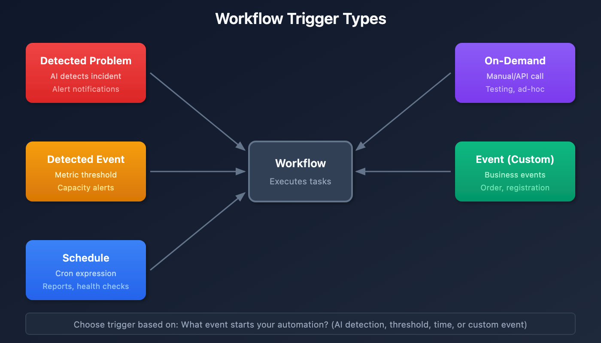
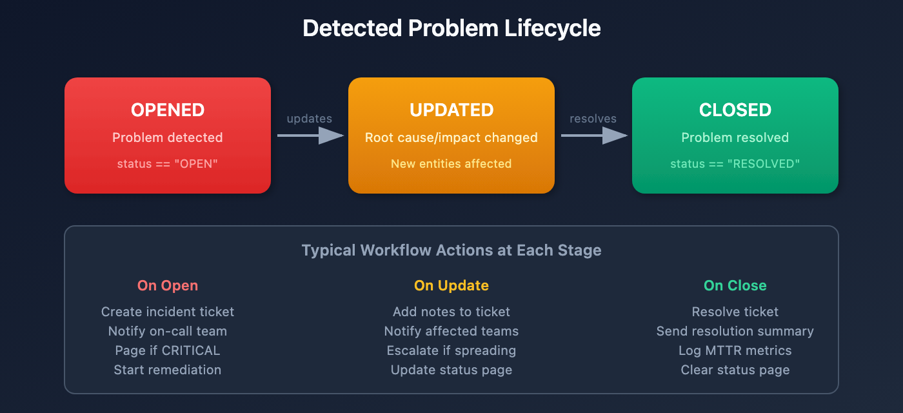

# WFLOW-02: Triggers & Event Types

> **Series:** WFLOW — Workflows and Alert Notifications | **Notebook:** 2 of 9 | **Created:** January 2026 | **Last Updated:** 01/28/2026

## Event-Driven Workflow Triggers
Triggers determine when workflows execute. This notebook covers all trigger types, detected problem events, metric events, schedules, and custom event triggers.

---

## Table of Contents

1. [Detected Problem Trigger](#davis-problem-trigger)
2. [Detected Event Trigger (Metrics)](#davis-event-trigger-metrics)
3. [Schedule Trigger](#schedule-trigger)
4. [On-Demand Trigger](#on-demand-trigger)
5. [Event Trigger (Custom/Business Events)](#event-trigger-custombusiness-events)
6. [Trigger Data and Expressions](#trigger-data-and-expressions)

---

## Prerequisites

| Requirement | Details |
|-------------|----------|
| **Dynatrace Environment** | SaaS with Platform subscription |
| **Permissions** | `automation:workflows:write` |
| **Prior Knowledge** | **WFLOW-01: Workflow Fundamentals** |

## 1. Trigger Types Overview

| Trigger Type | Fires When | Primary Use Case |
|--------------|------------|------------------|
| **Detected Problem** | Dynatrace Intelligence detects/updates/closes a problem | Alert notifications, incident management |
| **Detected Event** | Metric threshold breached | Capacity alerts, proactive notifications |
| **Schedule** | Cron expression matches | Reports, health checks, cleanup jobs |
| **On-Demand** | Manual execution or API call | Testing, ad-hoc automation |
| **Event** | Business/custom event ingested | Business process automation |



<!-- MARKDOWN_TABLE_ALTERNATIVE
| Trigger | Source | Use Case |
|---------|--------|----------|
| Detected Problem | AI detects incident | Alert notifications |
| Detected Event | Metric threshold | Capacity alerts |
| Schedule | Cron expression | Reports, health checks |
| On-Demand | Manual/API | Testing, ad-hoc |
| Event | Business event | Business automation |
For environments where SVG doesn't render
-->

### Choosing the Right Trigger

| Scenario | Recommended Trigger |
|----------|---------------------|
| "Notify when a service is slow" | Detected Problem |
| "Alert when CPU > 90% for 5 mins" | Detected Event |
| "Send weekly status report" | Schedule |
| "Process order completion events" | Event (bizevents) |
| "Test my workflow" | On-Demand |

<a id="davis-problem-trigger"></a>
## 2. Detected Problem Trigger
The most common trigger for alert notifications. Fires when Dynatrace Intelligence detects problems.

### Trigger Configuration

| Setting | Description | Example |
|---------|-------------|----------|
| **Categories** | Problem types to include | Infrastructure, Application |
| **Entity Type** | Entity types to filter | Service, Host, Process |
| **Management Zones** | Scope to specific zones | Production, Checkout |
| **Tags** | Entity tags to match | `env:prod`, `team:checkout` |

### Problem Event Data

When a detected problem triggers, you get access to:

```json
{
  "display_id": "P-12345",
  "title": "High response time on checkout service",
  "severity": "CRITICAL",
  "status": "OPEN",
  "start_time": "2026-01-27T10:00:00Z",
  "affected_entity_ids": ["SERVICE-ABC123"],
  "root_cause_entity_id": "HOST-XYZ789",
  "management_zones": ["Production"],
  "impacted_entities": [...],
  "problem_url": "https://env.dynatrace.com/ui/problems/P-12345"
}
```

### Problem Lifecycle Events

| Event | When | Typical Action |
|-------|------|----------------|
| Problem opened | New problem detected | Create incident, notify team |
| Problem updated | Root cause/impact changed | Update incident notes |
| Problem closed | Problem resolved | Close incident, send summary |



<!-- MARKDOWN_TABLE_ALTERNATIVE
| State | Description | Typical Workflow Actions |
|-------|-------------|--------------------------|
| OPENED | Problem detected | Create ticket, notify team, page if critical |
| UPDATED | Root cause changed | Add notes, escalate if spreading |
| CLOSED | Problem resolved | Resolve ticket, send summary, log MTTR |
For environments where SVG doesn't render
-->

### Example: Filter Critical Production Problems

```yaml
trigger:
  type: davis-problem
  config:
    categories:
      - AVAILABILITY
      - PERFORMANCE
    entityTagsMatch: all
    entityTags:
      - key: env
        value: prod
```

<a id="davis-event-trigger-metrics"></a>
## 3. Detected Event Trigger (Metrics)
Trigger based on metric thresholds without creating a detected problem.

### When to Use

- **Proactive alerts** before Dynatrace Intelligence detects a problem
- **Capacity warnings** (disk 80%, memory usage)
- **Business KPIs** (orders/minute, cart abandonment)
- **Custom thresholds** different from baselines

### Configuration

| Setting | Description |
|---------|-------------|
| **DQL Query** | Metric query defining the threshold |
| **Evaluation Frequency** | How often to check (1m - 1h) |
| **Alert Condition** | When the threshold is breached |

### Example: CPU Warning at 80%

```yaml
trigger:
  type: davis-event
  config:
    query: |
      timeseries avg_cpu = avg(builtin:host.cpu.usage), by:{dt.entity.host}
      | filter avg_cpu > 80
    evaluationFrequency: "5m"
```

### Event Data

```json
{
  "metric_key": "builtin:host.cpu.usage",
  "value": 85.5,
  "threshold": 80,
  "entity_id": "HOST-ABC123",
  "triggered_at": "2026-01-27T10:00:00Z"
}
```

<a id="schedule-trigger"></a>
## 4. Schedule Trigger
Execute workflows on a recurring schedule using cron expressions.

### Cron Expression Format

```
┌───────────── minute (0-59)
│ ┌───────────── hour (0-23)
│ │ ┌───────────── day of month (1-31)
│ │ │ ┌───────────── month (1-12)
│ │ │ │ ┌───────────── day of week (0-6, Sun=0)
│ │ │ │ │
* * * * *
```

### Common Schedules

| Schedule | Cron Expression | Description |
|----------|-----------------|-------------|
| Every hour | `0 * * * *` | Top of every hour |
| Daily at 9 AM | `0 9 * * *` | Every day at 9:00 |
| Weekdays at 8 AM | `0 8 * * 1-5` | Mon-Fri at 8:00 |
| First of month | `0 0 1 * *` | 1st day, midnight |
| Every 15 minutes | `*/15 * * * *` | 0, 15, 30, 45 past |

### Example: Daily Health Check Report

```yaml
trigger:
  type: schedule
  config:
    cron: "0 9 * * 1-5"  # Weekdays at 9 AM
    timezone: "America/New_York"
```

### Schedule Best Practices

- **Avoid minute 0** - Many workflows run at :00, spread load
- **Use timezones** - Be explicit about timezone
- **Consider rate limits** - Don't schedule too frequently

<a id="on-demand-trigger"></a>
## 5. On-Demand Trigger
Manual execution for testing, ad-hoc runs, or API-triggered automation.

### Manual Execution

1. Open workflow in editor
2. Click **Run** button
3. Optionally provide input parameters
4. View execution results

### API Execution

Trigger workflows programmatically via API:

```bash
curl -X POST "https://<env>/platform/automation/v1/workflows/<id>/run" \
  -H "Authorization: Api-Token <token>" \
  -H "Content-Type: application/json" \
  -d '{"params": {"custom_param": "value"}}'
```

### Input Parameters

Define custom parameters for on-demand workflows:

```yaml
trigger:
  type: on-demand
  config:
    parameters:
      - name: environment
        type: string
        required: true
      - name: notify_slack
        type: boolean
        default: true
```

Access in tasks:

```
{{ trigger().params.environment }}
{{ trigger().params.notify_slack }}
```

<a id="event-trigger-custombusiness-events"></a>
## 6. Event Trigger (Custom/Business Events)
Trigger on business events or custom events ingested into Grail.

### Use Cases

- **Order completed** → Update inventory system
- **User registered** → Send welcome notification
- **Deployment finished** → Run validation tests
- **Custom alert** → External system integration

### Configuration

```yaml
trigger:
  type: event
  config:
    eventType: "com.company.order-completed"
    filterQuery: |
      event.type == "com.company.order-completed"
      AND order.total > 1000
```

### Sending Business Events

Ingest events via API:

```bash
curl -X POST "https://<env>/api/v2/bizevents/ingest" \
  -H "Authorization: Api-Token <token>" \
  -H "Content-Type: application/json" \
  -d '{
    "type": "com.company.order-completed",
    "data": {
      "order_id": "ORD-12345",
      "customer": "ACME Corp",
      "total": 1500.00
    }
  }'
```

### Event Data

Access event fields in tasks:

```
{{ event()["data"]["order_id"] }}
{{ event()["data"]["customer"] }}
{{ event()["data"]["total"] }}
```

<a id="trigger-data-and-expressions"></a>
## 7. Trigger Data and Expressions
### Accessing Trigger Data

| Expression | Returns | Example |
|------------|---------|----------|
| `{{ event() }}` | Full event object | `{"title": "...", ...}` |
| `{{ event()["field"] }}` | Specific field | `"High response time"` |
| `{{ trigger() }}` | Trigger metadata | `{"type": "davis-problem"}` |
| `{{ trigger().params }}` | On-demand params | `{"env": "prod"}` |

### Common Event Fields by Trigger Type

**Detected Problem:**
```
{{ event()["display_id"] }}           # P-12345
{{ event()["title"] }}                # Problem title
{{ event()["severity"] }}             # CRITICAL, HIGH, MEDIUM, LOW
{{ event()["status"] }}               # OPEN, RESOLVED
{{ event()["affected_entity_ids"] }}  # Array of entity IDs
{{ event()["root_cause_entity_id"] }} # Root cause entity
{{ event()["management_zones"] }}     # Array of MZ names
{{ event()["problem_url"] }}          # Link to problem
```

**Detected Event (Metric):**
```
{{ event()["metric_key"] }}    # Metric identifier
{{ event()["value"] }}         # Current value
{{ event()["threshold"] }}     # Threshold that was breached
{{ event()["entity_id"] }}     # Affected entity
```

**Schedule:**
```
{{ trigger()["scheduled_time"] }}  # When scheduled to run
{{ trigger()["actual_time"] }}     # When actually started
```

### Query Detected Problems

```dql
// Recent detected problems that could trigger workflows
fetch events, from: now() - 24h
| filter event.kind == "DAVIS_PROBLEM"
| fields timestamp, 
         display_id,
         event.name,
         severity,
         status,
         affected_entity_ids,
         root_cause_entity_id
| sort timestamp desc
| limit 20
```

```dql
// Problem count by severity (last 7 days)
fetch events, from: now() - 7d
| filter event.kind == "DAVIS_PROBLEM"
| filter status == "OPEN"
| summarize problem_count = count(), by:{severity}
| sort problem_count desc
```

```dql
// Business events that could trigger workflows
fetch bizevents, from: now() - 24h
| summarize event_count = count(), by:{event.type}
| sort event_count desc
| limit 20
```

## Next Steps

Now that you understand triggers, learn to send notifications:

### Recommended Path

1. **WFLOW-03: Alert Notification Basics** - Slack, Teams, email notifications
2. **WFLOW-04: Advanced Notification Routing** - Conditional routing
3. **WFLOW-07: Problem-Triggered Remediation** - Auto-remediation patterns

### Key Takeaways

- **Detected Problem** triggers for AI-detected incidents
- **Detected Event** triggers for metric thresholds
- **Schedule** triggers for recurring tasks
- **On-Demand** triggers for testing and API integration
- **Event** triggers for business events
- Use expressions like `{{ event()["field"] }}` to access data

---

## Summary

In this notebook, you learned:

- All five trigger types and when to use each
- How to configure Detected Problem triggers with filters
- How to set metric thresholds with Detected Event triggers
- Cron expressions for schedule triggers
- On-demand execution via UI and API
- Business event triggers for custom automation
- How to access trigger data in expressions

---

## References

- [Workflow Triggers](https://docs.dynatrace.com/docs/platform/workflows/triggers)
- [Detected Problem Events](https://docs.dynatrace.com/docs/platform/davis-ai/detect/problems)
- [Business Events](https://docs.dynatrace.com/docs/platform/grail/business-events)
- [Cron Expression Guide](https://crontab.guru/)

---

<sub>*This notebook was AI-generated from community-submitted and publicly available sources. This notebook series is not officially supported by Dynatrace. Always verify information against official Dynatrace documentation.*</sub>
