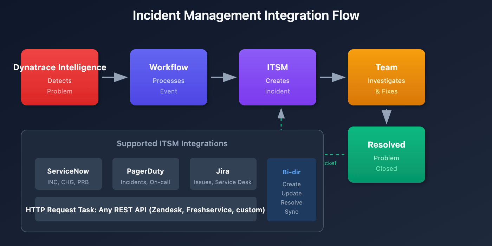

# PagerDuty & ServiceNow Integration

> **Series:** WFLOW | **Notebook:** 5 of 9 | **Created:** January 2026 | **Last Updated:** 01/28/2026

## Incident Management Automation
Integrate Dynatrace workflows with enterprise incident management platforms. This notebook covers PagerDuty and ServiceNow integration patterns, bi-directional sync, and incident lifecycle management.

---

## Table of Contents

1. [PagerDuty Setup](#pagerduty-setup)
2. [PagerDuty Workflow Tasks](#pagerduty-workflow-tasks)
3. [ServiceNow Setup](#servicenow-setup)
4. [ServiceNow Workflow Tasks](#servicenow-workflow-tasks)
5. [Bi-Directional Sync](#bi-directional-sync)
6. [Incident Lifecycle Patterns](#incident-lifecycle-patterns)

---

## Prerequisites

| Requirement | Details |
|-------------|----------|
| **Dynatrace Environment** | SaaS with Platform subscription |
| **Permissions** | `automation:workflows:write`, `automation:connections:write` |
| **PagerDuty** | Admin access to create services and integrations |
| **ServiceNow** | Admin access or integration user credentials |

## 1. Integration Overview

### Why Integrate?

| Benefit | Description |
|---------|-------------|
| **Single pane of glass** | Incidents tracked in one system |
| **On-call management** | Leverage PagerDuty/ServiceNow schedules |
| **Audit trail** | Complete incident history |
| **Escalation** | Built-in escalation policies |
| **Metrics** | MTTR, incident frequency reporting |

### Integration Flow



<!-- MARKDOWN_TABLE_ALTERNATIVE
| Step | Component | Action |
|------|-----------|--------|
| 1 | Dynatrace Intelligence | Detects problem |
| 2 | Workflow | Processes event |
| 3 | ITSM | Creates incident |
| 4 | Team | Investigates & fixes |
| 5 | Resolution | Problem closed, ticket resolved |
Supported: ServiceNow, PagerDuty, Jira, HTTP API
For environments where SVG doesn't render
-->

<a id="pagerduty-setup"></a>
## 2. PagerDuty Setup
### Creating PagerDuty Integration

1. **In PagerDuty:**
   - Go to **Services** → Select or create service
   - **Integrations** tab → **Add Integration**
   - Select **Events API v2**
   - Copy the **Integration Key** (routing key)

2. **In Dynatrace:**
   - Go to **Settings** → **Integration** → **Connections**
   - Click **+ Connection**
   - Select **PagerDuty**
   - Enter the Integration Key
   - Name: `pagerduty-production`

### Multiple Services Pattern

Create separate connections for different routing:

| Connection Name | PagerDuty Service | Use |
|-----------------|-------------------|------|
| `pagerduty-prod-critical` | Production-Critical | P1 incidents |
| `pagerduty-prod-standard` | Production-Standard | P2-P4 incidents |
| `pagerduty-platform` | Platform-Infrastructure | Infra issues |

<a id="pagerduty-workflow-tasks"></a>
## 3. PagerDuty Workflow Tasks
### Create Incident

```yaml
name: create_pagerduty_incident
type: dynatrace.pagerduty:create-incident
input:
  connection: pagerduty-production
  severity: '{{ {"CRITICAL": "critical", "HIGH": "error", "MEDIUM": "warning", "LOW": "info"}.get(event()["severity"], "warning") }}'
  summary: "[{{ event()['severity'] }}] {{ event()['title'] }}"
  source: "dynatrace"
  component: "{{ event().get('root_cause_entity_id', 'unknown') }}"
  group: "{{ event().get('management_zones', ['default'])[0] }}"
  class: "{{ event().get('event_type', 'problem') }}"
  customDetails:
    problem_id: "{{ event()['display_id'] }}"
    problem_url: "{{ event()['problem_url'] }}"
    affected_entities: "{{ event()['affected_entity_ids'] | join(', ') }}"
    root_cause: "{{ event().get('root_cause_entity_id', 'N/A') }}"
    start_time: "{{ event()['start_time'] }}"
  dedupKey: "dynatrace-{{ event()['display_id'] }}"
```

### Resolve Incident

Triggered when problem closes:

```yaml
name: resolve_pagerduty_incident
type: dynatrace.pagerduty:resolve-incident
input:
  connection: pagerduty-production
  dedupKey: "dynatrace-{{ event()['display_id'] }}"
  description: "Problem resolved in Dynatrace at {{ event().get('end_time', now()) }}"
```

### Acknowledge Incident

```yaml
name: acknowledge_pagerduty
type: dynatrace.pagerduty:acknowledge-incident
input:
  connection: pagerduty-production
  dedupKey: "dynatrace-{{ event()['display_id'] }}"
```

<a id="servicenow-setup"></a>
## 4. ServiceNow Setup
### Creating ServiceNow Connection

1. **In ServiceNow:**
   - Create integration user or use OAuth app
   - Grant appropriate roles: `itil`, `rest_api_user`
   - Note instance URL: `https://your-instance.service-now.com`

2. **In Dynatrace:**
   - Go to **Settings** → **Integration** → **Connections**
   - Click **+ Connection**
   - Select **ServiceNow**
   - Enter:
     - Instance URL
     - Username/Password or OAuth credentials
   - Name: `servicenow-production`

### Authentication Options

| Method | Best For |
|--------|----------|
| **Basic Auth** | Quick setup, development |
| **OAuth 2.0** | Production, better security |
| **API Key** | Service accounts |

<a id="servicenow-workflow-tasks"></a>
## 5. ServiceNow Workflow Tasks
### Create Incident

```yaml
name: create_snow_incident
type: dynatrace.servicenow:create-incident
input:
  connection: servicenow-production
  short_description: "[Dynatrace] {{ event()['title'] }}"
  description: |
    A problem has been detected by Dynatrace Dynatrace Intelligence.
    
    Problem Details:
    ================
    Problem ID: {{ event()['display_id'] }}
    Severity: {{ event()['severity'] }}
    Status: {{ event()['status'] }}
    Start Time: {{ event()['start_time'] }}
    
    Affected Entities:
    {{ event()['affected_entity_ids'] | join('\n') }}
    
    Root Cause Entity:
    {{ event().get('root_cause_entity_id', 'Pending analysis') }}
    
    View in Dynatrace:
    {{ event()['problem_url'] }}
  impact: '{{ {"CRITICAL": 1, "HIGH": 2, "MEDIUM": 2, "LOW": 3}.get(event()["severity"], 3) }}'
  urgency: '{{ {"CRITICAL": 1, "HIGH": 2, "MEDIUM": 2, "LOW": 3}.get(event()["severity"], 3) }}'
  category: "Software"
  subcategory: "Application"
  assignment_group: "Platform Engineering"
  caller_id: "dynatrace.integration"
  correlation_id: "DT-{{ event()['display_id'] }}"
```

### Update Incident

```yaml
name: update_snow_incident
type: dynatrace.servicenow:update-incident
input:
  connection: servicenow-production
  correlation_id: "DT-{{ event()['display_id'] }}"
  work_notes: |
    [Automated Update from Dynatrace]
    Problem updated at {{ now() }}
    Current status: {{ event()['status'] }}
```

### Resolve Incident

```yaml
name: resolve_snow_incident
type: dynatrace.servicenow:update-incident
input:
  connection: servicenow-production
  correlation_id: "DT-{{ event()['display_id'] }}"
  state: 6  # Resolved
  close_code: "Resolved"
  close_notes: |
    Problem automatically resolved in Dynatrace.
    Resolution time: {{ event().get('end_time', now()) }}
```

<a id="bi-directional-sync"></a>
## 6. Bi-Directional Sync
### Sync Status from ServiceNow to Dynatrace

Use scheduled workflow to check incident status:

```javascript
import { problemsClient } from '@dynatrace-sdk/client-classic-environment-v2';

export default async function({ connection }) {
  // Query ServiceNow for Dynatrace-related incidents
  const response = await fetch(
    `${connection.instance_url}/api/now/table/incident?` +
    `sysparm_query=correlation_id STARTSWITH DT-^state!=6`,
    {
      headers: {
        'Authorization': `Basic ${btoa(connection.username + ':' + connection.password)}`,
        'Accept': 'application/json'
      }
    }
  );
  
  const incidents = await response.json();
  
  // Process each incident
  for (const incident of incidents.result) {
    const problemId = incident.correlation_id.replace('DT-', '');
    // Add comment to Dynatrace problem with SNOW status
    // ...
  }
  
  return { processed: incidents.result.length };
}
```

### Store Incident ID for Updates

Capture ServiceNow incident number for later updates:

```yaml
tasks:
  - name: create_incident
    type: dynatrace.servicenow:create-incident
    # ... configuration ...

  - name: store_incident_id
    type: dynatrace.automations:run-javascript
    dependsOn: [create_incident]
    input:
      script: |
        export default async function({ result }) {
          const incidentNumber = result('create_incident').sys_id;
          // Store in workflow state or external system
          return { incident_number: incidentNumber };
        }
```

<a id="incident-lifecycle-patterns"></a>
## 7. Incident Lifecycle Patterns
### Complete Lifecycle Workflow

Handle open, update, and close events:

```yaml
name: incident-lifecycle-management

trigger:
  type: davis-problem
  config:
    # Trigger on all problem events (open, update, close)
    entityTagsMatch: all
    entityTags:
      - key: env
        value: prod

conditions:
  - name: is_problem_open
    expression: '{{ event()["status"] == "OPEN" }}'
  - name: is_problem_closed
    expression: '{{ event()["status"] == "CLOSED" }}'

tasks:
  # CREATE: When problem opens
  - name: create_incident
    type: dynatrace.pagerduty:create-incident
    conditions: [is_problem_open]
    input:
      connection: pagerduty-production
      severity: critical
      summary: "{{ event()['title'] }}"
      dedupKey: "dynatrace-{{ event()['display_id'] }}"

  # RESOLVE: When problem closes
  - name: resolve_incident
    type: dynatrace.pagerduty:resolve-incident
    conditions: [is_problem_closed]
    input:
      connection: pagerduty-production
      dedupKey: "dynatrace-{{ event()['display_id'] }}"
```

### Deduplication Strategy

| Platform | Dedup Field | Pattern |
|----------|-------------|----------|
| PagerDuty | `dedupKey` | `dynatrace-{problem_id}` |
| ServiceNow | `correlation_id` | `DT-{problem_id}` |

Same problem ID = same incident (no duplicates).

### Monitor Incident Integration

```dql
// PagerDuty/ServiceNow task executions
fetch events, from: now() - 7d
| filter event.type == "automation.task.execution"
| filter contains(task.type, "pagerduty") or contains(task.type, "servicenow")
| summarize 
    total = count(),
    succeeded = countIf(task.status == "SUCCEEDED"),
    failed = countIf(task.status == "FAILED"),
    by:{task.type}
| fieldsAdd success_rate = round(100.0 * succeeded / total, decimals: 2)
| sort total desc
```

```dql
// Failed incident management tasks
fetch events, from: now() - 24h
| filter event.type == "automation.task.execution"
| filter task.status == "FAILED"
| filter contains(task.type, "pagerduty") or contains(task.type, "servicenow")
| fields timestamp, workflow.name, task.name, task.type, task.error
| sort timestamp desc
| limit 20
```

```dql
// Incidents created per day
fetch events, from: now() - 30d
| filter event.type == "automation.task.execution"
| filter contains(task.type, "pagerduty:create") or contains(task.type, "servicenow:create")
| filter task.status == "SUCCEEDED"
| summarize incidents_created = count(), by:{time_bucket = bin(timestamp, 1d)}
| sort time_bucket asc
```

## Next Steps

With incident management configured, customize message templates:

### Recommended Path

1. **WFLOW-06: Custom Notification Templates** - Rich formatting
2. **WFLOW-07: Problem-Triggered Remediation** - Auto-remediation
3. **WFLOW-08: JavaScript & HTTP Actions** - Custom integrations

### Key Takeaways

- **PagerDuty** uses Events API v2 with routing keys
- **ServiceNow** uses REST API with correlation IDs
- **Deduplication** prevents duplicate incidents
- **Lifecycle workflows** handle open/update/close events
- **Bi-directional sync** keeps systems in alignment

---

## Summary

In this notebook, you learned:

- Integration benefits and architecture
- PagerDuty connection setup and tasks
- ServiceNow connection setup and tasks
- Bi-directional sync patterns
- Incident lifecycle management
- Deduplication strategies

---

## References

- [PagerDuty Actions](https://docs.dynatrace.com/docs/platform/workflows/actions/pagerduty)
- [ServiceNow Actions](https://docs.dynatrace.com/docs/platform/workflows/actions/servicenow)
- [PagerDuty Events API v2](https://developer.pagerduty.com/docs/events-api-v2/overview/)
- [ServiceNow REST API](https://developer.servicenow.com/dev.do#!/reference/api)

---

<sub>*This notebook was AI-generated from community-submitted and publicly available sources. This notebook series is not officially supported by Dynatrace. Always verify information against official Dynatrace documentation.*</sub>
