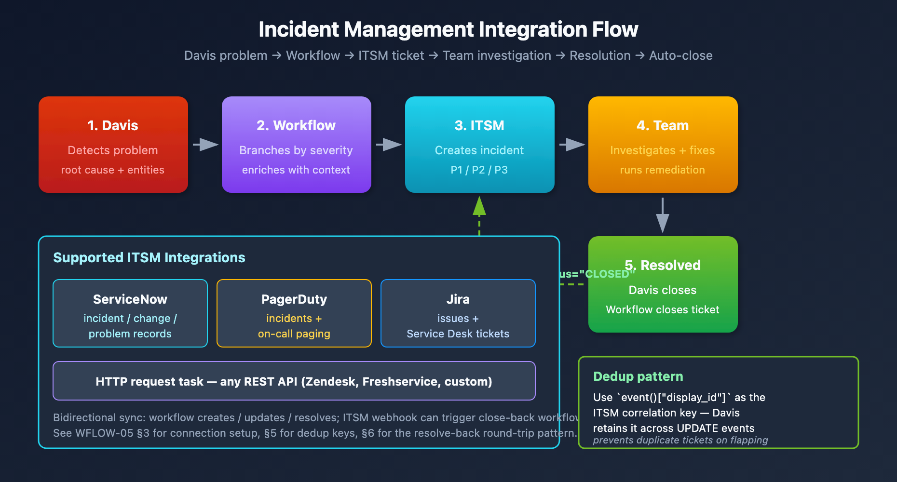

# WFLOW-05: PagerDuty & ServiceNow Integration

> **Series:** WFLOW — Workflows and Alert Notifications | **Notebook:** 5 of 10 | **Created:** January 2026 | **Last Updated:** 06/17/2026

## Incident Management Automation
Integrate Dynatrace workflows with enterprise incident management platforms. This notebook covers PagerDuty and ServiceNow integration patterns, bi-directional sync, and incident lifecycle management.

---

## Table of Contents

1. [PagerDuty Setup](#pagerduty-setup)
2. [PagerDuty Workflow Tasks](#pagerduty-workflow-tasks)
3. [ServiceNow Setup](#servicenow-setup)
4. [ServiceNow Workflow Tasks](#servicenow-workflow-tasks)
5. [Bi-Directional Sync](#bi-directional-sync)
6. [Incident Lifecycle Patterns](#incident-lifecycle-patterns)
7. [Production Hardening](#production-hardening)

---

## Prerequisites

| Requirement | Details |
|-------------|----------|
| **Dynatrace Environment** | SaaS with Platform subscription |
| **Permissions** | `automation:workflows:write`, `automation:connections:write` |
| **PagerDuty** | Admin access to create services and integrations |
| **ServiceNow** | Admin access or integration user credentials |

## 1. Integration Overview

### Why Integrate?

| Benefit | Description |
|---------|-------------|
| **Single pane of glass** | Incidents tracked in one system |
| **On-call management** | Leverage PagerDuty/ServiceNow schedules |
| **Audit trail** | Complete incident history |
| **Escalation** | Built-in escalation policies |
| **Metrics** | MTTR, incident frequency reporting |

### Integration Flow



<!-- MARKDOWN_TABLE_ALTERNATIVE
| Step | Component | Action |
|------|-----------|--------|
| 1 | Dynatrace Intelligence | Detects problem |
| 2 | Workflow | Processes event |
| 3 | ITSM | Creates incident |
| 4 | Team | Investigates & fixes |
| 5 | Resolution | Problem closed, ticket resolved |
Supported: ServiceNow, PagerDuty, Jira, HTTP API
For environments where SVG doesn't render
-->

### Why a Workflow (vs a Direct Webhook)

Davis can post to a webhook directly, but routing problems through a **workflow** buys four things a raw webhook cannot:

| Capability | What the workflow adds |
|------------|------------------------|
| **Payload shaping** | Map Dynatrace fields to the exact incident schema the target expects, including required and custom fields |
| **Retry + dead-letter** | Re-attempt on transient failures; quarantine permanent failures instead of losing them (see §7) |
| **Filtering** | Decide which problems become incidents — drop informational events before they reach the ITSM queue |
| **Link-back** | Capture the returned incident number and write it back onto the Dynatrace problem for cross-reference |

Reach for the native action first; drop to a raw HTTP action only when you need a field the action doesn't expose.

<a id="pagerduty-setup"></a>
## 2. PagerDuty Setup
### Creating PagerDuty Integration

1. **In PagerDuty:**
   - Go to **Services** → Select or create service
   - **Integrations** tab → **Add Integration**
   - Select **Events API v2**
   - Copy the **Integration Key** (routing key)

2. **In Dynatrace:**
   - Go to **Settings** → **Integration** → **Connections**
   - Click **+ Connection**
   - Select **PagerDuty**
   - Enter the Integration Key
   - Name: `pagerduty-production`

### Multiple Services Pattern

Create separate connections for different routing:

| Connection Name | PagerDuty Service | Use |
|-----------------|-------------------|------|
| `pagerduty-prod-critical` | Production-Critical | P1 incidents |
| `pagerduty-prod-standard` | Production-Standard | P2-P4 incidents |
| `pagerduty-platform` | Platform-Infrastructure | Infra issues |

<a id="pagerduty-workflow-tasks"></a>
## 3. PagerDuty Workflow Tasks
### Create Incident

```yaml
name: create_pagerduty_incident
type: dynatrace.pagerduty:create-incident
input:
  connection: pagerduty-production
  severity: '{{ {"CRITICAL": "critical", "HIGH": "error", "MEDIUM": "warning", "LOW": "info"}.get(event()["severity"], "warning") }}'
  summary: "[{{ event()['severity'] }}] {{ event()['title'] }}"
  source: "dynatrace"
  component: "{{ event().get('root_cause_entity_id', 'unknown') }}"
  group: "{{ event().get('management_zones', ['default'])[0] }}"
  class: "{{ event().get('event_type', 'problem') }}"
  customDetails:
    problem_id: "{{ event()['display_id'] }}"
    problem_url: "{{ event()['problem_url'] }}"
    affected_entities: "{{ event()['affected_entity_ids'] | join(', ') }}"
    root_cause: "{{ event().get('root_cause_entity_id', 'N/A') }}"
    start_time: "{{ event()['start_time'] }}"
  dedupKey: "dynatrace-{{ event()['display_id'] }}"
```

### Resolve Incident

Triggered when problem closes:

```yaml
name: resolve_pagerduty_incident
type: dynatrace.pagerduty:resolve-incident
input:
  connection: pagerduty-production
  dedupKey: "dynatrace-{{ event()['display_id'] }}"
  description: "Problem resolved in Dynatrace at {{ event().get('end_time', now()) }}"
```

### Acknowledge Incident

```yaml
name: acknowledge_pagerduty
type: dynatrace.pagerduty:acknowledge-incident
input:
  connection: pagerduty-production
  dedupKey: "dynatrace-{{ event()['display_id'] }}"
```

<a id="servicenow-setup"></a>
## 4. ServiceNow Setup
### Creating ServiceNow Connection

1. **In ServiceNow:**
   - Create integration user or use OAuth app
   - Grant appropriate roles: `itil`, `rest_api_user`
   - Note instance URL: `https://your-instance.service-now.com`

2. **In Dynatrace:**
   - Go to **Settings** → **Integration** → **Connections**
   - Click **+ Connection**
   - Select **ServiceNow**
   - Enter:
     - Instance URL
     - Basic-auth username/password **or** OAuth client ID/secret
   - Name: `servicenow-production`

### Authentication Options

The ServiceNow connection supports two authentication methods — these are the only two the native connector accepts:

| Method | Credentials | Best For |
|--------|-------------|----------|
| **Basic Authentication** | Username + password of a ServiceNow integration user | Quick setup, development |
| **OAuth Client Credentials** | Client ID + client secret | Production — avoids storing a user password |

> There is no API-key option for this connector. Store the chosen credential in the connection, never inline in a workflow task.

<a id="servicenow-workflow-tasks"></a>
## 5. ServiceNow Workflow Tasks

The native ServiceNow connector exposes these operations, selected **by name** in the workflow builder. The docs do not publish stable action-type identifiers, so the `# Operation:` comments below are the source of truth — the `name:` and field inputs are illustrative:

| Operation | Use |
|-----------|-----|
| **Create Incident** | Open an incident from a Davis problem |
| **Resolve incident** | Close the incident when the problem closes |
| **Comment on an incident** | Append work notes / status updates |
| **Update record** | Change fields on any table record (incidents included) |
| **Search incidents** | Look up an existing incident (e.g., by correlation ID) |
| **Get Groups** | Resolve assignment-group sys_ids |
| **Create a vulnerability item** | Open a VR item (security workflows) |

> **Required fields for Create Incident:** `Category`, `Subcategory`, `Impact`, `Urgency`, and `Assignment Group` are **required** — a create call missing any of them fails. `Correlation ID` is optional but strongly recommended: set it to the Dynatrace problem/event ID so later updates and resolves find the same incident instead of creating duplicates.

### Create Incident

```yaml
name: create_snow_incident
# Operation: "Create Incident" (select in the workflow builder)
input:
  connection: servicenow-production
  short_description: "[Dynatrace] {{ event()['title'] }}"
  description: |
    A problem has been detected by Davis.

    Problem Details:
    ================
    Problem ID: {{ event()['display_id'] }}
    Severity: {{ event()['severity'] }}
    Status: {{ event()['status'] }}
    Start Time: {{ event()['start_time'] }}

    Affected Entities:
    {{ event()['affected_entity_ids'] | join('\n') }}

    Root Cause Entity:
    {{ event().get('root_cause_entity_id', 'Pending analysis') }}

    View in Dynatrace:
    {{ event()['problem_url'] }}
  impact: '{{ {"CRITICAL": 1, "HIGH": 2, "MEDIUM": 2, "LOW": 3}.get(event()["severity"], 3) }}'
  urgency: '{{ {"CRITICAL": 1, "HIGH": 2, "MEDIUM": 2, "LOW": 3}.get(event()["severity"], 3) }}'
  category: "Software"
  subcategory: "Application"
  assignment_group: "Platform Engineering"
  caller_id: "dynatrace.integration"
  correlation_id: "DT-{{ event()['display_id'] }}"
```

**Severity → Impact / Urgency.** Dynatrace's unified `event.severity` is an integer **1–5** (1 = Critical … 5 = Informational; see AIOPS-03), and it is what the Davis problem and `fetch events` carry. ServiceNow `Impact`/`Urgency` run **1 (High) … 3 (Low)**, so the Dynatrace scale compresses:

| `event.severity` | ServiceNow Impact / Urgency |
|------------------|-----------------------------|
| 1 (Critical) | 1 (High) |
| 2 | 1 (High) |
| 3 | 2 (Medium) |
| 4 | 3 (Low) |
| 5 (Informational) | skip — usually no incident |

> **Verify what your `event()` accessor returns.** Whether the workflow `event()` accessor exposes severity as the integer field or a string label varies by tenant and trigger type — the example above keys on string labels (`"CRITICAL"`, …). Check your tenant's workflow editor and key the mapping to whatever `event()` actually returns. The same caveat applies to the PagerDuty severity mapping in §3.

### Comment on an Incident

```yaml
name: comment_snow_incident
# Operation: "Comment on an incident"
input:
  connection: servicenow-production
  correlation_id: "DT-{{ event()['display_id'] }}"
  work_notes: |
    [Automated Update from Dynatrace]
    Problem updated at {{ now() }}
    Current status: {{ event()['status'] }}
```

### Resolve Incident

```yaml
name: resolve_snow_incident
# Operation: "Resolve incident"
input:
  connection: servicenow-production
  correlation_id: "DT-{{ event()['display_id'] }}"
  close_code: "Resolved"
  close_notes: |
    Problem automatically resolved in Dynatrace.
    Resolution time: {{ event().get('end_time', now()) }}
```

<a id="bi-directional-sync"></a>
## 6. Bi-Directional Sync

The native ServiceNow **workflow action is one-way** — it creates, comments on, resolves, and updates ServiceNow records, but ServiceNow-side changes do not flow back automatically. There are two ways to close the loop:

- **DIY polling (shown below)** — a scheduled workflow queries ServiceNow for Dynatrace-correlated incidents and writes their status back onto the Dynatrace problem. Portable and works today, but you own the polling cadence and rate budget.
- **Native bi-directional (ITOM)** — the ServiceNow-side Dynatrace app / ITOM Event Management ingests Dynatrace events and synchronises incident state both ways. This is the richest option for ITOM-centric shops; the **ALERT-04** notebook lays out the full maturity ladder and when to climb to it.

### Sync Status from ServiceNow to Dynatrace (DIY polling)

Use a scheduled workflow to check incident status:

```javascript
import { problemsClient } from '@dynatrace-sdk/client-classic-environment-v2';

export default async function({ connection }) {
  // Query ServiceNow for Dynatrace-related incidents
  const response = await fetch(
    `${connection.instance_url}/api/now/table/incident?` +
    `sysparm_query=correlation_id STARTSWITH DT-^state!=6`,
    {
      headers: {
        'Authorization': `Basic ${btoa(connection.username + ':' + connection.password)}`,
        'Accept': 'application/json'
      }
    }
  );

  const incidents = await response.json();

  // Process each incident
  for (const incident of incidents.result) {
    const problemId = incident.correlation_id.replace('DT-', '');
    // Add comment to Dynatrace problem with SNOW status
    // ...
  }

  return { processed: incidents.result.length };
}
```

### Store Incident ID for Updates

Capture the ServiceNow incident number for later updates and for the link-back pattern (§7):

```yaml
tasks:
  - name: create_incident
    # Operation: "Create Incident"
    # ... configuration ...

  - name: store_incident_id
    type: dynatrace.automations:run-javascript
    dependsOn: [create_incident]
    input:
      script: |
        export default async function({ result }) {
          const incidentNumber = result('create_incident').sys_id;
          // Store in workflow state or external system
          return { incident_number: incidentNumber };
        }
```

<a id="incident-lifecycle-patterns"></a>
## 7. Incident Lifecycle Patterns
### Complete Lifecycle Workflow

Handle open, update, and close events:

```yaml
name: incident-lifecycle-management

trigger:
  type: davis-problem
  config:
    # Trigger on all problem events (open, update, close)
    entityTagsMatch: all
    entityTags:
      - key: env
        value: prod

conditions:
  - name: is_problem_open
    expression: '{{ event()["status"] == "OPEN" }}'
  - name: is_problem_closed
    expression: '{{ event()["status"] == "CLOSED" }}'

tasks:
  # CREATE: When problem opens
  - name: create_incident
    type: dynatrace.pagerduty:create-incident
    conditions: [is_problem_open]
    input:
      connection: pagerduty-production
      severity: critical
      summary: "{{ event()['title'] }}"
      dedupKey: "dynatrace-{{ event()['display_id'] }}"

  # RESOLVE: When problem closes
  - name: resolve_incident
    type: dynatrace.pagerduty:resolve-incident
    conditions: [is_problem_closed]
    input:
      connection: pagerduty-production
      dedupKey: "dynatrace-{{ event()['display_id'] }}"
```

### Deduplication Strategy

| Platform | Dedup Field | Pattern |
|----------|-------------|----------|
| PagerDuty | `dedupKey` | `dynatrace-{problem_id}` |
| ServiceNow | `correlation_id` | `DT-{problem_id}` |

Same problem ID = same incident (no duplicates).

<a id="production-hardening"></a>
## 8. Production Hardening

An incident integration sits on the critical path: when it silently fails, problems open in Dynatrace but never reach the on-call queue. Harden it before you depend on it.

### Failure Handling

Decide explicitly what happens on each failure mode rather than letting the workflow fail open:

| Failure | Handling |
|---------|----------|
| ServiceNow **5xx** (server error) | Retry with exponential backoff (e.g., 3 attempts) |
| ServiceNow **4xx** (bad payload / auth) | Do **not** retry — write to a dead-letter store and alert the team; a 4xx won't fix itself on retry |
| **Timeout** (slow response) | Retry once; surface the failure on the Dynatrace problem as a comment |
| **Rate limit reached** | Log dropped events and continue; alert if the sustained drop rate crosses a threshold |
| **DNS / connection failure** | Retry; if persistent, alert via a secondary channel (e.g., a Slack action) |
| **Auth token expired** | Re-fetch the credential once per run from the connection/secret store; alert ops if it recurs |

### Dead-Letter Queue

Retries cover transient failures; **permanent** failures (4xx, schema mismatch) must not vanish. Write the failed payload to a durable store — a dedicated Grail bucket or an external queue — with a retention window (e.g., 30 days) so an operator can inspect and **replay** it after fixing the root cause. Without a dead-letter store, a malformed-payload bug means silently lost incidents with no audit trail.

### Link Back to the Dynatrace Problem

Capture the ServiceNow incident number from the create response and write it onto the originating problem as a comment (the *Store Incident ID* pattern in §6). This gives responders a one-click path from the Dynatrace problem to the ServiceNow ticket — and is what lets later **Comment** / **Resolve** operations target the right incident via the correlation ID.

The integration is itself a production dependency, so monitor it like one — the queries below track execution volume, success rate, and failures so a broken connection surfaces as a metric, not as a silent gap in the incident queue.

### Monitor Incident Integration

```dql
// PagerDuty/ServiceNow task executions
fetch events, from: now() - 7d
| filter event.type == "automation.task.execution"
| filter contains(task.type, "pagerduty") or contains(task.type, "servicenow")
| summarize 
    total = count(),
    succeeded = countIf(task.status == "SUCCEEDED"),
    failed = countIf(task.status == "FAILED"),
    by:{task.type}
| fieldsAdd success_rate = round(100.0 * succeeded / total, decimals: 2)
| sort total desc
```

```dql
// Failed incident management tasks
fetch events, from: now() - 24h
| filter event.type == "automation.task.execution"
| filter task.status == "FAILED"
| filter contains(task.type, "pagerduty") or contains(task.type, "servicenow")
| fields timestamp, workflow.name, task.name, task.type, task.error
| sort timestamp desc
| limit 20
```

```dql
// Incidents created per day
fetch events, from: now() - 30d
| filter event.type == "automation.task.execution"
| filter contains(task.type, "pagerduty:create") or contains(task.type, "servicenow:create")
| filter task.status == "SUCCEEDED"
| summarize incidents_created = count(), by:{time_bucket = bin(timestamp, 24h)}
| sort time_bucket asc
```

## Next Steps

With incident management configured, customize message templates:

### Recommended Path

1. **WFLOW-06: Custom Notification Templates** - Rich formatting
2. **WFLOW-07: Problem-Triggered Remediation** - Auto-remediation
3. **WFLOW-08: JavaScript & HTTP Actions** - Custom integrations

### Key Takeaways

- **PagerDuty** uses Events API v2 with routing keys
- **ServiceNow** uses a native connection (Basic or OAuth Client Credentials) with operations selected by name; `Category`, `Subcategory`, `Impact`, `Urgency`, `Assignment Group` are required on create
- **Deduplication** via the correlation ID prevents duplicate incidents
- **Lifecycle workflows** handle open/update/close events
- **Bi-directional**: the native action is one-way; true state sync comes from the ServiceNow-side Dynatrace app / ITOM (see ALERT-04)
- **Production hardening** — retry, dead-letter, link-back, and monitoring keep the integration trustworthy

---

## Summary

In this notebook, you learned:

- Integration benefits and architecture
- PagerDuty connection setup and tasks
- ServiceNow connection setup and tasks
- Bi-directional sync patterns
- Incident lifecycle management
- Deduplication strategies
- Production hardening (failure handling, dead-letter, monitoring)

---

## References

- [ServiceNow action (DT docs)](https://docs.dynatrace.com/docs/analyze-explore-automate/workflows/default-workflow-actions/actions/service-now)
- [PagerDuty action (DT docs)](https://docs.dynatrace.com/docs/analyze-explore-automate/workflows/default-workflow-actions/actions/pagerduty)
- [Send Dynatrace notifications to ServiceNow (DT docs)](https://docs.dynatrace.com/docs/analyze-explore-automate/notifications-and-alerting/problem-notifications/servicenow-integration)
- [Notification actions umbrella (DT docs)](https://docs.dynatrace.com/docs/analyze-explore-automate/workflows/default-workflow-actions/actions)
- [HTTP request action (DT docs)](https://docs.dynatrace.com/docs/analyze-explore-automate/workflows/default-workflow-actions/http-request-workflow-action)
- [Davis Problems app (DT docs)](https://docs.dynatrace.com/docs/dynatrace-intelligence/problems-app)
- [PagerDuty Events API v2 (PagerDuty Developer)](https://developer.pagerduty.com/docs/events-api-v2/overview/)
- [ServiceNow REST API reference (ServiceNow Developer)](https://developer.servicenow.com/dev.do#!/reference/api)

---

<sub>*This notebook was AI-generated from community-submitted and publicly available sources. This notebook series is not officially supported by Dynatrace. Always verify information against official Dynatrace documentation.*</sub>
