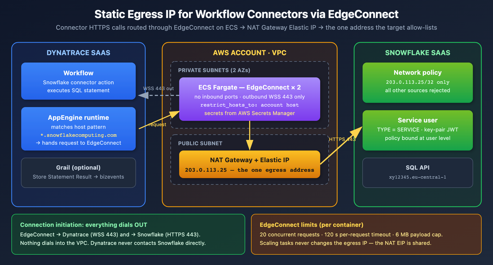

# WFLOW-94 LAB: Static Egress IP for Workflow Connectors — EdgeConnect on AWS ECS (Snowflake)

> **Series:** WFLOW — Workflows and Alert Notifications | **Reference:** 94 — EdgeConnect Static Egress LAB | **Created:** July 2026 | **Last Updated:** 07/14/2026

## Overview

Many SaaS and internal targets a Dynatrace Workflow needs to call are **IP-allow-listed**: the target rejects any client whose source address isn't on a short approved list. Workflow actions run in the Dynatrace AppEngine runtime and egress from Dynatrace's **shared SaaS IP ranges** — addresses you don't control and wouldn't want to allow-list wholesale.

This hands-on LAB solves that with **EdgeConnect**: a small stateless container you run in your own network that registers with your Dynatrace environment over an *outbound* WebSocket and transparently executes matching HTTP(S) requests on the runtime's behalf. Deployed on **AWS ECS Fargate in a private subnet behind a NAT Gateway with an Elastic IP**, every request the connector makes egresses from **one static, dedicated IP** — the only address the target needs to admit.

The worked example is the **Snowflake for Workflows** connector against a Snowflake account enforcing a network policy, but the pattern applies unchanged to any IP-allow-listed target (§11). It is a companion to **WFLOW-08 (JavaScript & HTTP Actions)** — EdgeConnect routes those `fetch()` calls too.

---

## Table of Contents

1. [Prerequisites](#prerequisites)
2. [The Problem: Shared Egress vs IP Allow-Lists](#the-problem)
3. [Architecture](#architecture)
4. [Key Design Decisions](#design-decisions)
5. [Step 1 — Dynatrace: EdgeConnect Configuration](#step-edgeconnect)
6. [Step 2 — AWS: Static-Egress Network (Terraform)](#step-network)
7. [Step 3 — AWS: ECS Task Definition and Service](#step-ecs)
8. [Step 4 — Snowflake: Service User, Network Rule, Network Policy](#step-snowflake)
9. [Step 5 — Dynatrace: Connection and Workflow](#step-workflow)
10. [Validation Checklist](#validation)
11. [Troubleshooting](#troubleshooting)
12. [Adapting the Pattern to Other Targets](#adapting)
13. [Next Steps and References](#next-steps)

---

<a id="prerequisites"></a>
## 1. Prerequisites

| Requirement | Details |
|-------------|---------|
| **Dynatrace Environment** | SaaS (Gen3) with the Workflows app; permission to create EdgeConnect configurations (`Settings` > `General` > `External Requests` > `EdgeConnect`) |
| **Snowflake for Workflows** | Installed from Dynatrace Hub; permission to create Connections (`Settings` > `Connections`) |
| **AWS Account** | Ability to create a VPC, NAT Gateway + Elastic IP, ECS Fargate cluster/service, Secrets Manager secrets, CloudWatch log group |
| **Snowflake Account** | `SECURITYADMIN`/`ACCOUNTADMIN` (or delegated roles) to create a service user, network rule, and network policy |
| **Tooling** | Terraform ≥ 1.5 for the AWS samples; SnowSQL (or a worksheet) for the Snowflake SQL |

> **Note on EdgeConnect version:** run **EdgeConnect ≥ 1.724.3**. The June 2026 release fixed a vulnerability where *"secrets could be leaked in HTTP error messages"* — relevant here because EdgeConnect carries authenticated Snowflake traffic.

<a id="the-problem"></a>
## 2. The Problem: Shared Egress vs IP Allow-Lists

A Dynatrace Workflow using the **Snowflake for Workflows** connector executes SQL statements against a Snowflake SaaS endpoint (`xy12345.eu-central-1.snowflakecomputing.com`). The Snowflake account enforces a **network policy**: any client whose source IP is not on the allow-list is rejected (the classic *"IP xx.xx.xx.xx is not allowed to access Snowflake"* login failure).

By default the connector's HTTPS calls originate from Dynatrace's shared SaaS IP ranges. Allow-listing those wholesale would admit every tenant of that Dynatrace region — a non-starter for most security teams.

**EdgeConnect changes where the request executes.** Per the Dynatrace EdgeConnect documentation, once a configuration with matching host patterns exists:

> *"any HTTP request that occurs as part of an app function, ad hoc function, or workflow action matching a host pattern, will be transparently run by EdgeConnect instead of directly by the Dynatrace runtime."*

The docs list workflow actions as a covered surface generally; they do not name the Snowflake connector specifically — treat connector coverage as expected-but-verify, and make the **URL verification** check in §10 a mandatory gate before you allow-list anything.

Because the EdgeConnect tasks live in a private subnet whose only route to the internet is a NAT Gateway with an Elastic IP, every call to Snowflake originates from **one static, dedicated IP** — the only address the Snowflake network policy needs to admit.

<a id="architecture"></a>
## 3. Architecture



<!-- MARKDOWN_TABLE_ALTERNATIVE
| Zone | Component | Role |
|------|-----------|------|
| Dynatrace SaaS | Workflow + Snowflake connector action | Issues the SQL-over-HTTPS request |
| Dynatrace SaaS | AppEngine runtime | Matches the host against EdgeConnect host patterns; hands matching requests to EdgeConnect |
| AWS VPC (private subnets) | ECS Fargate — EdgeConnect x2 | Holds an outbound WSS 443 to Dynatrace; executes the HTTPS request locally |
| AWS VPC (public subnet) | NAT Gateway + Elastic IP | The one static egress address (203.0.113.25) all tasks share |
| Snowflake SaaS | Network policy + service user | Admits 203.0.113.25/32 only; key-pair JWT auth, no MFA |
For environments where SVG doesn't render
-->

*Fig. 1 — Connection initiation. EdgeConnect dials **out** to Dynatrace (WSS 443) and **out** to Snowflake (HTTPS 443); nothing dials into the VPC. Dynatrace never contacts Snowflake directly.*

### Request flow

1. EdgeConnect tasks start on ECS, authenticate against `sso.dynatrace.com` with their OAuth client, and hold a persistent outbound WebSocket to `abc12345.apps.dynatrace.com`.
2. A workflow runs the Snowflake connector action. The connector issues an HTTPS request to your account host.
3. The AppEngine runtime matches the host against EdgeConnect host patterns (`*.snowflakecomputing.com`) and routes the request down the WebSocket instead of executing it in Dynatrace's network.
4. The EdgeConnect task executes the request. Egress from the private subnet traverses the NAT Gateway, so Snowflake sees source IP **203.0.113.25** (a documentation-only TEST-NET-3 address — substitute your real EIP throughout).
5. Snowflake's network policy admits the address, the statement executes, and the response returns over the same WebSocket to the workflow.

<a id="design-decisions"></a>
## 4. Key Design Decisions

| Decision | Choice | Rationale |
| --- | --- | --- |
| **Static IP mechanism** | NAT Gateway + Elastic IP; tasks in private subnets | Fargate public IPs change on every task replacement and are unusable for an allow-list. A NAT Gateway's EIP is permanent and shared by all tasks, so scaling EdgeConnect never touches the Snowflake policy. (EC2 launch type + EIP on the instance works too, but re-binds on instance replacement.) |
| **Launch type** | ECS Fargate | EdgeConnect is a single stateless container (~1 vCPU / 1 GB); no hosts to patch. |
| **Configuration** | Environment variables + Secrets Manager | Every EdgeConnect setting used here has an env-var form (`EDGE_CONNECT_*`), avoiding file mounts on Fargate. The OAuth client secret stays in AWS Secrets Manager. |
| **Scope of trust** | `restrict_hosts_to` pinned to the one Snowflake host | EdgeConnect executes requests on behalf of anyone who can run a workflow in the tenant. Local host restriction caps the blast radius regardless of what patterns are configured tenant-side. |
| **Snowflake policy level** | Network policy bound to the service user | Per Snowflake docs, *"network policies applied to a user override network policies applied to the account"* — locking down the Dynatrace service user doesn't disturb other clients, and an account-wide policy can't lock you out. |
| **Snowflake auth** | Key-pair JWT, dedicated `TYPE = SERVICE` user | The connector supports Programmatic Access Tokens (PAT), key-pair JWT, and external OAuth `client_credentials` — all run unattended. Dynatrace requires that *"the technical account does not use any form of multi-factor authentication (MFA)"*; Snowflake service users *"are not subject to authentication policy MFA enforcement"* and cannot log in with a password. |
| **Replicas** | 2 tasks (same config, both behind the same NAT) | One EdgeConnect container handles at most **20 concurrent requests** with a **120 s** per-request timeout and a **6 MB** payload cap; two tasks give headroom and rolling-update safety. |

<a id="step-edgeconnect"></a>
## 5. Step 1 — Dynatrace: EdgeConnect Configuration

In **Settings** > **General** > **External Requests** > **EdgeConnect** > **New EdgeConnect**, create a configuration named `snowflake-egress` with host pattern `*.snowflakecomputing.com` (or, tighter, the exact account host). Download `edgeConnect.yaml` — the OAuth client secret is shown **once**; store it in AWS Secrets Manager immediately.

Separately, the Snowflake connector requires the target domain under **Settings Classic** > **Preferences** > **Limit Outbound Connections** — per the connector setup docs: *"Select Add item and add the domain of your publicly accessible Snowflake, for example, `*.snowflakecomputing.com`."* This allow-list gates what the AppEngine runtime may call at all; the EdgeConnect host pattern then decides *where* matching calls execute.

```yaml
# edgeConnect.yaml — reference (values feed the ECS task in §7)
name: snowflake-egress
api_endpoint_host: abc12345.apps.dynatrace.com
oauth:
  endpoint: https://sso.dynatrace.com/sso/oauth2/token
  client_id: dt0s10.XXXXXXXX          # from the downloaded file
  client_secret: '*******'            # shown once — store in Secrets Manager
  resource: urn:dtenvironment:abc12345
# defense in depth: only Snowflake is reachable from this EdgeConnect
restrict_hosts_to:
  - "xy12345.eu-central-1.snowflakecomputing.com"
```

> **Two independent restrictions.** The tenant-side **host pattern** decides which requests are *routed* to this EdgeConnect; the container-side **`restrict_hosts_to`** decides which requests the container will *execute*. Keep the container-side list as tight as possible — it is your local control, unaffected by tenant-side configuration changes.

<a id="step-network"></a>
## 6. Step 2 — AWS: Static-Egress Network (Terraform)

```hcl
# network.tf
resource "aws_vpc" "edgeconnect" {
  cidr_block           = "10.42.0.0/24"
  enable_dns_support   = true
  enable_dns_hostnames = true
}

resource "aws_subnet" "public" {
  vpc_id                  = aws_vpc.edgeconnect.id
  cidr_block              = "10.42.0.0/26"
  availability_zone       = "eu-central-1a"
  map_public_ip_on_launch = true
}

resource "aws_subnet" "private_a" {
  vpc_id            = aws_vpc.edgeconnect.id
  cidr_block        = "10.42.0.64/26"
  availability_zone = "eu-central-1a"
}

resource "aws_subnet" "private_b" {
  vpc_id            = aws_vpc.edgeconnect.id
  cidr_block        = "10.42.0.128/26"
  availability_zone = "eu-central-1b"
}

resource "aws_internet_gateway" "igw" {
  vpc_id = aws_vpc.edgeconnect.id
}

# The one address Snowflake will allow-list. Protected from accidental destroy:
# recreating it silently breaks the allow-list until Snowflake is updated.
resource "aws_eip" "egress" {
  domain = "vpc"
  tags   = { Name = "edgeconnect-snowflake-egress" }
  lifecycle {
    prevent_destroy = true
  }
}

resource "aws_nat_gateway" "egress" {
  allocation_id = aws_eip.egress.id
  subnet_id     = aws_subnet.public.id
}

resource "aws_route_table" "public" {
  vpc_id = aws_vpc.edgeconnect.id
  route {
    cidr_block = "0.0.0.0/0"
    gateway_id = aws_internet_gateway.igw.id
  }
}

resource "aws_route_table" "private" {
  vpc_id = aws_vpc.edgeconnect.id
  route {
    cidr_block     = "0.0.0.0/0"
    nat_gateway_id = aws_nat_gateway.egress.id
  }
}

resource "aws_route_table_association" "public" {
  subnet_id      = aws_subnet.public.id
  route_table_id = aws_route_table.public.id
}

resource "aws_route_table_association" "private_a" {
  subnet_id      = aws_subnet.private_a.id
  route_table_id = aws_route_table.private.id
}

resource "aws_route_table_association" "private_b" {
  subnet_id      = aws_subnet.private_b.id
  route_table_id = aws_route_table.private.id
}

# Egress-only security group: WSS/HTTPS out, nothing in.
resource "aws_security_group" "edgeconnect" {
  name   = "edgeconnect-egress-only"
  vpc_id = aws_vpc.edgeconnect.id
  egress {
    from_port   = 443
    to_port     = 443
    protocol    = "tcp"
    cidr_blocks = ["0.0.0.0/0"]
  }
}

output "snowflake_allowlist_ip" {
  value = aws_eip.egress.public_ip   # -> 203.0.113.25 (example)
}
```

Notes:

- The `lifecycle { prevent_destroy = true }` block on the EIP is the same lifecycle-protection discipline covered in **AUTOM-09** — a `terraform destroy`/refactor that releases this address breaks the integration until the Snowflake network rule is updated.
- The 443-only egress security group is sufficient: name resolution goes to the VPC's built-in resolver, which AWS does not evaluate against security-group rules.
- Cost note: a NAT Gateway bills hourly plus per-GB processing. Connector result sets are small (≤ 6 MB per request through EdgeConnect anyway), so the hourly charge dominates.

<a id="step-ecs"></a>
## 7. Step 3 — AWS: ECS Task Definition and Service

EdgeConnect is configured entirely through environment variables; the OAuth credentials are injected from Secrets Manager. `assign_public_ip` stays **false** — a public task IP would bypass the NAT and break the allow-list.

**Pin the image version.** `dynatrace/edgeconnect:latest` makes rollbacks and change control impossible and can silently change behavior under you; pin a released version (≥ 1.724.3 for the June 2026 security fix) and bump it deliberately.

```json
{
  "family": "edgeconnect-snowflake",
  "requiresCompatibilities": ["FARGATE"],
  "networkMode": "awsvpc",
  "cpu": "1024",
  "memory": "2048",
  "executionRoleArn": "arn:aws:iam::123456789012:role/edgeconnect-exec",
  "containerDefinitions": [
    {
      "name": "edgeconnect",
      "image": "dynatrace/edgeconnect:1.724.3",
      "essential": true,
      "environment": [
        { "name": "EDGE_CONNECT_NAME",
          "value": "snowflake-egress" },
        { "name": "EDGE_CONNECT_API_ENDPOINT_HOST",
          "value": "abc12345.apps.dynatrace.com" },
        { "name": "EDGE_CONNECT_OAUTH__ENDPOINT",
          "value": "https://sso.dynatrace.com/sso/oauth2/token" },
        { "name": "EDGE_CONNECT_OAUTH__RESOURCE",
          "value": "urn:dtenvironment:abc12345" },
        { "name": "EDGE_CONNECT_RESTRICT_HOSTS_TO",
          "value": "xy12345.eu-central-1.snowflakecomputing.com" }
      ],
      "secrets": [
        { "name": "EDGE_CONNECT_OAUTH__CLIENT_ID",
          "valueFrom":
  "arn:aws:secretsmanager:eu-central-1:123456789012:secret:ec-oauth:client_id::" },
        { "name": "EDGE_CONNECT_OAUTH__CLIENT_SECRET",
          "valueFrom":
  "arn:aws:secretsmanager:eu-central-1:123456789012:secret:ec-oauth:client_secret::" }
      ],
      "logConfiguration": {
        "logDriver": "awslogs",
        "options": {
          "awslogs-group": "/ecs/edgeconnect",
          "awslogs-region": "eu-central-1",
          "awslogs-stream-prefix": "edgeconnect"
        }
      }
    }
  ]
}
```

```hcl
# service.tf
resource "aws_ecs_service" "edgeconnect" {
  name            = "edgeconnect-snowflake"
  cluster         = aws_ecs_cluster.main.id
  task_definition = aws_ecs_task_definition.edgeconnect.arn
  desired_count   = 2
  launch_type     = "FARGATE"

  network_configuration {
    subnets          = [aws_subnet.private_a.id, aws_subnet.private_b.id]
    security_groups  = [aws_security_group.edgeconnect.id]
    assign_public_ip = false   # egress must go through the NAT EIP
  }
}
```

<a id="step-snowflake"></a>
## 8. Step 4 — Snowflake: Service User, Network Rule, Network Policy

```sql
-- snowflake-setup.sql (run as SECURITYADMIN / ACCOUNTADMIN)

-- 1. Dedicated service user with key-pair (JWT) auth, no password, no MFA
CREATE USER IF NOT EXISTS DYNATRACE_WF_SVC
  DEFAULT_ROLE      = DYNATRACE_WF_ROLE
  DEFAULT_WAREHOUSE = WH_AUTOMATION
  RSA_PUBLIC_KEY    = 'MIIBIjANBgkqh...'   -- public half of the key pair
  TYPE              = SERVICE;             -- no password login; exempt from MFA policies

CREATE ROLE IF NOT EXISTS DYNATRACE_WF_ROLE;
GRANT USAGE ON WAREHOUSE WH_AUTOMATION TO ROLE DYNATRACE_WF_ROLE;
GRANT USAGE ON DATABASE ANALYTICS       TO ROLE DYNATRACE_WF_ROLE;
GRANT USAGE ON SCHEMA ANALYTICS.PUBLIC  TO ROLE DYNATRACE_WF_ROLE;
GRANT SELECT ON ALL TABLES IN SCHEMA ANALYTICS.PUBLIC
  TO ROLE DYNATRACE_WF_ROLE;
GRANT ROLE DYNATRACE_WF_ROLE TO USER DYNATRACE_WF_SVC;

-- 2. Network rule: the NAT Gateway's Elastic IP, and nothing else
CREATE NETWORK RULE DYNATRACE_EDGECONNECT_RULE
  MODE       = INGRESS
  TYPE       = IPV4
  VALUE_LIST = ('203.0.113.25/32');

-- 3. Network policy referencing the rule
CREATE NETWORK POLICY DYNATRACE_EDGECONNECT_POLICY
  ALLOWED_NETWORK_RULE_LIST = ('DYNATRACE_EDGECONNECT_RULE')
  COMMENT = 'Dynatrace Workflows via EdgeConnect on AWS ECS';

-- 4. Bind at USER level: overrides the account policy for this user only
ALTER USER DYNATRACE_WF_SVC
  SET NETWORK_POLICY = DYNATRACE_EDGECONNECT_POLICY;

-- Verify
SHOW PARAMETERS LIKE 'NETWORK_POLICY' FOR USER DYNATRACE_WF_SVC;
```

Grant only what the workflow needs (`SELECT` here). If the workflow will also write (e.g., status-table updates), add those grants explicitly rather than widening the role.

<a id="step-workflow"></a>
## 9. Step 5 — Dynatrace: Connection and Workflow

**Install and connect.** Install **Snowflake for Workflows** from Dynatrace Hub, then create a connection in **Settings** > **Connections**: the account URL (`https://xy12345.eu-central-1.snowflakecomputing.com`) and **Key-Pair JWT** credentials for `DYNATRACE_WF_SVC` (the private key matching the public key registered in §8). The connector also supports **Programmatic Access Tokens (PAT)** and **external OAuth `client_credentials`** — any of the three runs unattended; MFA is explicitly unsupported for this connection.

**Build the workflow.** The connector ships two actions — pick the shape that matches what you need:

| Action | What it does | Use when |
| --- | --- | --- |
| **Execute Statement** | Executes one SQL statement and returns the rows as the *action's output* (available downstream via `{{ result('task_name') }}`) | You want to transform, route, or act on the rows in later tasks (e.g., a *Run JavaScript* task) |
| **Store Statement Result** | Executes the provided statement and *"stores its result directly in Grail"* as business events — the rows never pass through the workflow | You just want the data queryable in Grail |

> **These do not chain.** *Store Statement Result* takes a **statement**, not data — you cannot feed *Execute Statement*'s output into it. To land rows in Grail, use *Store Statement Result* on its own with the same SQL.

For the daily-sync use case, a single-task workflow does it:

1. Create a workflow *"Snowflake daily order sync"* with a **cron schedule trigger** (`0 6 * * *`, your timezone — see WFLOW-02 for trigger mechanics).
2. Add a **Store Statement Result** action: select the connection, paste the statement, set the warehouse:

   ```sql
   SELECT order_id, status, amount, updated_at
   FROM   ANALYTICS.PUBLIC.ORDERS
   WHERE  updated_at >= DATEADD('day', -1, CURRENT_TIMESTAMP())
   ```

3. Set **Event type** to `snowflake.orders.daily`. Every stored row becomes a bizevent with that `event.type` (the default is `snowflake_connector`); `event.provider` is set to `data_connector`.

> **Workflow-as-code note.** The exact machine-readable action identifiers for the Snowflake actions are not published in the Dynatrace docs. Build the workflow in the editor first, then **export its YAML** — the export is the authoritative form if you want to manage it via AUTOM-04/Monaco patterns. Don't hand-author the action IDs from guesswork.

**Grail bucket routing.** Stored bizevents land in the default events bucket unless you route them; if this feeds long-lived reporting, review the connector's *Grail bucket permissions* guidance and the bucket strategy in ORGNZ-02 before the data volume grows.

<a id="validation"></a>
## 10. Validation Checklist

Work these in order — each gate isolates a different layer.

1. **EdgeConnect online** — **Settings** > **General** > **External Requests** > **EdgeConnect** shows availability *online* for both tasks. If offline, check the ECS task logs in CloudWatch.
2. **Routing verified (mandatory gate)** — in the EdgeConnect settings use **URL verification**: on the *Find matching EdgeConnects* tab, your account URL `https://xy12345.eu-central-1.snowflakecomputing.com` must resolve to `snowflake-egress`; then *Test HTTP request* against the account host confirms end-to-end reachability. If no pattern matches, connector calls egress from Dynatrace's shared IPs and Snowflake will reject them — do not proceed until this resolves.
3. **Egress IP confirmed** — from a one-off task in the private subnet: `curl https://checkip.amazonaws.com` must print your EIP (203.0.113.25 in the samples).
4. **Policy active** — from any non-allow-listed machine, a login as `DYNATRACE_WF_SVC` must **fail** with *"IP … is not allowed to access Snowflake"*; the workflow run must **succeed**.
5. **Workflow run and Grail landing** — trigger the workflow manually; the run log shows the statement result, and the stored rows are queryable as bizevents:

```dql
// Confirm Snowflake connector results landed in Grail
fetch bizevents, from:-24h
| filter event.provider == "data_connector" and event.type == "snowflake.orders.daily"
| sort timestamp desc
| limit 10
```

<a id="troubleshooting"></a>
## 11. Troubleshooting

| Symptom | Likely cause / fix |
| --- | --- |
| *"IP x.x.x.x is not allowed to access Snowflake"* | Request did not traverse EdgeConnect (host pattern mismatch — re-run URL verification), a task got a public IP (`assign_public_ip` must be false), or the EIP isn't in the network rule's `VALUE_LIST`. |
| EdgeConnect offline in Dynatrace | OAuth client_id/secret mismatch with the tenant configuration, or the security group / NACL blocks outbound 443 to `sso.dynatrace.com` and `abc12345.apps.dynatrace.com`. |
| Requests rejected by EdgeConnect itself | `restrict_hosts_to` doesn't cover the account host. It must include every Snowflake host the connector calls. |
| Connector action fails before any network call | Snowflake domain missing from **Limit Outbound Connections** (Settings Classic > Preferences) — required by the connector independently of EdgeConnect. |
| Timeouts on long statements | EdgeConnect enforces a 120 s per-request timeout and 6 MB payload cap; 20 concurrent requests per container. Split large queries, page results, set the action's timeout accordingly, or add tasks. |
| JWT authentication fails | Public key on the user doesn't match the private key in the connection, or the account identifier in the JWT issuer is wrong. Validate the pair with SnowSQL first. |
| Rows missing from the bizevents query | Wrong `event.type` filter (default is `snowflake_connector` unless you set it), or results were routed to a bucket the querying user can't read. |

<a id="adapting"></a>
## 12. Adapting the Pattern to Other Targets

Nothing in §§5–7 is Snowflake-specific. The same EdgeConnect deployment gives a static egress IP to **any** workflow action or `fetch()` call (WFLOW-08) whose target host matches a pattern:

- **IP-allow-listed SaaS APIs** — ITSM, ticketing, or partner endpoints that gate by source IP (pair with the routing content in WFLOW-04/ALERT-03).
- **Internal/private APIs** — EdgeConnect's primary documented use case: the target isn't even publicly reachable, and EdgeConnect executes the call from inside the network.
- **Multiple targets, one fleet** — add host patterns tenant-side and extend `restrict_hosts_to` container-side. Both lists must include a host before traffic flows to it; keep them reviewed as a pair.
- **Per-domain isolation** — for targets with different trust levels, prefer separate EdgeConnect configurations (and separate ECS services) over one wide pattern list, so each container's `restrict_hosts_to` stays tight.

Capacity: the 20-concurrent/120 s/6 MB limits are **per container** — scale `desired_count`, not the pattern list, when throughput grows. All tasks share the same NAT EIP, so the target's allow-list never changes.

<a id="next-steps"></a>
## 13. Next Steps and References

- **WFLOW-02: Triggers** — cron scheduling for the sync workflow.
- **WFLOW-08: JavaScript & HTTP Actions** — `fetch()` calls from *Run JavaScript* tasks route through EdgeConnect the same way; combine with this pattern for custom API integrations.
- **AUTOM-04 / AUTOM-09** — managing the Terraform here (state, lifecycle protections like the EIP's `prevent_destroy`) and exporting the built workflow as code.
- **ORGNZ-02** — bucket strategy if the stored bizevents feed long-lived reporting.

## References

- [EdgeConnect (DT docs)](https://docs.dynatrace.com/docs/ingest-from/edgeconnect) — host patterns, env-var configuration, `restrict_hosts_to`, the 20-concurrent/120 s/6 MB limits, URL verification
- [Snowflake for Workflows (DT docs)](https://docs.dynatrace.com/docs/analyze-explore-automate/workflows/default-workflow-actions/actions/snowflake)
- [Set up Snowflake (DT docs)](https://docs.dynatrace.com/docs/analyze-explore-automate/workflows/default-workflow-actions/actions/snowflake/snowflake-workflows-setup) — auth methods (PAT / key-pair JWT / external OAuth), the no-MFA requirement, Limit Outbound Connections
- [Snowflake actions (DT docs)](https://docs.dynatrace.com/docs/analyze-explore-automate/workflows/default-workflow-actions/actions/snowflake/snowflake-workflows-actions) — Execute Statement vs Store Statement Result semantics
- [Network policies (Snowflake docs)](https://docs.snowflake.com/en/user-guide/network-policies) — network rules, user-level override behavior
- [User management (Snowflake docs)](https://docs.snowflake.com/en/user-guide/admin-user-management) — `TYPE = SERVICE` users: no password login, exempt from MFA enforcement
- [Key-pair authentication (Snowflake docs)](https://docs.snowflake.com/en/user-guide/key-pair-auth)
- [NAT gateways (AWS docs)](https://docs.aws.amazon.com/vpc/latest/userguide/vpc-nat-gateway.html)

---

<sub>*This notebook was AI-generated from community-submitted and publicly available sources. This notebook series is not officially supported by Dynatrace. Always verify information against official Dynatrace documentation.*</sub>
