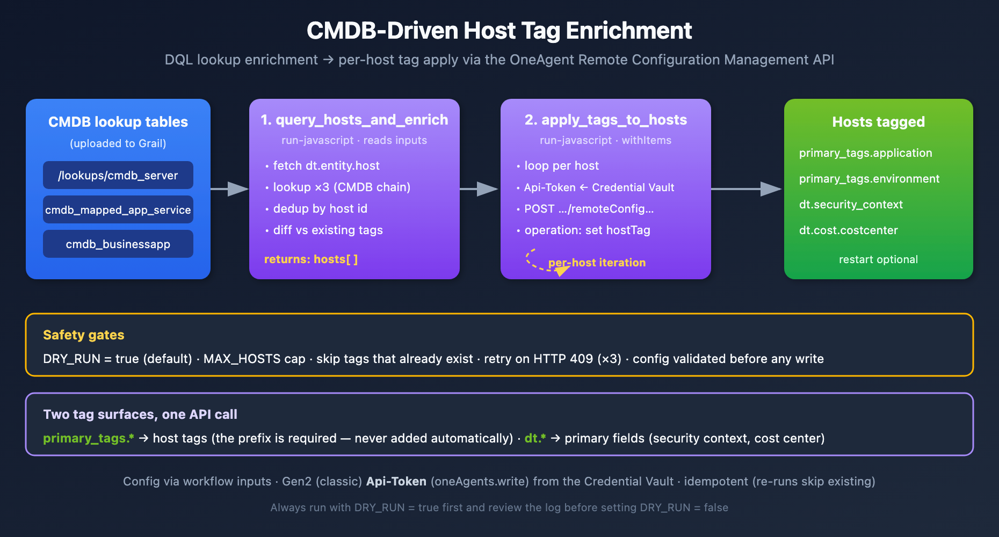
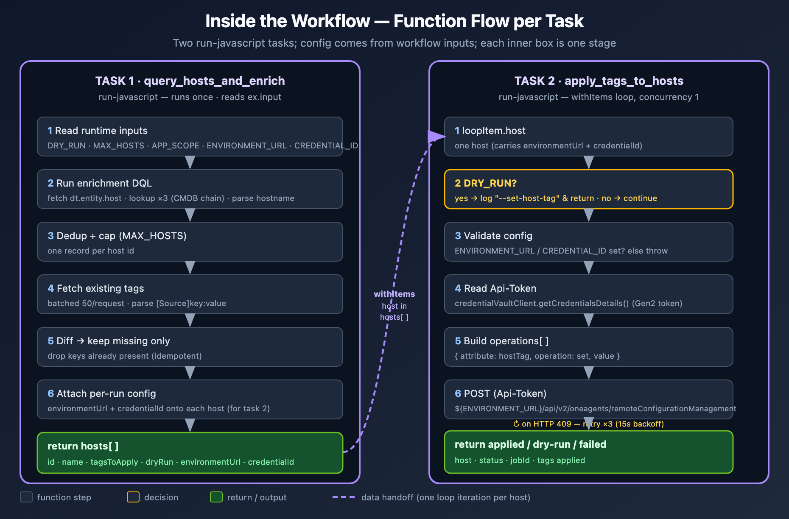

# WFLOW-95 LAB: CMDB-Driven Host Tag Enrichment

> **Series:** WFLOW — Workflows and Alert Notifications | **Reference:** 95 — CMDB-Driven Host Tag Enrichment LAB | **Created:** June 2026 | **Last Updated:** 06/19/2026

## Overview

A frequent ask: read host→application mappings from a CMDB and apply them as host tags in bulk. This hands-on LAB builds that end to end as a Dynatrace **Workflow** — two *Run JavaScript* tasks that enrich hosts from CMDB lookup tables and apply the tags via the OneAgent Remote Configuration Management API, safely (dry-run first) and idempotently (skip tags that already exist).

It is the capstone for **WFLOW-08 (JavaScript & HTTP Actions)** — it combines an SDK DQL query (WFLOW-08 §2), `fetch()` to a Dynatrace API with auth (§3), retry logic (§4), `result()` / `withItems` data passing between tasks (§7), and the Credential Vault into one deployable workflow. Build it in the editor by following the [steps](#build-steps), or import the [YAML skeleton](#import-skeleton) at the end.

---

## Table of Contents

1. [What This LAB Builds](#what-this-builds)
2. [The Two Tag Surfaces](#two-surfaces)
3. [Safety Model](#safety-model)
4. [Build It in the Workflows Editor](#build-steps)
5. [Prefer to Import? (YAML Skeleton)](#import-skeleton)
6. [Adapting It](#adapting)
7. [Next Steps](#next-steps)
8. [Bonus — Seed Sample Lookup Tables (testing only)](#bonus-seed-lookups)

---

## Prerequisites

| Requirement | Details |
|-------------|----------|
| **Dynatrace Environment** | SaaS with Workflows (AutomationEngine) and Grail |
| **Permissions** | `automation:workflows:write`; a Gen2 (classic) API token with `oneAgents.write` stored in the Credential Vault; and `environment-api:credentials:read` on the workflow's run-as identity (to read that token at runtime) |
| **Data** | Your CMDB exports uploaded as Grail lookup tables |
| **Prior Knowledge** | **WFLOW-08** (JavaScript & HTTP actions); DQL `lookup` / `load` |

<a id="what-this-builds"></a>
## 1. What This LAB Builds

The workflow is two `run-javascript` tasks chained by a loop:

| Task | Type | Role |
|------|------|------|
| `query_hosts_and_enrich` | `run-javascript` | Runs the DQL enrichment (host → three-table CMDB lookup chain), dedups by host id, fetches each host's current tags, and returns a `hosts[]` array containing **only the tags that are missing**. |
| `apply_tags_to_hosts` | `run-javascript` with a loop | For each host in `hosts[]`, reads the API token from the Credential Vault and POSTs a `set hostTag` operation to the **OneAgent Remote Configuration Management API** — respecting dry-run and retrying on HTTP 409. |

The write mechanism is `POST /api/v2/oneagents/remoteConfigurationManagement` with a `set hostTag` operation — the same `--set-host-tag` form you would run locally with `oneagentctl`, applied remotely across many hosts in one workflow.



<!-- MARKDOWN_TABLE_ALTERNATIVE
| Stage | What happens |
|-------|--------------|
| CMDB lookup tables (Grail) | cmdb_server -> cmdb_mapped_app_service -> cmdb_businessapp uploaded as lookup tables |
| 1. query_hosts_and_enrich (run-javascript) | fetch dt.entity.host, lookup x3 (CMDB chain), dedup by host id, diff vs existing tags -> returns hosts[] |
| 2. apply_tags_to_hosts (run-javascript, withItems loop) | per host: read token from Credential Vault, POST set hostTag to the Remote Configuration Management API |
| Hosts tagged | primary_tags.application, primary_tags.environment, dt.security_context, dt.cost.costcenter |
| Safety gates | DRY_RUN=true default, MAX_HOSTS cap, skip existing tags, retry on 409 (x3), config validated before any write |
-->

The two tasks are chained: task 2 loops over `result('query_hosts_and_enrich').hosts` (one run per host) and only runs when task 1 found at least one host. The diagram below opens each task into its internal function flow.



<!-- MARKDOWN_TABLE_ALTERNATIVE
| Task 1 — query_hosts_and_enrich (runs once) | Task 2 — apply_tags_to_hosts (per host, loop) |
|----------------------------------------------|-----------------------------------------------|
| 1. Run enrichment DQL (fetch host + lookup x3 + parse hostname) | 1. loopItem.host (one host from hosts[]) |
| 2. Deduplicate by host id -> uniqueHosts | 2. DRY_RUN? yes -> log and return, no -> continue |
| 3. Apply MAX_HOSTS cap | 3. Validate config (URL / CREDENTIAL_ID) |
| 4. Fetch existing tags (batched) | 4. Read API token <- Credential Vault |
| 5. Diff: drop tags already present | 5. Build operations[] (set hostTag per tag) |
| 6. Keep hosts with >=1 missing tag | 6. POST to API (retry x3 on HTTP 409) |
| -> return hosts[] | -> return applied / dry-run / failed |
| Task 1 output feeds Task 2 via the loop (one iteration per host) | |
-->

<a id="two-surfaces"></a>
## 2. The Two Tag Surfaces, One API Call

`TAG_MAPPING` maps an enrichment field to a host-tag key. Two different Dynatrace surfaces are written through the **same** `set hostTag` operation:

- `primary_tags.application` / `primary_tags.environment` become **primary tags**. The `primary_tags.` prefix is mandatory and is **never added for you** — a bare `application` key would create an ordinary tag, not a primary tag.
- `dt.security_context` and `dt.cost.costcenter` are **primary fields** (security context, cost-allocation), set through that same operation.

This split — and the primary-tags prefix rule — is covered in depth in **FAQ-02 (Tagging: Sources, Standards & Strategy)**. Tune `TAG_MAPPING` to the fields and tag keys your environment actually uses.

<a id="safety-model"></a>
## 3. Safety Model

The workflow defaults to **safe**: a first run changes nothing. Read the dry-run log, confirm the proposed tags, then flip one flag.

| Gate | What it does |
|------|--------------|
| `DRY_RUN = true` *(default)* | Task 2 only logs the `--set-host-tag` it *would* run — no write. Set to `false` to apply. |
| `MAX_HOSTS` | Caps hosts processed per run (default `50`; `0` = unlimited). |
| Skip-existing | Task 1 reads current tags and drops any key already present — re-runs are idempotent. |
| 409 retry | Remote Config Management allows one job per host at a time; task 2 retries up to `MAX_RETRIES` (3) with a 15s backoff on HTTP 409. |
| Credential Vault | Task 2 reads a Gen2 (classic) `oneAgents.write` API token from the vault at runtime via `credentialVaultClient` — never hardcoded. (The endpoint requires a classic token; the platform-token path isn't GA yet.) |
| Config validation | Task 2 throws *before any live write* if `ENVIRONMENT_URL` / `CREDENTIAL_ID` still hold placeholders. |
| Loop concurrency `1` | Hosts are tagged one at a time (serialized loop) to avoid colliding jobs and API pressure. |

<a id="build-steps"></a>
## 4. Build It in the Workflows Editor (Step by Step)

Two *Run JavaScript* tasks wired with a loop. **All configuration lives in workflow inputs** (runtime variables) — task 1 reads them with `ex.input` and passes the values task 2 needs onto each host object, so the loop task needs no input wiring of its own.

> **UI labels vary between Workflows app versions.** Where you define workflow inputs and the loop differs by version; the authoritative shape is the exported YAML (see the [import skeleton](#import-skeleton), which includes the `input:` block verbatim).

**Step 0 — Prerequisites (once):**

- **Upload your CMDB exports as Grail lookup tables** at the paths the query references (`/lookups/cmdb_server`, `/lookups/cmdb_mapped_app_service`, `/lookups/cmdb_businessapp`); adjust names/`fields` to your schema. *(If they're missing, task 1's preflight stops the run cleanly with a "Missing CMDB lookup tables" message — no raw `UNKNOWN_TABULAR_FILE` error.)*
- **Create a Gen2 (classic) API token** with the **`oneAgents.write`** scope (`dt0c01.…`), store it in the **Credential Vault**, and copy its credential ID (`CREDENTIALS_VAULT-…`).
- **Grant the workflow's run-as identity `environment-api:credentials:read`** so the workflow can read that token from the vault at runtime.

> **Why a classic token, not a platform token?** The remote-config endpoint currently rejects platform Bearer tokens at the scheme level; the platform-token path (`fleet-management:oneagents:write`) is not generally available yet. Revisit when it ships.

**Step 1 — Create the workflow and define its inputs.** New workflow (leave the on-demand trigger). Define these **workflow inputs** — they become the parameters you can override in the Run dialog (easiest to set via the YAML editor — see the [import skeleton](#import-skeleton)):

| Input | Default | Purpose |
|-------|---------|---------|
| `DRY_RUN` | `true` | preview only; flip to `false` to apply |
| `MAX_HOSTS` | `50` | cap per run; `0` = unlimited |
| `APP_SCOPE` | `''` | limit to one business app; `''` = all |
| `EXCLUDE_PRODUCTION` | `false` | skip `environment == production` |
| `RESTART_ONEAGENT` | `false` | restart OneAgent after tagging |
| `ENVIRONMENT_URL` | `https://<your-environment>.live.dynatrace.com` | tenant API base (no trailing slash) |
| `CREDENTIAL_ID` | `CREDENTIALS_VAULT-…` | vault entry holding the `oneAgents.write` token |

**Step 2 — Add the first JavaScript block.** Click **+** under the trigger → **Run JavaScript**. Rename it `query_hosts_and_enrich`.

**Step 3 — Fill it with this code.** It preflights the lookup tables (so a missing upload fails clean), then enriches and diffs:

```javascript
import { queryExecutionClient } from '@dynatrace-sdk/client-query';
import { execution } from '@dynatrace-sdk/automation-utils';

export default async function ({ execution_id }) {
  // ---- Runtime inputs (workflow `input` block; override per run) ----
  const ex = await execution(execution_id);
  const inp = ex.input || {};
  const MAX_HOSTS = Number(inp.MAX_HOSTS ?? 50);
  const DRY_RUN = (inp.DRY_RUN === false || inp.DRY_RUN === 'false') ? false : true; // default true
  const RESTART_ONEAGENT = (inp.RESTART_ONEAGENT === true || inp.RESTART_ONEAGENT === 'true');
  const APP_SCOPE = (inp.APP_SCOPE ?? '').toString();
  const EXCLUDE_PRODUCTION = (inp.EXCLUDE_PRODUCTION === true || inp.EXCLUDE_PRODUCTION === 'true');
  const ENVIRONMENT_URL = (inp.ENVIRONMENT_URL ?? '').toString().replace(/\/+$/, '');
  const CREDENTIAL_ID = (inp.CREDENTIAL_ID ?? '').toString();

  const TAG_MAPPING = {
    'application': 'primary_tags.application',
    'environment': 'primary_tags.environment',
    'dt.security_context': 'dt.security_context',
    'dt.cost.costcenter': 'dt.cost.costcenter',
  };

  console.log('=== Host Tag Enrichment (runtime inputs) ===');
  console.log(`DRY_RUN=${DRY_RUN} | MAX_HOSTS=${MAX_HOSTS} | APP_SCOPE='${APP_SCOPE}' | EXCLUDE_PRODUCTION=${EXCLUDE_PRODUCTION} | RESTART_ONEAGENT=${RESTART_ONEAGENT}`);

  // ---- Preflight: confirm the CMDB lookup tables exist before querying them, ----
  // ---- so a missing upload stops cleanly instead of throwing UNKNOWN_TABULAR_FILE. ----
  const LOOKUP_TABLES = ['/lookups/cmdb_server', '/lookups/cmdb_mapped_app_service', '/lookups/cmdb_businessapp'];
  const missingTables = await checkLookupTables(LOOKUP_TABLES);
  if (missingTables.length > 0) {
    console.log(`Missing CMDB lookup tables: ${missingTables.join(', ')}`);
    console.log('Upload them first (Step 0), then re-run. Stopping cleanly - no hosts processed.');
    return { hosts: [], totalFound: 0, toProcess: 0, dryRun: DRY_RUN, missingLookupTables: missingTables };
  }

  let enrichmentQuery = `fetch dt.entity.host
| fields id, entity.name, monitoringMode, paasVendorType, isMonitoringCandidate, awsNameTag
| filter isMonitoringCandidate == false
| fieldsAdd monitoringMode = if(isNotNull(paasVendorType), "APP_ONLY", else:if(isMonitoringCandidate == true, "CANDIDATE", else:monitoringMode)),
            provider = if(isNotNull(awsNameTag), "aws", else: "datacenter")
| filterOut monitoringMode == "APP_ONLY"
| fieldsRemove paasVendorType, awsNameTag, isMonitoringCandidate
| parse entity.name, """LD:hostname ('.' LD:domain)? EOS"""
| lookup [load "/lookups/cmdb_server"
          | fields cmdb_ci_key, name, dv_operational_status, environment, busapp_cmdb_ci_key, apps_cmdb_ci_key], sourceField:hostname, lookupField:name, prefix:"server."
| lookup [load "/lookups/cmdb_mapped_app_service"
          | fields environment, managed_by_email, cmdb_ci_key, busapp_name], sourceField:server.apps_cmdb_ci_key, lookupField:cmdb_ci_key, prefix:"mapped_app."
| lookup [load "/lookups/cmdb_businessapp"
          | fields short_name, owned_by, cmdb_ci_key], sourceField:server.busapp_cmdb_ci_key, lookupField:cmdb_ci_key, prefix:"bus_app."
| fields id, entity.name, application = lower(bus_app.short_name), environment = lower(mapped_app.environment), dt.cost.costcenter = lower(bus_app.short_name), dt.security_context = lower(bus_app.short_name)
| filter isNotNull(application) OR isNotNull(environment)`;

  if (APP_SCOPE && APP_SCOPE.trim().length > 0) enrichmentQuery += `\n| filter application == "${APP_SCOPE.trim().toLowerCase()}"`;
  if (EXCLUDE_PRODUCTION) enrichmentQuery += `\n| filterOut environment == "production"`;

  const enriched = await executeDqlQuery(enrichmentQuery);
  console.log(`Found ${enriched.length} enriched host records`);

  const hostMap = new Map();
  enriched.forEach(record => {
    if (!hostMap.has(record.id)) {
      const hostData = { id: record.id, name: record['entity.name'], application: record.application };
      Object.keys(TAG_MAPPING).forEach(f => { hostData[f] = getNestedField(record, f); });
      hostMap.set(record.id, hostData);
    }
  });
  const uniqueHosts = Array.from(hostMap.values());
  const hostsToProcess = MAX_HOSTS > 0 ? uniqueHosts.slice(0, MAX_HOSTS) : uniqueHosts;
  console.log(`${uniqueHosts.length} unique hosts; processing ${hostsToProcess.length}`);
  if (hostsToProcess.length === 0) return { hosts: [], totalFound: 0, toProcess: 0, dryRun: DRY_RUN };

  const BATCH = 50;
  const existing = new Map();
  for (let i = 0; i < hostsToProcess.length; i += BATCH) {
    const batch = hostsToProcess.slice(i, i + BATCH);
    const filterParts = batch.map(h => `id == "${h.id}"`).join(' or ');
    const recs = await executeDqlQuery(`fetch dt.entity.host
| fieldsAdd tags
| filter ${filterParts}
| fields id, tags`);
    recs.forEach(record => {
      const allTags = (record.tags || []).filter(t => typeof t === 'string');
      const keys = allTags.map(t => {
        let s = t; const b = t.lastIndexOf(']'); if (b !== -1) s = t.substring(b + 1);
        const c = s.indexOf(':'); return c === -1 ? null : s.substring(0, c);
      }).filter(k => k && Object.values(TAG_MAPPING).includes(k));
      existing.set(record.id, new Set(keys));
    });
  }

  const hostsWithTags = [];
  let skipped = 0;
  hostsToProcess.forEach(host => {
    const have = existing.get(host.id) || new Set();
    const tagsToApply = [];
    Object.entries(TAG_MAPPING).forEach(([f, tagKey]) => {
      const value = host[f];
      if (!value || String(value).trim().length === 0) return;
      if (have.has(tagKey)) { skipped++; return; }
      tagsToApply.push({ key: tagKey, value: sanitizeTagValue(value) });
    });
    if (tagsToApply.length > 0) {
      hostsWithTags.push({ id: host.id, name: host.name, application: host.application, tagsToApply,
        dryRun: DRY_RUN, restartOneAgent: RESTART_ONEAGENT, environmentUrl: ENVIRONMENT_URL, credentialId: CREDENTIAL_ID });
    }
  });

  console.log(DRY_RUN ? 'DRY RUN - no changes' : 'LIVE - will apply tags');
  hostsWithTags.forEach((h, i) => { console.log(`  ${i + 1}. ${h.name} (${h.id})`); h.tagsToApply.forEach(t => console.log(`     + ${t.key}=${t.value}`)); });
  console.log(`Hosts to tag: ${hostsWithTags.length} | tags skipped (exist): ${skipped}`);

  return { hosts: hostsWithTags, totalFound: uniqueHosts.length, toProcess: hostsWithTags.length, totalSkipped: skipped, dryRun: DRY_RUN };
}

// Preflight helper: returns the subset of lookup-table paths that do NOT exist.
async function checkLookupTables(paths) {
  const missing = [];
  for (const path of paths) {
    try {
      await executeDqlQuery(`load "${path}" | limit 1`);
    } catch (e) {
      if (e.message && e.message.includes('UNKNOWN_TABULAR_FILE')) missing.push(path);
      else throw e; // a real/unexpected error - surface it
    }
  }
  return missing;
}

function getNestedField(record, fieldName) {
  if (record[fieldName] !== undefined) return record[fieldName];
  return fieldName.split('.').reduce((v, p) => (v == null ? undefined : v[p]), record);
}
function sanitizeTagValue(value) { return String(value).replace(/\s/g, '').trim().slice(0, 270); }
async function executeDqlQuery(query) {
  let r = await queryExecutionClient.queryExecute({ body: { query, requestTimeoutMilliseconds: 60000, maxResultRecords: 10000 } });
  while (r.state === 'RUNNING') { await new Promise(s => setTimeout(s, 1000)); r = await queryExecutionClient.queryPoll({ requestToken: r.requestToken }); }
  if (r.state !== 'SUCCEEDED') throw new Error(`DQL failed: ${r.state}`);
  let recs = r.result?.records || [];
  while (r.result?.nextPageKey) { r = await queryExecutionClient.queryPoll({ requestToken: r.requestToken, nextPageKey: r.result.nextPageKey }); if (r.result?.records) recs = recs.concat(r.result.records); }
  return recs;
}
```

**Step 4 — Customize task 1.** Adjust `TAG_MAPPING`, the three `lookup [load "/lookups/…"]` tables and their `| fields …` lists, and the final `| fields … = lower(…)` mapping to match your CMDB. **If you rename the lookup tables, update both the `LOOKUP_TABLES` preflight list and the `lookup [load …]` calls.** Run scope and behavior (`DRY_RUN`, `MAX_HOSTS`, etc.) come from the **inputs**, not code constants.

**Step 5 — Add the second JavaScript block.** Click **+** beneath task 1 → **Run JavaScript**. Rename it `apply_tags_to_hosts` (placing it beneath task 1 makes task 1 its predecessor).

**Step 6 — Fill it with this code:**

```javascript
import { actionExecution } from '@dynatrace-sdk/automation-utils';
import { credentialVaultClient } from '@dynatrace-sdk/client-classic-environment-v2';

const MAX_RETRIES = 3;
const RETRY_DELAY_MS = 15000; // 15s between retries on 409

export default async function ({ action_execution_id }) {
  const actionExe = await actionExecution(action_execution_id);
  const host = actionExe.loopItem.host;
  const ENVIRONMENT_URL = host.environmentUrl;   // from task 1 (workflow input)
  const CREDENTIAL_ID = host.credentialId;       // from task 1 (workflow input)

  console.log(`--- ${host.name} (${host.id}) - ${host.tagsToApply.length} tag(s) ---`);

  if (host.dryRun) {
    host.tagsToApply.forEach(t => console.log(`  [DRY RUN] --set-host-tag=${t.key}=${t.value}`));
    return { host: host.name, hostId: host.id, status: 'dry-run', tagCount: host.tagsToApply.length };
  }

  if (!ENVIRONMENT_URL || ENVIRONMENT_URL.includes('<')) throw new Error('ENVIRONMENT_URL input is not set.');
  if (!CREDENTIAL_ID || CREDENTIAL_ID.includes('X')) throw new Error('CREDENTIAL_ID input is not set.');

  // Gen2 (classic) API token with oneAgents.write, read from the Credential Vault.
  // Reading the vault needs environment-api:credentials:read on the run-as identity.
  const cred = await credentialVaultClient.getCredentialsDetails({ id: CREDENTIAL_ID });
  const API_TOKEN = cred.token;
  if (!API_TOKEN) throw new Error('Credential has no token value.');

  const operations = host.tagsToApply.map(tag => ({ attribute: 'hostTag', operation: 'set', value: `${tag.key}=${tag.value}` }));
  const url = `${ENVIRONMENT_URL}/api/v2/oneagents/remoteConfigurationManagement?restart=${host.restartOneAgent}`;

  for (let attempt = 1; attempt <= MAX_RETRIES; attempt++) {
    try {
      const response = await fetch(url, {
        method: 'POST',
        headers: { 'Authorization': `Api-Token ${API_TOKEN}`, 'Content-Type': 'application/json; charset=utf-8' },
        body: JSON.stringify({ entities: [host.id], operations })
      });
      if (response.status === 409 && attempt < MAX_RETRIES) { await new Promise(s => setTimeout(s, RETRY_DELAY_MS)); continue; }
      if (!response.ok) throw new Error(`HTTP ${response.status}: ${await response.text()}`);
      const data = await response.json();
      console.log(`  SUCCESS (attempt ${attempt}) jobId=${data.id || 'N/A'}`);
      return { host: host.name, hostId: host.id, status: 'applied', tagsApplied: host.tagsToApply.length, jobId: data.id || 'N/A', attempt };
    } catch (error) {
      if (attempt < MAX_RETRIES && error.message && error.message.includes('409')) { await new Promise(s => setTimeout(s, RETRY_DELAY_MS)); continue; }
      console.error(`  FAILED (attempt ${attempt}): ${error.message}`);
      return { host: host.name, hostId: host.id, status: 'failed', error: error.message, attempt };
    }
  }
  return { host: host.name, hostId: host.id, status: 'failed', error: 'Max retries exceeded' };
}
```

**Step 7 — Customize task 2.** Normally nothing: `ENVIRONMENT_URL` and `CREDENTIAL_ID` arrive from task 1 (sourced from the workflow inputs) on each host object, and the token is read from the vault at runtime. Just confirm Step 0's token and the `environment-api:credentials:read` grant.

**Step 8 — Make task 2 loop over the hosts.** Enable the loop (Options → Loop / "Run task for each item"):

- **Items:** `{{ result('query_hosts_and_enrich').hosts }}`
- **Loop item variable name:** `host` — must be `host` so `actionExe.loopItem.host` resolves.
- **Concurrency:** `1` (serialize the writes).

Run condition (Conditions → Custom): `{{ result('query_hosts_and_enrich').hosts | length > 0 }}`

**Step 9 — Run with inputs.** Save → Run. In the Run dialog set `ENVIRONMENT_URL` and `CREDENTIAL_ID` (leave `DRY_RUN = true`). Review the task-2 log's `--set-host-tag` lines, then re-run with `DRY_RUN = false` to apply. Add a schedule trigger (WFLOW-02) to keep newly onboarded hosts tagged; skip-existing keeps repeat runs cheap and idempotent.

<a id="import-skeleton"></a>
## 5. Prefer to Import? (YAML Skeleton)

Build the envelope below — it includes the `input:` block and the loop/condition wiring — paste the **Step 3** and **Step 6** scripts into the `script:` blocks, and import it from the Workflows app.

```yaml
metadata:
  version: '1'
  dependencies:
    apps:
      - id: dynatrace.automations
        version: ^1.3074.2
workflow:
  title: Host Tag Enrichment from Lookup Table
  schemaVersion: 4
  trigger: {}
  type: STANDARD
  input:
    DRY_RUN: true
    APP_SCOPE: ''
    MAX_HOSTS: 50
    ENVIRONMENT_URL: 'https://<your-environment>.live.dynatrace.com'
    CREDENTIAL_ID: CREDENTIALS_VAULT-XXXXXXXXXXXXXXXX
    RESTART_ONEAGENT: false
    EXCLUDE_PRODUCTION: false
  tasks:
    query_hosts_and_enrich:
      name: query_hosts_and_enrich
      action: dynatrace.automations:run-javascript
      predecessors: []
      input:
        script: |
          # paste the Step 3 script (query_hosts_and_enrich) here
    apply_tags_to_hosts:
      name: apply_tags_to_hosts
      action: dynatrace.automations:run-javascript
      predecessors:
        - query_hosts_and_enrich
      conditions:
        custom: '{{ result(''query_hosts_and_enrich'').hosts | length > 0 }}'
        states:
          query_hosts_and_enrich: OK
      withItems: host in {{ result('query_hosts_and_enrich').hosts }}
      concurrency: 1
      input:
        script: |
          # paste the Step 6 script (apply_tags_to_hosts) here
```

<a id="adapting"></a>
## 6. Adapting It

- **Runtime inputs** — every knob (`DRY_RUN`, `MAX_HOSTS`, `APP_SCOPE`, `EXCLUDE_PRODUCTION`, `RESTART_ONEAGENT`, `ENVIRONMENT_URL`, `CREDENTIAL_ID`) is a workflow input, overridable per run in the Run dialog. No code edits to change scope or target.
- **Scope filters** — `APP_SCOPE` limits the run to one business app; `EXCLUDE_PRODUCTION` skips hosts whose enriched `environment` is `production`. Both are appended to the DQL at runtime.
- **`sanitizeTagValue`** strips whitespace and caps values at 270 characters (Dynatrace tag-value constraint).
- **Schedule it** with a cron trigger (WFLOW-02) so newly onboarded hosts get tagged automatically; skip-existing keeps repeat runs cheap.
- **Token type** — this uses a **Gen2 (classic) `Api-Token`** because the platform-token path (`fleet-management:oneagents:write`) is not GA yet. When it ships, the call can move to platform-token auth — potentially with no stored token at all if the workflow's run-as identity carries the scope.

<a id="next-steps"></a>
## 7. Next Steps

- **WFLOW-02: Triggers** — add a schedule trigger to run this enrichment on a cadence.
- **WFLOW-07: Auto-Remediation** — the DRY_RUN / max-attempts / serialized-write guardrails here are the same safety patterns used for remediation tasks.
- **WFLOW-08: JavaScript & HTTP Actions** — the building blocks this LAB composes (SDK DQL, `fetch()`, retry, `result()` / `withItems`, Credential Vault).
- **FAQ-02: Tagging — Sources, Standards & Strategy** — the tagging-source model and the `primary_tags.` prefix rule that this workflow writes against.

## References

- [OneAgent remote configuration management API — POST a configuration job (DT docs)](https://docs.dynatrace.com/docs/dynatrace-api/environment-api/remote-configuration/oneagent/post-config-job)
- [Remote configuration management of OneAgents and ActiveGates (DT docs)](https://docs.dynatrace.com/docs/ingest-from/bulk-configuration)
- [Lookup data in Grail (DT docs)](https://docs.dynatrace.com/docs/platform/grail/lookup-data)
- [Build workflows (DT docs)](https://docs.dynatrace.com/docs/analyze-explore-automate/workflows/build)
- [Run JavaScript action (DT docs)](https://docs.dynatrace.com/docs/analyze-explore-automate/workflows/default-workflow-actions/run-javascript-workflow-action)
- [OneAgent tag setup — primary tags / fields (DT docs)](https://docs.dynatrace.com/docs/manage/tags/tags-domain-oneagent)

> <sub>**Sources:** [OneAgent remote configuration management API — POST a configuration job (DT docs)](https://docs.dynatrace.com/docs/dynatrace-api/environment-api/remote-configuration/oneagent/post-config-job) — documents the `hostTag` `set` operation, the `dt.cost.costcenter=<value>` form, and the `oneAgents.write` scope, [Build workflows (DT docs)](https://docs.dynatrace.com/docs/analyze-explore-automate/workflows/build), [Lookup data in Grail (DT docs)](https://docs.dynatrace.com/docs/platform/grail/lookup-data), [OneAgent tag setup (DT docs)](https://docs.dynatrace.com/docs/manage/tags/tags-domain-oneagent). **Derived:** the GUI step ordering and the safety-model table synthesize the cited API/lookup/build pages with the WFLOW-08 §2–§7 mechanics — exact editor labels vary by app version; verify with `DRY_RUN = true` before applying. This workflow is derived from a working deployment; the tenant URL and customer name have been genericized.</sub>

<a id="bonus-seed-lookups"></a>
## Appendix — Bonus: Seed Sample Lookup Tables (Testing Only)

> **Not part of the main workflow.** In production the three CMDB lookup tables are uploaded from your **real CMDB** (Step 0). This appendix is only for trying the LAB on a tenant that has **no CMDB tables** — it creates three tiny sample tables so the enrichment resolves for one host. **Do not run it where the real tables already exist** (it would overwrite them).

It uses the Grail **Resource Store API** (`/platform/storage/resource-store/v1/files/tabular/lookup:upload`) — the reverse direction of this LAB (writing *to* a lookup table instead of reading *from* one). The same API is how you'd build a real "sync CMDB → lookup table" job if your CMDB is reachable from a workflow.

**Prerequisite:** the workflow's run-as identity needs **`storage:files:write`** (reading the tables back in DQL needs nothing extra).

**How to use:** create a **separate** one-task workflow (don't add this to the tagging workflow), paste the code, **replace `myhost-01`** with the short hostname of a real host in your tenant (the part before the first dot), and run it once. Then verify with `load "/lookups/cmdb_server" | limit 10` and run the main workflow with `DRY_RUN = true`. The sample chain resolves to `application = sampleapp`, `environment = dev`.

```javascript
const BASE = '/platform/storage/resource-store/v1/files/tabular';

const TABLES = [
  {
    filePath: '/lookups/cmdb_server', lookupField: 'name', displayName: 'cmdb_server',
    parsePattern: 'JSON{STRING:name, STRING:cmdb_ci_key, STRING:dv_operational_status, STRING:environment, STRING:busapp_cmdb_ci_key, STRING:apps_cmdb_ci_key}(flat=true)',
    rows: [{ name: 'myhost-01', cmdb_ci_key: 'SRV1', dv_operational_status: 'operational',
             environment: 'dev', busapp_cmdb_ci_key: 'BAPP1', apps_cmdb_ci_key: 'APP1' }],
  },
  {
    filePath: '/lookups/cmdb_mapped_app_service', lookupField: 'cmdb_ci_key', displayName: 'cmdb_mapped_app_service',
    parsePattern: 'JSON{STRING:cmdb_ci_key, STRING:environment, STRING:managed_by_email, STRING:busapp_name}(flat=true)',
    rows: [{ cmdb_ci_key: 'APP1', environment: 'dev',
             managed_by_email: 'owner@example.com', busapp_name: 'Sample App' }],
  },
  {
    filePath: '/lookups/cmdb_businessapp', lookupField: 'cmdb_ci_key', displayName: 'cmdb_businessapp',
    parsePattern: 'JSON{STRING:cmdb_ci_key, STRING:short_name, STRING:owned_by}(flat=true)',
    rows: [{ cmdb_ci_key: 'BAPP1', short_name: 'sampleapp', owned_by: 'platform-team' }],
  },
];

export default async function () {
  const out = {};
  for (const t of TABLES) {
    const jsonl = t.rows.map(r => JSON.stringify(r)).join('\n');

    // delete first (ignore "does not exist") so re-runs are clean
    try {
      const del = await fetch(`${BASE}/lookup:delete`, { method: 'POST', body: JSON.stringify({ filePath: t.filePath }) });
      console.log(`[delete] ${t.filePath} -> HTTP ${del.status}`);
    } catch (e) { console.log(`[delete] ${t.filePath} skipped: ${e.message}`); }

    // upload (multipart: request as a JSON string + content blob; NO headers)
    const form = new FormData();
    form.append('request', JSON.stringify({
      filePath: t.filePath,
      displayName: t.displayName,
      description: 'Sample CMDB data for testing host-tag enrichment',
      parsePattern: t.parsePattern,
      skippedRecords: 0,
      overwrite: true,
      lookupField: t.lookupField,
      timezone: 'UTC',
      locale: 'en_US',
    }));
    form.append('content', new Blob([jsonl], { type: 'text/plain' }), 'data.jsonl');

    const resp = await fetch(`${BASE}/lookup:upload`, { method: 'POST', body: form });
    const body = await resp.text();
    console.log(`[upload] ${t.filePath} -> HTTP ${resp.status} :: ${body.slice(0, 300)}`);
    out[t.filePath] = { status: resp.status, ok: resp.ok };
    if (!resp.ok) console.error(`Upload failed for ${t.filePath}: ${body}`);
  }
  console.log('Verify each: load "/lookups/cmdb_server" | limit 10');
  return out;
}
```

**Upload mechanics (reusable for any lookup-table upload):**

- `parsePattern: 'JSON{STRING:field, INT:field, …}(flat=true)'` produces **flat top-level columns** from JSONL — bare `JSON` would nest them under one field.
- The `request` part is a plain **JSON string**; `content` is a `Blob`; **set no headers** — `fetch` builds the multipart boundary.
- The **relative URL** is authenticated by the platform as the workflow's run-as identity — **no token needed**. (This is a platform-native endpoint, unlike the classic remote-config API the main LAB uses, which requires a Gen2 Api-Token.)
- **Re-runnable:** it deletes then re-uploads. To remove a table, POST `{"filePath": "/lookups/<name>"}` to `…/lookup:delete`.

---

<sub>*This notebook was AI-generated from community-submitted and publicly available sources. This notebook series is not officially supported by Dynatrace. Always verify information against official Dynatrace documentation.*</sub>
