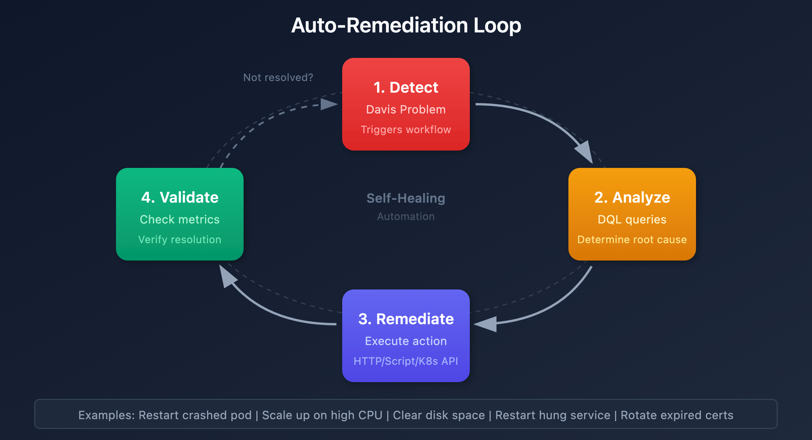

# Problem-Triggered Remediation

> **Series:** WFLOW | **Notebook:** 7 of 9 | **Created:** January 2026 | **Last Updated:** 01/28/2026

## Auto-Remediation with Workflows
Move beyond notifications to automated problem resolution. This notebook covers remediation patterns, safety guardrails, runbook automation, and common remediation scenarios.

---

## Table of Contents

1. [Auto-Remediation Principles](#auto-remediation-principles)
2. [Safety Guardrails](#safety-guardrails)
3. [Common Remediation Patterns](#common-remediation-patterns)
4. [Kubernetes Remediation](#kubernetes-remediation)
5. [Cloud Resource Remediation](#cloud-resource-remediation)
6. [Runbook Automation](#runbook-automation)
7. [Approval Workflows](#approval-workflows)

---

## Prerequisites

| Requirement | Details |
|-------------|----------|
| **Dynatrace Environment** | SaaS with Platform subscription |
| **Permissions** | `automation:workflows:write` |
| **Prior Knowledge** | **WFLOW-01** through **WFLOW-06** |
| **External Systems** | kubectl access, cloud API credentials |

<a id="auto-remediation-principles"></a>
## 1. Auto-Remediation Principles
### When to Automate Remediation

| Scenario | Automate? | Reason |
|----------|-----------|--------|
| Pod crash loop | Yes | Well-defined fix (restart) |
| Disk space 90% | Yes | Clear action (cleanup) |
| Memory pressure | Maybe | Scale up vs investigate |
| Database deadlock | No | Needs investigation |
| Security incident | No | Requires human judgment |

### Remediation Maturity Model

```
Level 0: Manual remediation (runbook lookup)
Level 1: Automated notification with runbook link
Level 2: Semi-automated (human approval required)
Level 3: Fully automated with guardrails
Level 4: Self-healing with learning
```

### Auto-Remediation Loop



<!-- MARKDOWN_TABLE_ALTERNATIVE
| Step | Action | Description |
|------|--------|-------------|
| 1. Detect | Davis Problem | Triggers workflow |
| 2. Analyze | DQL queries | Determine root cause |
| 3. Remediate | Execute action | HTTP/Script/K8s API |
| 4. Validate | Check metrics | Verify resolution |
| Loop | If not resolved | Return to step 1 |
Examples: Restart pod, scale up, clear cache, rotate certs
For environments where SVG doesn't render
-->

<a id="safety-guardrails"></a>
## 2. Safety Guardrails
### Essential Guardrails

| Guardrail | Implementation | Purpose |
|-----------|----------------|----------|
| **Rate limiting** | Max 3 remediations/hour | Prevent loops |
| **Time window** | Business hours only | Avoid off-hours changes |
| **Environment scope** | Non-prod first | Protect production |
| **Cooldown period** | 30 min between actions | Allow stabilization |
| **Rollback capability** | Capture pre-state | Enable undo |

### Rate Limiting Implementation

```javascript
import { queryExecutionClient } from '@dynatrace-sdk/client-query';

export default async function({ event }) {
  const entityId = event.root_cause_entity_id;
  
  // Check recent remediation attempts
  const result = await queryExecutionClient.queryExecute({
    body: {
      query: `
        fetch events, from: now() - 1h
        | filter event.type == "automation.workflow.execution"
        | filter contains(workflow.name, "remediation")
        | filter entity_id == "${entityId}"
        | summarize attempts = count()
      `
    }
  });
  
  const attempts = result.result.records[0]?.attempts || 0;
  const maxAttempts = 3;
  
  if (attempts >= maxAttempts) {
    return {
      proceed: false,
      reason: `Rate limit reached: ${attempts}/${maxAttempts} in last hour`
    };
  }
  
  return { proceed: true, attempt_number: attempts + 1 };
}
```

### Time Window Check

```yaml
conditions:
  - name: is_safe_window
    expression: |
      
      
      {{ weekday < 5 and hour >= 6 and hour < 22 }}

tasks:
  - name: remediation_action
    conditions: [is_safe_window]
    # ... action config
```

<a id="common-remediation-patterns"></a>
## 3. Common Remediation Patterns
### Pattern 1: Service Restart

```javascript
// Restart a service via SSH/API
export default async function({ event }) {
  const hostId = event.root_cause_entity_id;
  const serviceName = extractServiceName(event.title);
  
  // Call external automation system
  const response = await fetch('https://automation.company.com/api/restart', {
    method: 'POST',
    headers: {
      'Authorization': `Bearer ${env.AUTOMATION_TOKEN}`,
      'Content-Type': 'application/json'
    },
    body: JSON.stringify({
      host: hostId,
      service: serviceName,
      reason: `Dynatrace problem ${event.display_id}`
    })
  });
  
  return {
    success: response.ok,
    message: await response.text()
  };
}
```

### Pattern 2: Clear Cache

```yaml
tasks:
  - name: clear_cache
    type: dynatrace.http:request
    input:
      url: "https://{{ event().get('affected_entity_ids')[0] }}.internal/admin/cache/clear"
      method: POST
      headers:
        Authorization: "Bearer {{ env.ADMIN_TOKEN }}"
```

### Pattern 3: Traffic Redirect

```javascript
// Redirect traffic away from failing instance
export default async function({ event }) {
  const failingInstance = event.root_cause_entity_id;
  
  // Update load balancer to remove failing instance
  await updateLoadBalancer({
    action: 'drain',
    instance: failingInstance,
    reason: event.display_id
  });
  
  return { redirected: true };
}
```

<a id="kubernetes-remediation"></a>
## 4. Kubernetes Remediation
### Pod Restart

```javascript
import { KubeConfig, CoreV1Api } from '@kubernetes/client-node';

export default async function({ event }) {
  // Extract pod info from problem
  const podName = extractPodName(event.root_cause_entity_id);
  const namespace = extractNamespace(event.root_cause_entity_id);
  
  // Configure kubernetes client
  const kc = new KubeConfig();
  kc.loadFromString(env.KUBECONFIG);
  const k8sApi = kc.makeApiClient(CoreV1Api);
  
  // Delete pod (Kubernetes will recreate it)
  try {
    await k8sApi.deleteNamespacedPod(podName, namespace);
    return {
      success: true,
      action: 'pod_restarted',
      pod: podName,
      namespace: namespace
    };
  } catch (error) {
    return {
      success: false,
      error: error.message
    };
  }
}
```

### Deployment Rollback

```javascript
import { KubeConfig, AppsV1Api } from '@kubernetes/client-node';

export default async function({ event }) {
  const deploymentName = extractDeployment(event);
  const namespace = extractNamespace(event);
  
  const kc = new KubeConfig();
  kc.loadFromString(env.KUBECONFIG);
  const k8sApi = kc.makeApiClient(AppsV1Api);
  
  // Get deployment history
  const deployment = await k8sApi.readNamespacedDeployment(deploymentName, namespace);
  const currentRevision = deployment.body.metadata.annotations['deployment.kubernetes.io/revision'];
  
  // Rollback to previous revision
  await k8sApi.patchNamespacedDeployment(
    deploymentName,
    namespace,
    {
      spec: {
        rollbackTo: { revision: parseInt(currentRevision) - 1 }
      }
    },
    undefined,
    undefined,
    undefined,
    undefined,
    { headers: { 'Content-Type': 'application/strategic-merge-patch+json' } }
  );
  
  return {
    action: 'rollback',
    deployment: deploymentName,
    from_revision: currentRevision,
    to_revision: parseInt(currentRevision) - 1
  };
}
```

### Horizontal Pod Autoscaler Adjustment

```javascript
export default async function({ event }) {
  // Temporarily increase replicas for high load
  const response = await fetch(
    `${env.K8S_API_SERVER}/apis/autoscaling/v2/namespaces/production/horizontalpodautoscalers/checkout-hpa`,
    {
      method: 'PATCH',
      headers: {
        'Authorization': `Bearer ${env.K8S_TOKEN}`,
        'Content-Type': 'application/merge-patch+json'
      },
      body: JSON.stringify({
        spec: {
          minReplicas: 5  // Increase from default 2
        }
      })
    }
  );
  
  return { scaled: response.ok };
}
```

<a id="cloud-resource-remediation"></a>
## 5. Cloud Resource Remediation
### AWS EC2 Instance Restart

```javascript
import { EC2Client, RebootInstancesCommand } from '@aws-sdk/client-ec2';

export default async function({ event }) {
  const ec2Client = new EC2Client({
    region: 'us-east-1',
    credentials: {
      accessKeyId: env.AWS_ACCESS_KEY_ID,
      secretAccessKey: env.AWS_SECRET_ACCESS_KEY
    }
  });
  
  const instanceId = extractEC2InstanceId(event.root_cause_entity_id);
  
  const command = new RebootInstancesCommand({
    InstanceIds: [instanceId]
  });
  
  await ec2Client.send(command);
  
  return {
    action: 'ec2_reboot',
    instance_id: instanceId
  };
}
```

### AWS Lambda Function Redeploy

```javascript
import { LambdaClient, UpdateFunctionCodeCommand } from '@aws-sdk/client-lambda';

export default async function({ event }) {
  const lambdaClient = new LambdaClient({ region: 'us-east-1' });
  const functionName = extractLambdaName(event);
  
  // Force cold start by updating function
  const command = new UpdateFunctionCodeCommand({
    FunctionName: functionName,
    S3Bucket: env.LAMBDA_BUCKET,
    S3Key: `${functionName}/latest.zip`
  });
  
  await lambdaClient.send(command);
  
  return { redeployed: functionName };
}
```

### Azure App Service Restart

```javascript
export default async function({ event }) {
  const response = await fetch(
    `https://management.azure.com/subscriptions/${env.AZURE_SUBSCRIPTION_ID}/resourceGroups/${resourceGroup}/providers/Microsoft.Web/sites/${appName}/restart?api-version=2022-03-01`,
    {
      method: 'POST',
      headers: {
        'Authorization': `Bearer ${env.AZURE_TOKEN}`
      }
    }
  );
  
  return { restarted: response.ok };
}
```

<a id="runbook-automation"></a>
## 6. Runbook Automation
### Runbook Lookup and Execution

```javascript
export default async function({ event }) {
  // Map problem types to runbooks
  const runbookMap = {
    'High CPU': 'runbook-cpu-investigation',
    'Memory exhaustion': 'runbook-memory-cleanup',
    'Disk space': 'runbook-disk-cleanup',
    'Connection pool': 'runbook-connection-reset'
  };
  
  // Find matching runbook
  let runbookId = null;
  for (const [pattern, id] of Object.entries(runbookMap)) {
    if (event.title.includes(pattern)) {
      runbookId = id;
      break;
    }
  }
  
  if (!runbookId) {
    return {
      action: 'no_runbook',
      message: 'No automated runbook for this problem type'
    };
  }
  
  // Execute runbook via automation system
  const result = await executeRunbook(runbookId, {
    problem_id: event.display_id,
    entity_id: event.root_cause_entity_id
  });
  
  return {
    action: 'runbook_executed',
    runbook: runbookId,
    result: result
  };
}
```

### Include Runbook Link in Notification

```yaml
message: |
  :warning: *{{ event()['title'] }}*
  
  *Suggested Runbook:*
  
  <https://wiki.company.com/runbooks/cpu-investigation|CPU Investigation Runbook>
  
  <https://wiki.company.com/runbooks/memory-troubleshooting|Memory Troubleshooting Runbook>
  
  <https://wiki.company.com/runbooks|Browse Runbooks>
  
```

<a id="approval-workflows"></a>
## 7. Approval Workflows
### Human-in-the-Loop Pattern

```yaml
tasks:
  # 1. Notify team of proposed remediation
  - name: request_approval
    type: dynatrace.slack:message
    input:
      channel: "#approvals"
      blocks:
        - type: section
          text:
            type: mrkdwn
            text: "*Remediation Approval Required*\n\nProblem: {{ event()['title'] }}\nProposed Action: Restart pod\nEntity: {{ event()['root_cause_entity_id'] }}"
        - type: actions
          elements:
            - type: button
              text:
                type: plain_text
                text: "Approve"
              action_id: "approve_remediation"
              style: primary
            - type: button
              text:
                type: plain_text
                text: "Reject"
              action_id: "reject_remediation"
              style: danger

  # 2. Wait for approval (timeout 30 min)
  - name: wait_approval
    type: dynatrace.automations:wait-for-event
    dependsOn: [request_approval]
    input:
      eventType: "remediation.approval"
      timeout: "30m"
      correlationId: "{{ event()['display_id'] }}"

  # 3. Execute if approved
  - name: execute_remediation
    type: dynatrace.automations:run-javascript
    dependsOn: [wait_approval]
    conditions:
      - '{{ result("wait_approval").approved }}'
    input:
      script: |
        // Perform remediation action
```

### Auto-Approve for Non-Production

```yaml
conditions:
  - name: is_production
    expression: '{{ "Production" in event().get("management_zones", []) }}'

tasks:
  # Auto-execute for non-prod
  - name: auto_remediate
    conditions: [not is_production]
    # ... remediation action

  # Require approval for prod
  - name: request_prod_approval
    conditions: [is_production]
    # ... approval workflow
```

### Monitor Remediation Workflows

```dql
// Remediation workflow success rates
fetch events, from: now() - 7d
| filter event.type == "automation.workflow.execution"
| filter contains(workflow.name, "remediation") or contains(workflow.name, "auto-heal")
| summarize 
    total = count(),
    succeeded = countIf(execution.status == "SUCCEEDED"),
    failed = countIf(execution.status == "FAILED"),
    by:{workflow.name}
| fieldsAdd success_rate = round(100.0 * succeeded / total, decimals: 2)
| sort total desc
```

```dql
// Problems auto-remediated vs manually resolved
fetch events, from: now() - 30d
| filter event.kind == "DAVIS_PROBLEM" and status == "CLOSED"
| summarize 
    total = count(),
    auto_remediated = countIf(isNotNull(auto_remediation_id)),
    by:{time_bucket = bin(timestamp, 1d)}
| fieldsAdd auto_rate = round(100.0 * auto_remediated / total, decimals: 2)
| sort time_bucket asc
```

## Next Steps

With remediation patterns in place, learn advanced integrations:

### Recommended Path

1. **WFLOW-08: JavaScript & HTTP Actions** - Custom integrations
2. **WFLOW-09: Security & Governance** - Production best practices

### Key Takeaways

- **Guardrails** prevent runaway automation
- **Rate limiting** avoids remediation loops
- **Kubernetes** can be automated via API
- **Runbook mapping** ties problems to solutions
- **Approval workflows** for production changes

---

## Summary

In this notebook, you learned:

- Auto-remediation principles and maturity model
- Safety guardrails (rate limiting, time windows)
- Common remediation patterns
- Kubernetes pod/deployment remediation
- Cloud resource remediation (AWS, Azure)
- Runbook automation integration
- Human-in-the-loop approval workflows

---

## References

- [Workflow Actions](https://docs.dynatrace.com/docs/platform/workflows/actions)
- [JavaScript Action](https://docs.dynatrace.com/docs/platform/workflows/actions/javascript)
- [HTTP Request Action](https://docs.dynatrace.com/docs/platform/workflows/actions/http-request)
- [Kubernetes API](https://kubernetes.io/docs/reference/kubernetes-api/)

---

<sub>*This notebook was AI-generated from community-submitted and publicly available sources. This notebook series is not officially supported by Dynatrace. Always verify information against official Dynatrace documentation.*</sub>
